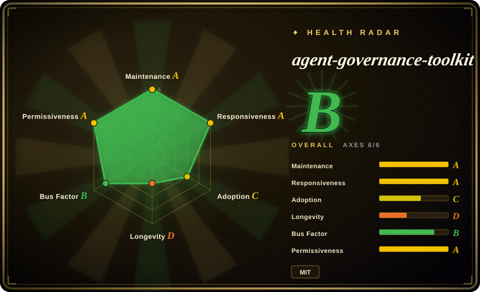

# agent-governance-toolkit

Microsoft's public-preview governance toolkit for production AI agents: policy-gated tool calls, identity/trust, audit/compliance, MCP security gateway, SRE controls, and multi-language SDKs around agent frameworks.

## When to use

You are shipping AI agents that call tools, browse, query databases, delegate to other agents, or run through frameworks such as Semantic Kernel, AutoGen, LangGraph/LangChain, CrewAI, OpenAI Agents SDK, Claude Code, Google ADK, LlamaIndex, Haystack, Mastra, or MCP. Use agent-governance-toolkit when you need deterministic policy checks and audit records around agent actions rather than only prompt-level instructions.

It is strongest when governance has to be a product surface: YAML/Cedar/OPA-style policy evaluation, identity/trust, compliance CLI (`agt verify`, `agt lint-policy`, red-team scan), language SDKs (Python, TypeScript, .NET, Rust, Go), and framework adapters. The upstream README labels the project **Public Preview**, so use it as an actively developed governance stack with possible breaking changes before GA.

## When NOT to use

- **You need a stable GA contract today.** Upstream explicitly says Public Preview and warns about possible breaking changes before GA.
- **You need OS-level containment as the primary control.** The README states AGT works at the application middleware layer and recommends separate containers for OS-level isolation; do not treat it as a kernel sandbox.
- **You only need one small local policy check.** Open Policy Agent, Cedar, or a few lines of application middleware may be smaller than adopting AGT's full governance stack.
- **You cannot afford multi-language/package surface area.** The project spans Python, TypeScript, .NET, Rust, Go, Claude Code plugins, Copilot CLI, MCP, docs, compliance artifacts, and framework adapters; that breadth is operational weight.
- **Your risk model is content quality, not agent action governance.** Use eval/red-team tools for prompt quality and model behavior; AGT is about governing tool calls, identity, audit, compliance, and runtime controls.

## Comparison

| Alternative | In index | Our verdict | Tradeoff |
|---|---|---|---|
| Open Policy Agent | 未收录 | Choose OPA when you only need a general policy engine and already own the agent middleware. | Smaller and mature for policy decisions; AGT packages agent-specific identity, audit, compliance, and framework adapters. |
| Cedar / Cedarling | 未收录 | Choose Cedar when authorization semantics and fine-grained policy evaluation are the core requirement. | Strong policy model; AGT is broader and more agent-governance specific. |
| Custom middleware | 未收录 | Build custom when you only need to gate a handful of tools in one service. | Less dependency surface, but you must design audit, identity, enforcement points, and compliance evidence yourself. |
| Prompt-only safety rules | 未收录 | Use only for low-risk guidance where policy violations have low consequence. | Cheap to add, but not a deterministic control surface for tool execution. |

## Tech stack

- **Python-first monorepo** — Python packages provide the full stack; TypeScript, .NET, Rust, and Go packages expose core governance surfaces.
- **CLI and SDKs** — README documents `agt doctor`, `agt verify`, `agt red-team scan`, `agt lint-policy`, Python `govern()`, TypeScript `PolicyEngine`, .NET MCP integration, Rust, and Go examples.
- **Agent framework adapters** — documented integrations include Microsoft Agent Framework, Semantic Kernel, AutoGen, LangGraph/LangChain, CrewAI, OpenAI Agents SDK, Claude Code, Google ADK, LlamaIndex, Haystack, Mastra, Dify, and MCP.

## Dependencies

- **Python 3.10+** for the documented quick start; Node.js 18+ / npm 9+, .NET 8+, Go 1.25+, and Rust 1.70+ for the corresponding SDKs.
- **Package registries** — PyPI (`agent-governance-toolkit`), npm (`@microsoft/agent-governance-sdk` and related packages), NuGet, crates.io, plus source packages in the monorepo.
- **Optional Azure credentials** — README lists `AZURE_CLIENT_ID`, `AZURE_TENANT_ID`, and `AZURE_CLIENT_SECRET` for Azure-integrated features.
- **Framework-specific hooks** — real deployment depends on where you insert AGT into your agent framework, MCP server, CLI, or plugin flow.

## Ops difficulty

**Medium to high.** `pip install agent-governance-toolkit[full]` and a two-line `govern()` wrapper are easy to try, but production rollout means defining policies, enforcement points, audit retention, identity/trust model, framework adapters, and OS/container boundaries.

## Health & viability

- **Maintenance snapshot (2026-07-16):** GitHub reports `archived=false` and `pushed_at=2026-07-16T07:08:50Z`; health scores maintenance and responsiveness as A.
- **Adoption snapshot:** ~4,889 GitHub stars as of 2026-07 and health found 88,426 last-month PyPI downloads for `agent_governance_toolkit`; treat this as early adoption, not a mature long-lived standard.
- **License snapshot:** MIT verified from GitHub metadata and root `LICENSE` in the read-only upstream check.
- **Lindy / governance:** the project is very young (health longevity D) but backed by Microsoft, has governance docs, maintainers docs, security policy, and broad contributor signals.
- **Risk flags:** Public Preview status, broad package surface, and middleware-level security boundary are the main practical risks.

## Caveats (unverified)

- [未验证] The README claims broad standards/framework coverage and many conformance tests; this pass read the README and license, not the full conformance suite.
- [未验证] Package split and legacy compatibility notes are moving quickly in Public Preview; pin exact versions before production rollout.
- [推断] Teams with only one or two internal tools may find AGT's breadth heavier than a small policy middleware.
