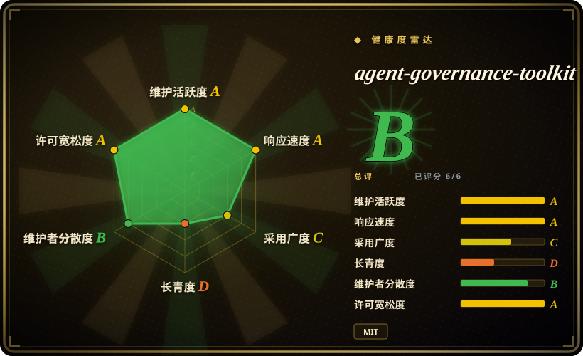

# agent-governance-toolkit

Microsoft 面向生产 AI agent 的 public-preview 治理工具包：策略门控 tool call、身份 / 信任、审计 / 合规、MCP security gateway、SRE 控制，以及围绕 agent framework 的多语言 SDK。

## 何时使用

你在上线会调用工具、浏览网页、查数据库、委派其他 agent，或运行在 Semantic Kernel、AutoGen、LangGraph / LangChain、CrewAI、OpenAI Agents SDK、Claude Code、Google ADK、LlamaIndex、Haystack、Mastra、MCP 等框架里的 AI agent。需要对 agent action 做确定性的策略检查和审计记录，而不是只在 prompt 里写安全规则时，选 agent-governance-toolkit。

它适合把治理做成产品面：YAML / Cedar / OPA 风格策略评估、身份 / 信任、合规 CLI（`agt verify`、`agt lint-policy`、red-team scan）、多语言 SDK（Python、TypeScript、.NET、Rust、Go）和框架 adapter。上游 README 明确标注 **Public Preview**，因此应按活跃开发中的治理栈使用，并预期 GA 前可能有 breaking changes。

## 何时不用

- **你今天需要稳定 GA contract。** 上游明确写着 Public Preview，并提示 GA 前可能有 breaking changes。
- **你把 OS 级隔离当作主要控制面。** README 说明 AGT 工作在 application middleware 层，并建议用独立 container 做 OS 级隔离；不要把它当 kernel sandbox。
- **你只需要一个很小的本地策略检查。** Open Policy Agent、Cedar 或几行应用 middleware 可能比采用 AGT 全套治理栈更小。
- **你承受不了多语言 / 多包 surface area。** 项目覆盖 Python、TypeScript、.NET、Rust、Go、Claude Code plugin、Copilot CLI、MCP、文档、合规材料和框架 adapter；这本身就是运维重量。
- **你的风险模型是内容质量，不是 agent action 治理。** prompt 质量和模型行为评估应看 eval / red-team 工具；AGT 主要治理 tool call、身份、审计、合规和 runtime control。

## 横向对比

| 替代品 | 是否收录 | 我们的评价 | 取舍 |
|---|---|---|---|
| Open Policy Agent | 未收录 | 只需要通用 policy engine，且 agent middleware 自己掌控时选 OPA。 | OPA 更小、更成熟；AGT 额外打包 agent-specific identity、audit、compliance 和 framework adapter。 |
| Cedar / Cedarling | 未收录 | 核心需求是授权语义和细粒度 policy evaluation 时选 Cedar。 | Cedar policy model 强；AGT 更宽，且更面向 agent governance。 |
| 自研 middleware | 未收录 | 只需要在单个服务里 gate 少量工具时自研。 | 依赖面小，但审计、身份、enforcement point 和合规证据都要自己设计。 |
| Prompt-only safety rules | 未收录 | 只在低风险提示和后果很低的场景使用。 | 成本低，但不是 tool execution 的确定性控制面。 |

## 技术栈

- **Python-first monorepo**——Python packages 提供完整栈；TypeScript、.NET、Rust 和 Go packages 暴露核心治理能力。
- **CLI 和 SDK**——README 文档包含 `agt doctor`、`agt verify`、`agt red-team scan`、`agt lint-policy`、Python `govern()`、TypeScript `PolicyEngine`、.NET MCP integration、Rust 和 Go 示例。
- **Agent framework adapters**——文档列出 Microsoft Agent Framework、Semantic Kernel、AutoGen、LangGraph / LangChain、CrewAI、OpenAI Agents SDK、Claude Code、Google ADK、LlamaIndex、Haystack、Mastra、Dify 和 MCP。

## 依赖

- **Python 3.10+** 是 quick start 要求；对应 SDK 分别要求 Node.js 18+ / npm 9+、.NET 8+、Go 1.25+、Rust 1.70+。
- **Package registries**——PyPI（`agent-governance-toolkit`）、npm（`@microsoft/agent-governance-sdk` 及相关包）、NuGet、crates.io，以及 monorepo 源码包。
- **可选 Azure credentials**——README 列出 `AZURE_CLIENT_ID`、`AZURE_TENANT_ID`、`AZURE_CLIENT_SECRET`，用于 Azure integrated features。
- **框架级 hook**——真实部署取决于你把 AGT 插入 agent framework、MCP server、CLI 或 plugin 流程的位置。

## 运维难度

**中到高。** `pip install agent-governance-toolkit[full]` 和两行 `govern()` 很容易试，但生产 rollout 需要定义 policy、enforcement point、audit retention、identity / trust model、framework adapter，以及 OS / container 边界。

## 健康度与可持续性

- **维护快照（2026-07-16）：** GitHub 返回 `archived=false`，`pushed_at=2026-07-16T07:08:50Z`；health 将 maintenance 和 responsiveness 评为 A。
- **采用快照：** 2026-07 约 4,889 个 GitHub stars，health 也找到 `agent_governance_toolkit` 过去一个月 88,426 次 PyPI 下载；这说明早期采用，不等于长期成熟标准。
- **许可证快照：** 只读上游核验确认 GitHub metadata 和根目录 `LICENSE` 均为 MIT。
- **Lindy / 治理：** 项目很年轻（health longevity D），但由 Microsoft 支持，且有 governance docs、maintainers docs、security policy 和较广贡献者信号。
- **风险信号：** Public Preview 状态、宽 package surface 和 middleware-level security boundary 是主要实践风险。

## 存疑（未验证）

- [未验证] README 声称覆盖多项标准 / framework 且有大量 conformance tests；本次只读 README 和 license，没有审计完整 conformance suite。
- [未验证] Package split 和 legacy compatibility notes 在 Public Preview 阶段变化较快；生产 rollout 前需要 pin 精确版本。
- [推断] 如果团队只有一两个内部工具，AGT 的宽度可能比小型 policy middleware 更重。
