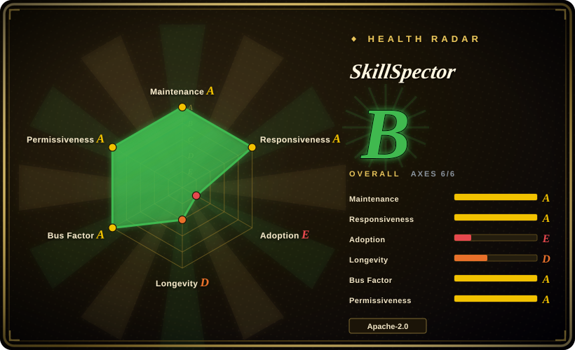

# SkillSpector

NVIDIA's Python CLI and MCP server for scanning AI agent skills before installation, combining static pattern checks, AST/YARA/OSV analysis, optional LLM semantic review, baselines, and JSON/Markdown/SARIF output.

## When to use

You're maintaining a coding-agent harness, skill marketplace, or internal agent plugin workflow, and agents are starting to install third-party `SKILL.md` bundles from GitHub, zip files, local directories, or MCP-adjacent packages. The risk is not generic model quality; it is whether an untrusted skill contains prompt injection, data exfiltration, excessive agency, dangerous scripts, tool poisoning, or vulnerable dependencies. You use SkillSpector as a pre-install or CI gate that returns a risk score, severity, recommendation, findings, and machine-readable output.

Pick it when your governance need is specifically **skill safety scanning**. It is more focused than a broad agent-governance framework: it scans one target, can run static-only with `--no-llm`, can optionally send file contents to a configured LLM provider for semantic review, supports baselines for accepted findings, emits SARIF for CI/IDE integration, and can expose a `scan_skill` MCP tool.

## When NOT to use

- **You need runtime policy enforcement around live agent tool calls.** Use [agent-governance-toolkit](agent-governance-toolkit.md) when the problem is policy-gating actions, identity, audit trails, and framework adapters at runtime; SkillSpector is an install-time/static scanner.
- **You need an isolation boundary.** Use containers, sandboxes, restricted permissions, or OS-level controls when untrusted skills may execute; SkillSpector's README states it never executes scanned skills and does not sandbox the host.
- **You cannot send skill contents to third-party LLM providers.** Run `--no-llm` or choose a local/CLI provider; the README says LLM analysis sends file contents to the configured provider.
- **You require perfect detection across languages, images, binaries, or runtime behavior.** The README lists limitations for non-English content, image-based attacks, encrypted/binary code, runtime behavior, and offline OSV coverage.
- **You only need broad cybersecurity playbooks.** Use [Anthropic Cybersecurity Skills](../agent-skills/security/anthropic-cybersecurity-skills.md) for security runbooks; SkillSpector is a scanner, not an analyst playbook pack.
- **You only need a small hand review of one trusted skill.** A manual source review may be cheaper for a single internal skill; SkillSpector pays off when scanning is repeated, automated, or needs JSON/SARIF evidence.

## Comparison

| Alternative | In index | Our verdict | Tradeoff |
|---|---|---|---|
| [agent-governance-toolkit](agent-governance-toolkit.md) | ✅ | Choose AGT when runtime governance and policy/audit integration are required; choose SkillSpector when the immediate question is whether a skill is safe to install. | AGT is broader and heavier at runtime; SkillSpector is narrower, scanner-first, and easier to wire into install gates. |
| [Anthropic Cybersecurity Skills](../agent-skills/security/anthropic-cybersecurity-skills.md) | ✅ | Choose Anthropic Cybersecurity Skills for agent-loaded cybersecurity runbooks; choose SkillSpector to inspect skills for malicious or risky patterns. | One teaches an agent security work; the other evaluates the safety of the skill artifact itself. |
| Semgrep | 未收录 | Choose Semgrep for general code static analysis; choose SkillSpector for agent-skill-specific rules such as prompt injection, MCP poisoning, and excessive agency. | Semgrep is mature and language-general; SkillSpector encodes agent-skill threat categories and risk scoring. |
| OpenSSF Scorecard | 未收录 | Choose Scorecard for repository supply-chain posture; choose SkillSpector for scanning the content of a skill before installation. | Scorecard evaluates repo hygiene; SkillSpector inspects skill files, scripts, dependencies, and prompt-level instructions. |
| Manual review checklist | 未收录 | Choose manual review for one trusted internal skill; choose SkillSpector when you need repeatable JSON/SARIF evidence and baseline suppression. | Manual review has better context but poor repeatability; SkillSpector is automatable but still has false positives and blind spots. |

## Tech stack

- **Python 3.12+ package** with a Typer CLI entry point named `skillspector` and a LangGraph workflow engine.
- **Analyzers** include static regex/pattern checks, Python AST behavioral analysis, taint tracking, YARA signatures, OSV.dev dependency lookup, MCP least-privilege/tool-poisoning checks, and optional LLM semantic analysis.
- **Outputs** include terminal, JSON, Markdown, and SARIF; baseline suppression is documented through `.skillspector-baseline.yaml`.
- **Integrations** include a Dockerfile, an MCP server (`skillspector mcp`), and a Pi extension tool wrapper.

## Dependencies

- **Runtime:** Python `>=3.12,<3.15`; `uv` is the documented quick install path, with source installs through `make install` or `make install-dev`.
- **Python dependencies:** README/`pyproject.toml` list Typer, Rich, HTTPX, PyYAML, Pydantic, OpenAI/LangChain/LangGraph/Anthropic/AWS/NVIDIA provider packages, boto3, LangSmith, and `yara-python`.
- **Network egress:** OSV.dev dependency lookup is used for live CVE data; LLM analysis sends file contents to the configured provider unless `--no-llm` is used.
- **Optional deployment:** Docker image for isolated CLI runs; `skillspector[mcp]` extra for MCP server mode.

## Ops difficulty

**Medium.** Static scans are straightforward (`uv tool install git+https://github.com/NVIDIA/skillspector.git` then `skillspector scan ... --no-llm`), but production use means deciding gate policy for `SAFE`/`CAUTION`/`DO_NOT_INSTALL`, managing false-positive baselines, handling provider credentials if LLM analysis is enabled, and documenting data egress to OSV.dev and LLM providers.

## Health & viability

- **Maintenance snapshot (2026-07-16):** GitHub reports `archived=false`, default branch `main`, and last push on 2026-07-14.
- **Adoption snapshot:** GitHub reports ~13.3k stars and 1,084 forks as of 2026-07-16; `pyproject.toml` reports version `2.3.13` and Development Status `3 - Alpha`.
- **License snapshot:** Apache-2.0 verified from GitHub metadata, README badge, `pyproject.toml`, and root `LICENSE`.
- **Governance / backing:** organization-owned by NVIDIA, with public GitHub CI plus documented internal GitLab validation in the development guide.
- **Risk flags:** very young project, high open-issue count, scanner false positives/false negatives, and explicit data-egress implications for LLM and OSV modes.

## Caveats (unverified)

- [未验证] This pass read README, LICENSE, `pyproject.toml`, development docs, Pi extension docs, GitHub metadata, and the repo tree; it did not install or run SkillSpector locally.
- [未验证] The README cites research statistics about vulnerable/malicious skills; this page did not independently verify that paper or dataset.
- [未验证] Provider defaults and model names in the README can change quickly; verify current config before relying on a specific LLM backend.
- [推断] Because SkillSpector combines static heuristics and optional LLM review, results should be treated as triage evidence, not proof that a skill is safe.
