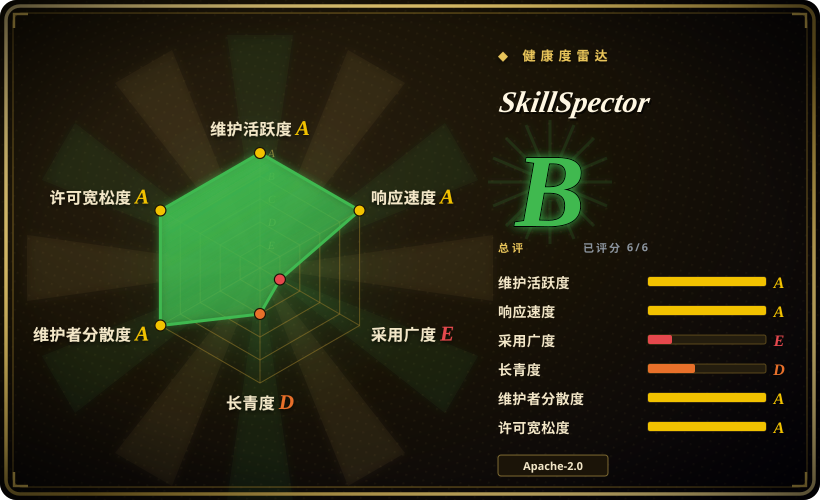

# SkillSpector

NVIDIA 的 Python CLI 与 MCP server，用于在安装 AI agent skill 前扫描风险，组合静态模式检查、AST/YARA/OSV 分析、可选 LLM 语义评审、baseline、JSON/Markdown/SARIF 输出。

## 何时使用

你在维护 coding-agent harness、skill marketplace 或内部 agent plugin 流程，agent 开始从 GitHub、zip、本地目录或 MCP 邻近包安装第三方 `SKILL.md`。风险不是泛泛的模型质量，而是未受信 skill 是否包含 prompt injection、数据外传、过度自主、危险脚本、tool poisoning 或有漏洞的依赖。你用 SkillSpector 作为安装前或 CI gate，得到 risk score、severity、recommendation、findings 和机器可读输出。

当治理需求明确是 **skill 安全扫描** 时选它。它比宽泛 agent-governance framework 更聚焦：扫描一个 target，可用 `--no-llm` 做纯静态扫描，也可把文件内容发给配置好的 LLM provider 做语义评审，支持 accepted findings baseline，能输出 SARIF 接入 CI/IDE，也能暴露 `scan_skill` MCP tool。

## 何时不用

- **你需要 live agent tool call 的运行时策略执行。** 问题是运行时 action policy、身份、审计和 framework adapter 时，用 [agent-governance-toolkit](agent-governance-toolkit.zh.md)；SkillSpector 是安装前／静态 scanner。
- **你需要隔离边界。** 未受信 skill 可能执行时，用容器、沙箱、受限权限或 OS 级控制；SkillSpector README 说明它不会执行被扫描 skill，也不隔离 host。
- **你不能把 skill 内容发给第三方 LLM provider。** 用 `--no-llm` 或选择本地／CLI provider；README 说明启用 LLM analysis 时会把文件内容发送给配置的 provider。
- **你要求跨语言、图片、二进制或运行时行为的完美检测。** README 明确列出非英语内容、图片攻击、加密／二进制代码、运行时行为和离线 OSV 覆盖的限制。
- **你只需要宽泛网络安全 playbook。** 安全 runbook 用 [Anthropic Cybersecurity Skills](../agent-skills/security/anthropic-cybersecurity-skills.zh.md)；SkillSpector 是 scanner，不是 analyst playbook 包。
- **你只要手动审一个可信内部 skill。** 单个内部 skill 手审可能更便宜；当扫描要重复、自动化，或需要 JSON/SARIF 证据时，SkillSpector 更有价值。

## 横向对比

| 替代品 | 是否收录 | 我们的评价 | 取舍 |
|---|---|---|---|
| [agent-governance-toolkit](agent-governance-toolkit.zh.md) | ✅ | 需要运行时治理和 policy/audit 集成时选 AGT；眼前问题是 skill 是否安全可安装时选 SkillSpector。 | AGT 更宽、更重、偏运行时；SkillSpector 更窄，scanner-first，更容易接到安装闸门。 |
| [Anthropic Cybersecurity Skills](../agent-skills/security/anthropic-cybersecurity-skills.zh.md) | ✅ | 需要 agent 加载的网络安全 runbook 时选 Anthropic Cybersecurity Skills；要检查 skill artifact 是否有恶意或风险模式时选 SkillSpector。 | 一个教 agent 做安全工作；另一个评估 skill artifact 本身的安全性。 |
| Semgrep | 未收录 | 通用代码静态分析选 Semgrep；需要 prompt injection、MCP poisoning、excessive agency 等 agent-skill 专项规则时选 SkillSpector。 | Semgrep 成熟且语言通用；SkillSpector 编码了 agent-skill 威胁类别和风险评分。 |
| OpenSSF Scorecard | 未收录 | 评估仓库供应链姿态选 Scorecard；安装前扫描 skill 内容选 SkillSpector。 | Scorecard 看 repo hygiene；SkillSpector 看 skill 文件、脚本、依赖和 prompt-level 指令。 |
| 手动评审清单 | 未收录 | 单个可信内部 skill 可手审；需要可重复 JSON/SARIF 证据和 baseline suppression 时选 SkillSpector。 | 手审上下文更强但复用差；SkillSpector 可自动化，但仍有误报和盲区。 |

## 技术栈

- **Python 3.12+ package**，Typer CLI 入口为 `skillspector`，核心是 LangGraph workflow engine。
- **分析器**包括静态 regex/pattern 检查、Python AST 行为分析、taint tracking、YARA signature、OSV.dev 依赖漏洞查询、MCP least-privilege/tool-poisoning 检查，以及可选 LLM 语义分析。
- **输出**包括 terminal、JSON、Markdown 和 SARIF；通过 `.skillspector-baseline.yaml` 做 baseline suppression。
- **集成**包括 Dockerfile、MCP server（`skillspector mcp`）和 Pi extension tool wrapper。

## 依赖

- **运行时：** Python `>=3.12,<3.15`；文档推荐用 `uv` 快速安装，也可源码 `make install` 或 `make install-dev`。
- **Python 依赖：** README/`pyproject.toml` 列出 Typer、Rich、HTTPX、PyYAML、Pydantic、OpenAI/LangChain/LangGraph/Anthropic/AWS/NVIDIA provider 包、boto3、LangSmith 和 `yara-python`。
- **网络外连：** OSV.dev 依赖查询用于实时 CVE 数据；除非使用 `--no-llm`，LLM analysis 会把文件内容发送给配置的 provider。
- **可选部署：** Docker image 用于隔离 CLI 运行；MCP server 模式需要 `skillspector[mcp]` extra。

## 运维难度

**中等。** 静态扫描很直接（`uv tool install git+https://github.com/NVIDIA/skillspector.git` 后 `skillspector scan ... --no-llm`），但生产接入要决定 `SAFE`/`CAUTION`/`DO_NOT_INSTALL` 的 gate policy，维护 false-positive baseline，启用 LLM 分析时管理 provider credentials，并记录 OSV.dev 与 LLM provider 的数据外传边界。

## 健康度与可持续性

- **维护快照（2026-07-16）：** GitHub 显示 `archived=false`，默认分支为 `main`，最近 push 是 2026-07-14。
- **采用快照：** GitHub 在 2026-07-16 显示约 13.3k stars 和 1,084 forks；`pyproject.toml` 显示版本 `2.3.13`，Development Status 为 `3 - Alpha`。
- **许可证快照：** Apache-2.0 已由 GitHub metadata、README badge、`pyproject.toml` 和根目录 `LICENSE` 核验。
- **治理 / backing：** NVIDIA 组织拥有；development guide 记录了 public GitHub CI 和内部 GitLab validation。
- **风险信号：** 项目很年轻、open issue 数较高、scanner 有误报／漏报，LLM 与 OSV 模式有明确数据外传影响。

## 存疑（未验证）

- [未验证] 本轮读取了 README、LICENSE、`pyproject.toml`、development docs、Pi extension docs、GitHub metadata 和 repo tree；没有在本机安装或运行 SkillSpector。
- [未验证] README 引用的 vulnerable/malicious skill 研究统计，本页没有独立核验论文或数据集。
- [未验证] README 中的 provider 默认值和模型名变化可能很快；依赖具体 LLM backend 前请核对当前配置。
- [推断] 因 SkillSpector 组合静态启发式与可选 LLM review，结果应视为 triage 证据，而不是 skill 安全性的证明。
