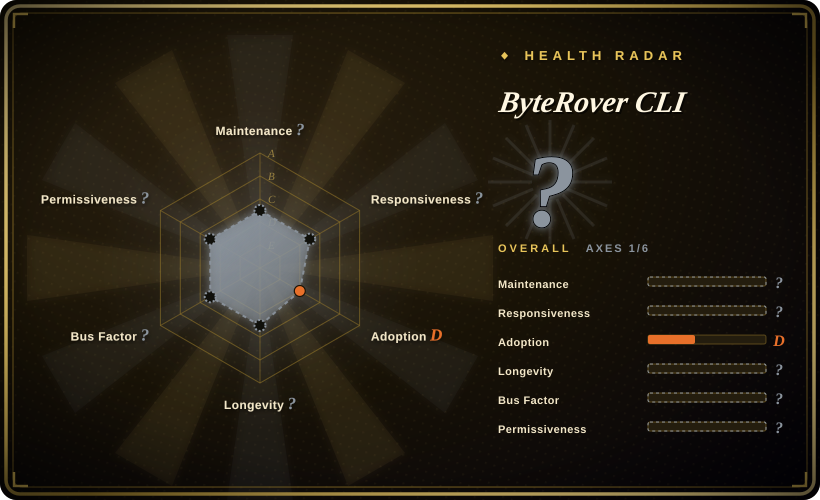

# ByteRover CLI

A portable memory layer for autonomous coding agents (formerly Cipher) — structured context trees with git-like versioning, cloud sync, and MCP integration.

## When to use

You're a developer who runs AI coding agents across multiple sessions and keeps losing context. You've tried relying on the agent's built-in memory, but it forgets project conventions, architectural decisions, and your personal coding style between sessions. You install ByteRover CLI (`brv`) in your project directory, and it builds an interactive REPL that understands your codebase through an agentic map, reads and writes files, executes code, and stores knowledge in a persistent context tree. You can version-control that context tree with git-like commands (branch, commit, merge, push/pull), sync it to the cloud for access across machines, and share it with teammates. It works with 20+ LLM providers and integrates with 22+ AI coding agents via MCP.

## When NOT to use

- **You want a simple, well-established memory solution.** ByteRover is extremely young (created 2025-06) and pre-1.0. The context-tree abstraction, git-like versioning, and cloud sync are novel but unproven at scale. If you need battle-tested agent memory, consider [Mem0](mem0.md) or [Memori](memori.md). [推断]
- **You don't want to add another dependency layer.** ByteRover sits between your coding agent and your project, adding a CLI tool, a web dashboard, and optionally a cloud backend. If you want minimal overhead, a simpler wrapper or direct prompt engineering might be lighter.
- **You need a library you can embed in your own application.** ByteRover is primarily a CLI tool and REPL (`brv`), not a clean embeddable library with a simple API. If you need to add memory to a custom agent framework you built, you may find the CLI-centric design constraining. [推断]
- **You are sensitive to license ambiguity.** The GitHub metadata reports `NOASSERTION` (no recognized license), while the README shows an "Elastic 2.0" badge. The license situation needs clarification before commercial use. [未验证]
- **You don't want cloud sync or external dependencies.** While local-only use is possible, the product's value proposition includes cloud sync and a hub ecosystem. If you want fully offline, air-gapped memory, the cloud-centric design may be a mismatch. [推断]
- **You need enterprise-grade security or compliance.** The project is young, small, and the security model of the cloud sync and MCP integration has not been independently audited. [推断]

## Comparison

| Alternative | In index | Our verdict | Tradeoff |
|---|---|---|---|
| [Mem0](mem0.md) | ✅ | Mature, LLM-agnostic memory API with strong adoption and cloud service. | A hosted API-first memory service with broader ecosystem support; less focus on local CLI and git-like versioning than ByteRover. |
| [Memori](memori.md) | ✅ | Lightweight wrapper for adding persistent memory to existing LLM clients. | Simpler to adopt — wraps your existing client without a new CLI or context tree; less structured than ByteRover's approach. |
| [claude-mem](claude-mem.md) | ✅ | Hook/MCP memory wired into Claude Code's session lifecycle. | Tightly coupled to Claude Code; not a general-purpose cross-agent memory layer like ByteRover. |
| MemGPT / Letta | 未收录 | Academic research project turned commercial for LLM memory management. | Deep research roots in memory management for LLMs; commercial service with a different pricing and integration model. |
| Cognee | 未收录 | Open-source memory layer for AI agents with graph-based recall. | Graph-based memory with a different abstraction; younger and less proven than Mem0. |

## Tech stack

- **TypeScript** — primary implementation language.
- **Node.js** — runtime for the CLI and web dashboard.
- **React / Ink** — the interactive TUI REPL interface.
- **MCP (Model Context Protocol)** — integration with coding agents.
- **Cloud backend** — sync and hub services (optional, for push/pull).

## Dependencies

- **Node.js runtime** for the CLI and dashboard.
- **LLM provider** — one of 20+ supported providers (Anthropic, OpenAI, Google, Groq, Mistral, xAI, DeepSeek, etc.).
- **Optional: cloud account** — for sync, push/pull, and the hub ecosystem.
- **Project workspace** — ByteRover operates within a project directory, building an agentic map of the codebase.

## Ops difficulty

**Low to medium.** Installation is via npm (`npm install -g byterover-cli`). The CLI is self-contained, and local-only use requires no server setup. The medium difficulty comes from integrating it into your agent workflow: configuring the MCP integration, deciding what belongs in the context tree, and managing cloud sync if you use it. Because the project is young and pre-1.0, expect breaking changes and evolving configuration.

## Health & viability

- **Maintenance — very active for a young project.** Pushed 2026-06-25; not archived. The project is under rapid development with frequent updates, but the entire codebase is only about a year old. [推断]
- **Governance — organization-owned, small team.** Owned by the `campfirein` organization. The bus factor is unknown but likely small given the project's youth and modest star count. [推断]
- **Age & Lindy — extremely young, no Lindy signal.** Created 2025-06. At roughly one year old, this is a brand-new project with no proven longevity. The high star count (~4.9k) relative to its age suggests early interest, but that is hype, not durability. [推断]
- **Adoption & ecosystem — early stage, niche interest.** ~4.9k stars, ~450 forks. The ecosystem of connectors, skills, and bundles is nascent. It claims compatibility with 22+ coding agents, but the depth of each integration is unverified. [未验证]
- **Risk flags — license ambiguity and extreme youth.** The `NOASSERTION` GitHub metadata vs. Elastic 2.0 badge on the README is a red flag for commercial use. The project is also a recent rebrand (formerly "Cipher"), which adds identity risk. [推断]

## Caveats (unverified)

- [未验证] Repo facts as of 2026-07-01 via GitHub API: created 2025-06-19, last push 2026-06-25, not archived, ~4.9k stars, ~453 forks, NOASSERTION license in metadata, language reported as TypeScript, owner type Organization.
- [未验证] The README shows an "Elastic 2.0" license badge, but GitHub metadata reports `NOASSERTION`. The actual license file and terms need verification before any commercial use.
- [未验证] The "20+ LLM providers", "24 built-in agent tools", "22+ AI coding agents" compatibility claims, and the cloud sync features are from the README; exact coverage and stability are not independently verified.
- [推断] The project was formerly named "Cipher" (as noted in the GitHub description: "formerly Cipher"); the rebrand timeline and any breaking changes from the old name are not documented here.
- [未验证] The "agentic map" of the codebase, context-tree versioning, and the web dashboard features are described in the README but not independently tested or verified.
- [推断] With ~4.9k stars on a repo created in mid-2025, the star count may reflect marketing or early hype rather than sustained production adoption.
