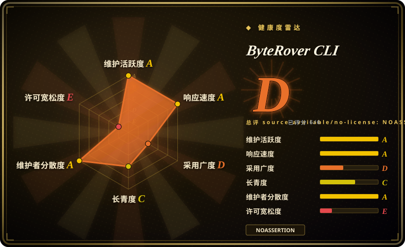

# ByteRover CLI

面向自主编码 agent 的可移植记忆层（原名为 Cipher）——带 git 式版本控制、云同步和 MCP 集成的结构化上下文树。

## 何时使用

你是一名开发者，在多个会话中运行 AI 编码 agent，却不断丢失上下文。你试过依赖 agent 内置的记忆，但它在会话之间遗忘了项目约定、架构决策和个人编码风格。你在项目目录里安装 ByteRover CLI（brv），它会构建一个交互式 REPL，通过 agentic 映射理解你的代码库，读写文件、执行代码，并将知识存储在持久的上下文树中。你可以用 git 式命令（branch、commit、merge、push/pull）对这个上下文树做版本控制，跨机器同步到云端，并与团队成员共享。它支持 20 余家 LLM 提供商，通过 MCP 与 22 余种 AI 编码 agent 集成。

## 何时不用

- **你想要简单、成熟稳定的记忆方案。** ByteRover 极其年轻（2025-06 创建），尚未到 1.0。上下文树抽象、git 式版本控制和云同步都是新颖的，但规模上未经检验。如果你需要久经沙场的 agent 记忆，请考虑 [Mem0](mem0.zh.md) 或 [Memori](memori.zh.md)。[推断]
- **你不想增加额外的依赖层。** ByteRover 夹在你的编码 agent 和项目之间，增加了 CLI 工具、Web 仪表盘，以及可选的云端后端。如果你想要最小开销，更简单的包装层或直接调优提示词可能更轻。
- **你需要一个可嵌入自己应用的库。** ByteRover 主要是一个 CLI 工具和 REPL（brv），不是一个干净、可嵌入、带简单 API 的库。如果你需要为自建 agent 框架添加记忆，CLI 中心的设计可能带来限制。[推断]
- **你对许可模糊敏感。** GitHub 元数据报告 NOASSERTION（无识别许可证），而 README 显示「Elastic 2.0」徽章。商业使用前需要澄清许可情况。[未验证]
- **你不想要云同步或外部依赖。** 虽然可以仅本地使用，但产品的价值主张包括云同步和 hub 生态。如果你想要完全离线、气隙隔离的记忆，云中心的设计可能不匹配。[推断]
- **你需要企业级安全或合规。** 项目年轻、体量小，云同步和 MCP 集成的安全模型未经独立审计。[推断]

## 横向对比

| 替代品 | 是否收录 | 我们的评价 | 取舍 |
|---|---|---|---|
| [Mem0](mem0.zh.md) | ✅ | 成熟、LLM 无关的记忆 API，采用度高，带云服务。 | 托管 API 优先的记忆服务，生态支持更广；不如 ByteRover 聚焦本地 CLI 和 git 式版本控制。 |
| [Memori](memori.zh.md) | ✅ | 轻量级包装器，为现有 LLM 客户端添加持久记忆。 | 更易采用——包裹现有客户端，无需新 CLI 或上下文树；结构不如 ByteRover 丰富。 |
| [claude-mem](claude-mem.zh.md) | ✅ | 接入 Claude Code 会话生命周期的 hook/MCP 记忆。 | 与 Claude Code 紧耦合；不是像 ByteRover 这样通用的跨 agent 记忆层。 |
| MemGPT / Letta | 未收录 | 学术研究项目转商业化，用于 LLM 记忆管理。 | 在 LLM 记忆管理上有深厚的研究根基；商业服务和集成模式不同。 |
| Cognee | 未收录 | 面向 AI agent 的开源记忆层，基于图召回。 | 基于图的记忆，抽象不同；比 Mem0 更年轻、更未经检验。 |

## 技术栈

- **TypeScript** —— 主要实现语言。
- **Node.js** —— CLI 和 Web 仪表盘的运行时。
- **React / Ink** —— 交互式 TUI REPL 界面。
- **MCP（Model Context Protocol）** —— 与编码 agent 集成。
- **云端后端** —— 同步和 hub 服务（可选，用于 push/pull）。

## 依赖

- **Node.js 运行时** —— 用于 CLI 和仪表盘。
- **LLM 提供商** —— 20 余家支持的提供商之一（Anthropic、OpenAI、Google、Groq、Mistral、xAI、DeepSeek 等）。
- **可选：云端账户** —— 用于同步、push/pull 和 hub 生态。
- **项目工作区** —— ByteRover 在项目目录内运作，构建代码库的 agentic 映射。

## 运维难度

**低到中等。** 安装通过 npm（npm install -g byterover-cli）。CLI 自包含，仅本地使用无需服务器设置。中等难度来自把它集成进 agent 工作流：配置 MCP 集成、决定什么该放进上下文树、以及如果使用的话管理云同步。因为项目年轻且未到 1.0，请预期破坏性改动和不断演变的配置。

## 健康度与可持续性

- **维护——对年轻项目而言非常活跃。** 最后推送 2026-06-25；未归档。项目处于快速开发中，更新频繁，但整个代码库只有约一年历史。[推断]
- **治理——组织所有，小团队。** 由 campfirein 组织所有。bus factor 未知，但鉴于项目年轻和 modest 的 star 数，很可能很小。[推断]
- **年龄与 Lindy——极其年轻，没有 Lindy 信号。** 2025-06 创建。大约一岁，这是一个全新的项目，没有已验证的耐久性。相对于年龄而言约 4.9k star 较高，暗示早期兴趣，但这是炒作而非耐久性。[推断]
- **采用与生态——早期阶段，小众兴趣。** 约 4.9k star、约 450 fork。连接器、技能和 bundle 生态尚处萌芽。它声称兼容 22 种编码 agent，但每种集成的深度未经检验。[未验证]
- **风险信号——许可模糊和极度年轻。** GitHub 元数据 NOASSERTION 与 README 上的 Elastic 2.0 徽章之间的差异，对商业使用是 red flag。项目也是近期改名（原名为「Cipher」），增加了身份风险。[推断]

## 存疑（未验证）

- [未验证] 仓库事实，截至 2026-07-01 经 GitHub API：2025-06-19 创建、最后推送 2026-06-25、未归档、约 4.9k star、约 453 fork、NOASSERTION 许可证（元数据）、语言报告为 TypeScript、owner 类型为 Organization。
- [未验证] README 显示「Elastic 2.0」许可证徽章，但 GitHub 元数据报告 NOASSERTION。商业使用前必须核实实际许可证文件和条款。
- [未验证] 「20+ LLM 提供商」「24 内置 agent 工具」「22+ AI 编码 agent」兼容声明及云同步功能来自 README；实际覆盖范围和稳定性未经独立验证。
- [推断] 项目原名为「Cipher」（如 GitHub 描述所述：formerly Cipher）；从旧名 rebranded 的时间线和任何破坏性变更未在此记录。
- [未验证] 代码库的「agentic 映射」、上下文树版本控制和 Web 仪表盘功能在 README 中有描述，但未独立测试或验证。
- [推断] 约 4.9k star 对于 2025 年中创建的仓库而言，可能反映营销或早期炒作，而非持续的生产级采用。
