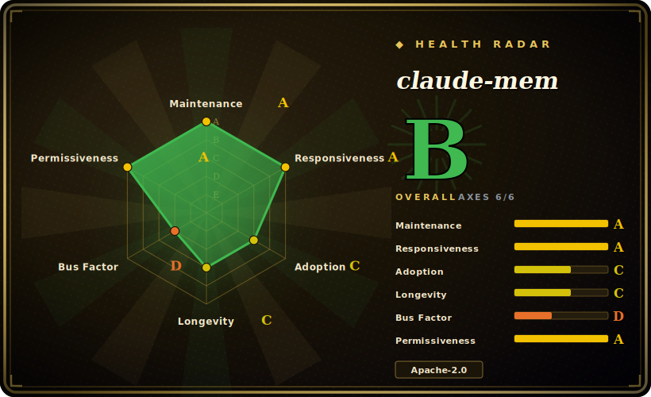

# claude-mem

A hook/MCP-based memory layer for coding agents: it captures everything an agent does during a session, compresses it with an LLM, and injects the relevant slices back into future sessions — local SQLite + vector store, no hosted backend.

## When to use

You're a Claude Code (or Codex / Gemini / Copilot / OpenCode) power user who burns the first ten minutes of every session re-establishing context: which files matter, what you decided yesterday, why that refactor stalled. Worse, you hit `/clear` mid-task to reclaim context window and watch all of that working memory evaporate — the agent forgets the constraint you just spent three turns explaining. You don't want to hand-maintain a sprawling CLAUDE.md, and you don't want a cloud memory service that ships your transcripts off-box. You install claude-mem with `npx claude-mem install`; it wires lifecycle hooks (`SessionStart`, `UserPromptSubmit`, `PostToolUse`, `Stop`, `SessionEnd`) so that when a session ends it captures the activity, an LLM compresses it into observations, and on your next session start the relevant context is searched out of a local store and injected back into the prompt — surviving both session boundaries and `/clear`.

It fits when you want this *across* tools, not bound to one agent: the same memory backend serves Claude Code, Codex, Gemini, Copilot, OpenClaw, Hermes, and OpenCode through hooks and an MCP interface (`search`, `timeline`, `get_observations`), with everything stored locally in SQLite (FTS5) plus a Chroma vector index. If you want the captured history kept on your machine and queryable — and you're comfortable running a local HTTP service and the Bun/uv toolchain it depends on — this is the local-first option for cross-session agent memory.

## When NOT to use

- **You need memory inside your own application, not your coding agent.** claude-mem is a *developer-workstation* tool wired into agent hooks. If you're embedding user memory into an app you ship (a chatbot, a support agent), a model-agnostic memory **library/API** like [Mem0](mem0.md) or [Memori](memori.md) is the right shape — claude-mem has no SDK you call from product code.
- **Single-developer maintenance / abandonment risk.** The project is authored by one developer (`@thedotmack`). It moves fast (v13.x in 2026), but a hook tool sitting in your every-session critical path from a single maintainer is a bus-factor-of-one dependency — weigh that before making it load-bearing.
- **You want a hosted, multi-tenant memory service.** It is self-hosted and local-only (install via `npx`, data in local SQLite, HTTP API on `localhost:37777`). There's no managed multi-tenant backend to share memory across a team or fleet; it's per-developer-machine.
- **Privacy of captured session data.** By design it captures *everything the agent does* — file contents, commands, outputs — and an LLM compresses it. Data stays local and `<private>` tags can exclude content from storage, but you're standing up a process that records your work; on a sensitive repo, audit what lands in the store and whether the compression step calls an external model.
- **You distrust the popularity signal.** The ~84.8k star count is API-verified, but it is extreme for a young, single-developer tool and its production-adoption/vetting meaning is unverified and suspicious `[未验证]`; do not adopt it *because* it looks widely vetted — evaluate the code and your own constraints, not the star count.

## Comparison

| Alternative | In index | Our verdict | Tradeoff |
|---|---|---|---|
| [Mem0](mem0.md) | ✅ | Use this page for its stated niche; choose Mem0 when you need model-agnostic memory **library/API** you embed in your own agent code (Python/TS, any LLM). | Model-agnostic memory **library/API** you embed in your own agent code (Python/TS, any LLM); built for app-embedded user memory. claude-mem is a workstation hook tool for coding agents, not a library you call. |
| [Memori](memori.md) | ✅ | Use this page for its stated niche; choose Memori when you need SQL-first memory engine you wrap your LLM client with. | SQL-first memory engine you wrap your LLM client with; framework-agnostic, with a cloud/BYODB split. claude-mem is local-only and hook-driven, scoped to coding-agent sessions rather than app memory. |
| [Claude Subconscious](claude-subconscious.md) | ✅ | Use this page for its stated niche; choose Claude Subconscious when you need closest shape: a Claude Code hook plugin doing cross-session memory. | Closest shape: a Claude Code hook plugin doing cross-session memory — but it's a Letta-backed *demo* explicitly "not for production" and Claude-Code-only. claude-mem is local-store (SQLite+Chroma), multi-agent, and positions as a real install. |
| Letta (MemGPT) | 未收录 | Use this page for its stated niche; choose Letta (MemGPT) when you need stateful agent runtime with a self-editing memory OS and a server. | Stateful agent runtime with a self-editing memory OS and a server; owns the agent loop. claude-mem slots under your existing agents via hooks rather than replacing them. |
| Zep / Graphiti | 未收录 | Use this page for its stated niche; choose Zep / Graphiti when you need temporal knowledge-graph memory service with explicit fact invalidation. | Temporal knowledge-graph memory service with explicit fact invalidation; a hosted/self-host backend for app memory, not a per-developer coding-agent hook layer. |

## Tech stack

- **Language:** JavaScript / TypeScript (repo is ~55% JavaScript, ~42% TypeScript per GitHub's linguist estimate).
- **Capture surface:** five Claude Code lifecycle hooks (`SessionStart`, `UserPromptSubmit`, `PostToolUse`, `Stop`, `SessionEnd`) plus an MCP server exposing `search`, `timeline`, and `get_observations`.
- **Storage:** local **SQLite** with **FTS5** full-text search, plus a **Chroma** vector database for semantic/keyword retrieval.
- **Process model:** a local **HTTP API on port 37777**; runs under **Bun** as the JS runtime/process manager; **uv** used as the Python package manager (for the Chroma side).
- **Compression:** an LLM pass compresses captured session activity into stored observations before injection.
- **Distribution:** plugin-marketplace integration plus `npx claude-mem install`.

## Dependencies

- **A supported coding agent:** Claude Code, Codex, Gemini, Copilot, OpenCode, OpenClaw, or Hermes — claude-mem hooks into the agent's lifecycle; it is not standalone.
- **Node.js ≥ 20.0.0** (per README).
- **Bun** (JS runtime / process manager) and **uv** (Python package manager) — both required by the install path (whether either can be substituted is unconfirmed).
- **Chroma** vector database and a **SQLite** file — provisioned locally by the installer.
- **An LLM for the compression step** — the README's headline is "compresses it with AI"; whether this uses your agent's own model or a separately configured one is not spelled out. `[未验证]`
- **Install:** `npx claude-mem install`; a local service then listens on `localhost:37777`.

## Ops difficulty

**Low-to-medium, on a single workstation.** The install is one `npx` command and a hook wiring; there's no server fleet, no multi-tenant backend, no clustering — everything is local. The medium part is the moving-parts count for a *memory* tool: a long-running HTTP service on a fixed port (37777 — collisions and stale processes are a real failure mode), a Bun runtime, a `uv`-managed Python side for Chroma, and a SQLite + vector store you now own (size growth, corruption, backups are yours). Failures in async capture at session boundaries can be silent to the foreground, and an LLM compression step on capture adds latency and a token cost per session. It's "install and forget" until the local stack drifts — then you're debugging a port, a runtime, and two datastores on your own machine.

## Health & viability

- **Maintenance — very active (as of 2026-06).** Last push 2026-06; latest release v13.8.0 (2026-06-21); not archived. Fast-moving with a high major version on a young project — actively maintained, but the unusual versioning is itself a thing to verify against the live repo.
- **Governance & bus factor — single developer, star/maturity mismatch ⇒ strong red flag.** A `User`-owned repo (`@thedotmack`) sitting in your every-session critical path is a bus-factor-of-one dependency. The ~84.8k star count is API-verified, but it is wildly disproportionate for a young single-developer hook tool and its production-adoption/vetting meaning is unverified and suspicious — treat popularity as decoupled from vetting, not as adoption evidence. [未验证]
- **Age & Lindy — young, unproven.** Created 2025-08, ~10 months old (as of 2026-06). Active but no track record; young-and-hyped, not Lindy-safe — do not adopt *because* it looks widely vetted.
- **Risk flags — data capture + local-stack ownership.** Apache-2.0 (no relicense risk), but by design it records everything the agent does and runs an LLM compression step whose model/egress is under-documented; you also own the local SQLite+Chroma stack. Privacy and bus-factor are the dominant risks, not licensing.

## Caveats (unverified)

- `[未验证]` **~84.8k GitHub stars as of 2026-06: the count is API-verified, but its production-adoption/vetting meaning is unverified and suspicious** — that figure is wildly disproportionate for a young, single-developer hook tool. Treat the count's adoption/vetting meaning as unverified and *not* as evidence of adoption or vetting; GitHub stars are unreliable and date-sensitive regardless.
- `[未验证]` v13.8.0 released 2026-06-21 (per the repo). The very high major version on a young project is itself unusual — verify the release cadence against the live repo.
- `[未验证]` Supported-agent list (Claude Code, Codex, Gemini, Copilot, OpenCode, OpenClaw, Hermes) is the README's own framing; depth/parity of support per agent is not independently confirmed.
- `[未验证]` The LLM used for the compression step, and whether any data leaves the box during compression, is not clearly documented — confirm before pointing it at sensitive repos.
- `[未验证]` Language split (~55% JS, ~42% TS) is GitHub's linguist estimate.
- `[推断]` `uv`/Python is present for the Chroma vector-store component; the exact division of labor between the Bun and Python sides is inferred, not stated.
- `[推断]` Hook names and MCP tool names are taken from the README; behavior at each hook was not inspected in source.
