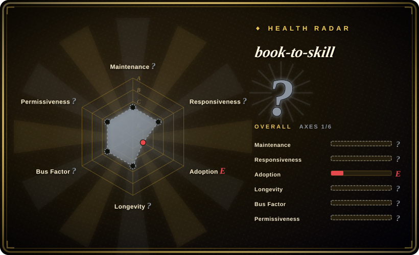

# book-to-skill

A Python CLI tool that turns technical book PDFs (and other document formats) into structured agent skills — installable into Claude Code, GitHub Copilot CLI, Amp, and other skill-capable harnesses.

## When to use

You're a software engineer who has accumulated a shelf of technical PDFs — language specs, framework guides, algorithm references — and you want your coding agent (Claude Code, Copilot CLI, Amp) to have that knowledge on tap while you work. Instead of manually summarizing each book or copying excerpts into context, you want a repeatable pipeline: feed the PDF into a tool, get back a structured skill with chunked, referenceable content that the agent can load on demand. You install book-to-skill, point it at a PDF directory, and it generates a skill pack ready to install into your agent harness — turning static documents into living, queryable expertise.

## When NOT to use

- **Non-technical or narrative books.** The tool is optimized for technical documentation with structured headings, code examples, and reference material. Novels, essays, and unstructured prose will not yield useful skills.
- **Documents you don't own or can't process.** Copyrighted material without appropriate rights cannot be processed. The tool is for your own documents and public-domain or licensed technical content.
- **Real-time query needs.** This is a batch conversion tool, not a live RAG system. If you need dynamic retrieval over a large document corpus with embeddings and semantic search, use a proper RAG pipeline (e.g., FAISS + vector DB).
- **You need editing or authoring features.** The tool extracts and structures content; it does not let you edit, annotate, or augment the source material after conversion.
- **Agent harness without skill support.** If your coding agent doesn't support the Agent Skills standard (SKILL.md) or plugin installation, the generated output won't be loadable.
- **High-frequency updates.** If the source document changes frequently, you'll need to re-run the conversion pipeline each time. A live integration with the document source would be more appropriate.
- **Production-grade accuracy requirements.** The extraction and chunking are heuristic-based; subtle technical details, edge cases, or nuanced explanations may be lost or mangled in the skill generation process. [未验证]

## Comparison

| Alternative | In index | Our verdict | Tradeoff |
|---|---|---|---|
| [Docling](../document-parsing/docling.md) | ✅ | Document parser for RAG pipelines. | Docling is a general document parser for RAG pipelines; book-to-skill is specifically a skill-generator for agent harnesses. |
| [MarkItDown](../document-parsing/markitdown.md) | ✅ | Lightweight document-to-Markdown converter. | MarkItDown converts documents to Markdown but doesn't structure them as agent skills or handle multi-format book sources. |
| [NotebookLM Claude Code Skill](context-engineering/notebooklm-skill.md) | ✅ | Claude Code skill that queries Google NotebookLM. | Queries an external Google service; book-to-skill converts your own local PDFs into local skills with no external dependency. |
| [Waza](engineering/waza.md) | ✅ | Engineering habit skills for coding agents. | Waza provides curated engineering skills; book-to-skill generates skills from your own book collection. |
| [Scientific Agent Skills](engineering/scientific-agent-skills.md) | ✅ | Scientific/research skill pack. | A curated scientific skill pack; book-to-skill is a tool to create your own domain-specific skills from any technical book. |
| LlamaIndex / RAG pipelines | 未收录 | Full RAG with embeddings and retrieval. | RAG pipelines offer dynamic retrieval and semantic search but require more infrastructure; book-to-skill is simpler, static skill generation. |
| Readwise / Obsidian plugins | 未收录 | Read-later and note-taking integrations. | Consumer read-later tools for personal knowledge management; book-to-skill targets agent harness integration, not human note-taking. |

## Tech stack

- **Python** — primary implementation language and CLI interface
- **Document parsing** — multi-format ingestion (PDF, EPUB, DOCX, HTML, RTF, MOBI, Markdown) [未验证]
- **Agent Skills standard** — SKILL.md generation for installable skill packs
- **Chunking and structural analysis** — heuristic pipeline for breaking documents into agent-loadable segments

## Dependencies

- **Python 3.9+** — runtime environment
- **Document parsing libraries** — format-specific dependencies (e.g., for PDF text extraction, EPUB parsing) [未验证]
- **No GPU required** — rule-based and traditional extraction, no neural model inference
- **No external services or databases** — pure local CLI tool; generates files on disk

## Ops difficulty

**Low.** `pip install` and run as a CLI. The tool is stateless and generates local files. The main operational concern is managing the input document collection and keeping the generated skills updated when source documents change. No service to deploy, no database to manage, and no persistent infrastructure.

## Health & viability

- **Maintenance:** Active — last push 2026-06-30, very recent. Created 2026-05-01, so only ~2 months old as of 2026-07. [未验证]
- **Governance:** Single-user repo (`virgiliojr94`). Bus factor is 1. The project is extremely young with no organizational backing. [推断]
- **Backing:** No institutional backing — maintained by an individual contributor. GitHub Sponsors is available but does not constitute an organizational commitment. [推断]
- **Age & Lindy:** Created 2026-05-01 (~2 months old). No Lindy track record whatsoever. The rapid accumulation of 7.4k stars in 2 months suggests viral hype rather than proven longevity. Treat as experimental. [推断]
- **Adoption:** 7.4k stars in ~2 months is a high growth rate, but for a tool this young, star count reflects hype and marketing (e.g., trending on GitHub) more than production adoption. [推断]
- **Risk flags:** MIT license is clean and permissive. However, the extreme youth, single maintainer, and unproven maintenance commitment are major risks. The Agent Skills standard itself is evolving, so the generated skill format may need updates. The high star count on a 2-month-old project is suspiciously high and may not reflect actual usage.

## Caveats (unverified)

- [未验证] The exact list of supported formats (PDF, EPUB, DOCX, HTML, RTF, MOBI, Markdown) and parsing quality per format is from the README; actual coverage and extraction fidelity may vary significantly.
- [未验证] The generated skill format compatibility with each agent harness (Claude Code, Copilot CLI, Amp, etc.) is claimed but not independently verified.
- [未验证] The 7.4k star count and "trending" status are point-in-time observations; they may change rapidly and do not indicate long-term viability.
- [未验证] The chunking and structural analysis pipeline is heuristic-based; nuanced technical content, code snippets, and cross-references may be lost or mangled.
- [推断] The high star count on a 2-month-old project is likely amplified by social media hype and the "turn books into AI skills" narrative.
- [推断] Single-maintainer projects with no organizational backing have a high risk of abandonment if the author loses interest or changes priorities.
