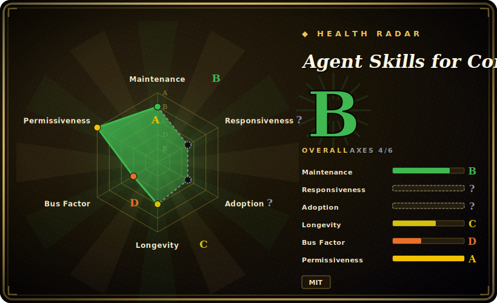

# Agent Skills for Context Engineering

A 15-skill plugin pack that teaches a coding agent the discipline of *context engineering* — managing what goes into the context window — covering fundamentals, degradation, compression, multi-agent coordination, memory, tool design, evaluation, and harness engineering.

## When to use

You're an agent engineer building a multi-agent or long-running agent system, and your runs keep falling over for context reasons: the window fills with stale tool output, the agent "forgets" earlier decisions mid-task, a sub-agent gets handed the wrong slice of state, or your retrieval dumps so much into the prompt that quality degrades instead of improving. You know roughly *that* it's a context problem, but you don't have a vocabulary or a checklist for diagnosing which failure mode you're in or how to fix it. This pack gives your agent a curated set of on-demand skills — `context-fundamentals`, `context-degradation`, `context-compression`, `context-optimization`, `multi-agent-patterns`, `memory-systems`, `tool-design`, `filesystem-context`, `hosted-agents`, `evaluation`, `advanced-evaluation`, `harness-engineering`, `latent-briefing`, `project-development`, `bdi-mental-states` — each shipping a `SKILL.md` plus runnable scripts and reference docs, so the agent loads the relevant one when a task touches that area.

You reach for it when you want an opinionated, pre-built corpus rather than authoring your own context-management skills from scratch, and when you work primarily inside Claude Code (the pack installs as a plugin via its bundled marketplace manifest, `/plugin marketplace add … && /plugin install context-engineering@context-engineering-marketplace`). Individual skill folders can also be copied into `.claude/skills/`, and the README claims Cursor support via the Open Plugins standard, so the same corpus can follow you across those harnesses. [推断]

## When NOT to use

- **You already maintain your own context/memory skill stack.** This pack is broad and opinionated (15 skills with their own routing). Layering it over an existing curated system invites overlapping, conflicting guidance on compression, memory, and multi-agent patterns — pick one source of truth rather than double-routing.
- **You're not on a supported harness.** Activation depends on a plugin/skill loader. It's built first for Claude Code (plugin marketplace manifest); Cursor support is README-claimed via Open Plugins. On a bespoke or unsupported agent there's no loader to fire the skills, and the markdown alone won't auto-activate.
- **You want a runnable library/CLI.** This is a behavior-shaping skill corpus, not a package you `import`. The bundled scripts are demonstrations and benchmarks, not a product API; outside a supporting agent the skills do nothing.
- **Advisory, not enforced.** Behavior lives in prompt/markdown skills the agent chooses to load and follow. There is no runtime that forces correct context handling — the agent can still ignore a skill or mis-route.
- **You need a stable, frozen spec.** Single-maintainer project moving fast (v2.x with router benchmarks and "corpus hardening" between releases). Skill names, count, and routing can shift release-to-release; pin a tag if you depend on a specific skill's behavior.

## Comparison

| Alternative | In index | Our verdict | Tradeoff |
|---|---|---|---|
| notebooklm-skill | 未收录 | Use this page for its stated niche; choose notebooklm-skill when you need sibling in this leaf, but a single narrow skill (NotebookLM-style document grounding) rather than a. | Sibling in this leaf, but a single narrow skill (NotebookLM-style document grounding) rather than a broad context-engineering corpus. Pick it for one capability; pick this pack for a whole context-management methodology. |
| [Superpowers](../../agent-dev-methodology/superpowers.md) | ✅ | Use this page for its stated niche; choose Superpowers when you need full SDLC methodology (brainstorm→plan→TDD→verify) as a skill plugin. | Full SDLC methodology (brainstorm→plan→TDD→verify) as a skill plugin; overlaps on the "install a curated skill bundle" form but targets the *software-development loop*, not context-window engineering. Complementary, not a substitute. |
| Anthropic's own context-engineering guidance / built-in skills | 未收录 | Use this page for its stated niche; choose Anthropic's own context-engineering guidance / built-in skills when you need the platform's first-party docs and native skills. | The platform's first-party docs and native skills; this is a third-party corpus layered on top, so it can duplicate or conflict with native guidance and must be reconciled. |
| Hand-rolled context/memory skills in your own repo | 未收录 | Use this page for its stated niche; choose Hand-rolled context/memory skills in your own repo when you need maximum fit and zero lock-in, but you author and maintain everything. | Maximum fit and zero lock-in, but you author and maintain everything. This pack trades some fit for a ready-made, benchmarked corpus. |

## Health & viability

- **Maintenance (2026-06):** active — latest release v2.3.0 (2026-05), last pushed 2026-05, not archived, with "corpus hardening" and router-benchmark work between releases. Moving fast enough that skill names/count/routing shift release-to-release.
- **Governance / bus factor:** a **single-maintainer, `User`-owned** repo (`muratcankoylan`) carrying ~16k stars — that popularity-vs-bus-factor mismatch is a real fragility flag: a heavily-starred personal repo has no team or org continuity if the author steps away. `[推断]`
- **Age & Lindy verdict:** young (created 2025-12, ~6 months old) and riding the 2026 skill-pack hype wave — **unproven** on Lindy. It's a corpus of advice, not load-bearing runtime, so the downside of it going stale is lower than for a library, but don't treat its longevity as established.
- **Risk flags:** advisory-only (prompt/markdown the agent may ignore), Claude-Code-first activation (Cursor support is README-claimed), and self-reported benchmark numbers — none independently verified. No relicense/CVE concerns for a skill corpus, but pin a tag for reproducibility.

## Caveats (unverified)

- [未验证] Metadata as of 2026-06-26 (GitHub): latest release v2.3.0 (published 2026-05-22), last push 2026-05-26, license MIT, primary language Python, not archived. Re-verify before relying on a specific version's behavior.
- [未验证] Star count (~16.8k per GitHub on 2026-06-26) is unreliable and date-sensitive; treat as indicative only, not a quality signal.
- [未验证] The skill set is 15 skills under `skills/` (each with `SKILL.md` + `scripts/` + `references/`) per the live repo tree on this check; names and count change release-to-release, so read the current `skills/` directory rather than trusting this list.
- [未验证] Cursor / Open-Plugins support and the cross-harness activation claim come from the README; actual activation fidelity outside Claude Code is not independently confirmed here.
- [未验证] Router-benchmark figures (skill-activation accuracy across frontier models, "skill health score 0.9117") are project-reported numbers from the README/CHANGELOG, not independently reproduced.
- [推断] Because behavior is prompt/markdown loaded by the agent, enforcement is advisory — "patterns" are instructions, not hard runtime guarantees; the agent can still deviate.
