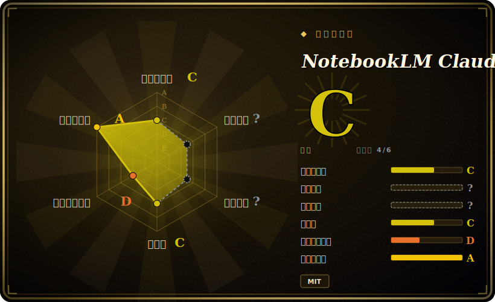

# NotebookLM Claude Code Skill

一个 Claude Code skill：用真实 Chrome 浏览器驱动查询你的 Google NotebookLM 笔记本，让 agent 从你自己上传的文档里取回有来源依据、带引用的答案，而不是逐个读文件（或凭空编造）。

## 何时使用

你是一名用 Claude Code 的开发者，手头有一大堆参考材料——第三方 SDK 文档、内部 wiki、一本维修手册、一摞 PDF——而 agent 老是处理不好。你说“搜一下我的文档”，它就一个文件接一个文件地读（烧 token），按关键词 grep、错过文档之间的关联；找不到某个 API 时，又会编一个看起来很合理的出来。这些文档你其实早就上传到了 Google NotebookLM——那里 Gemini 已经把它们预处理成了一个有来源依据的知识库——但你只能在 NotebookLM 浏览器标签页和编辑器之间手动复制粘贴问题和答案。

于是你安装这个 skill（`git clone` 到 `~/.claude/skills/notebooklm/`），让 Claude 直接和 NotebookLM 对话。首次使用时它会自建一个隔离的 `.venv` 和一个真实 Chrome 实例；你在弹出的有头浏览器窗口里做一次性 Google 登录，把每个笔记本按链接共享，再注册进一个带标签的本地小型 library。此后当你问“我的 React 文档怎么讲 hooks 的？”，Claude 会挑出对应笔记本、跑 Python 脚本、开一个全新浏览器去问 Gemini，把综合好、带引用的答案拿回 CLI——再据此写出正确代码。它是一座取回桥：NotebookLM 负责做来源依据，这个 skill 是让 agent 在你不插手的情况下能够到它的管道。

## 何时不用

- **你不（或不愿）把文档放进 Google NotebookLM。** 这是一座*桥*，不是 RAG 引擎。它自己没有 embedding、没有向量库、没有任何本地索引——如果你的知识没有先进到一个 NotebookLM 笔记本里（且按“任何拥有链接的人”共享），就根本没东西可查。要自托管本地 RAG，请用完全不同的工具。
- **你不是在本地 Claude Code 上跑。** 它*只*能配本地 Claude Code 安装。Web UI 把 skill 沙箱化、无网络访问，所以它依赖的浏览器自动化跑不起来。这里也没有 Codex/Cursor 支持——那是另一个独立的 [MCP server](https://github.com/PleasePrompto/notebooklm-mcp)，不是本 skill。
- **自动化操作一个 Google 账号对你是问题。** 它会用真实 Chrome 会话登录并驱动 Google。作者明确建议用一个*专用* Google 账号，并警告自动化使用可能被检测或标记；这是实打实的 ToS/账号风险面，不是假想。 [未验证]
- **你需要有状态的多轮研究。** 会话模型是无状态的——每个问题开一个全新浏览器、用完即关；没有持久聊天上下文，答案也无法引用“上一条回答”。多步深度来自 agent 反复追问，而非一个被保持住的会话。
- **你在意 NotebookLM 自身的限制。** 免费档每日查询上限、需手动上传、笔记本必须公开链接共享——这些都是 NotebookLM 的约束，本 skill 继承且无法消除。
- **你想要一个免操心、加固过的依赖。** 它在首次运行时自动安装 Google Chrome 和一套基于 Playwright 的自动化栈，并依赖反检测（“拟人化”）启发式——当 Google 的 UI 或检测变化时这些可能失效。

## 横向对比

| 替代方案 | 已收录 | 取舍 |
|---|---|---|
| [Agent Skills for Context Engineering](context-engineering-skills.zh.md) | ✅ | 一个更宽泛的 context-engineering *skill 包*（多份用于上下文管道的 prompt/skill 文件）；本仓库是面向单一外部服务（NotebookLM）的单个可运行取回桥，而非方法论捆绑。 |
| notebooklm-mcp（同作者） | 未收录 | MCP server 同门：持久聊天会话、TypeScript/npm、多工具支持（Claude Code、Codex、Cursor）。要跨工具的有状态研究选它；要零服务器、Python、仅 Claude Code 的 clone 即用安装选本 skill。 |
| 本地 RAG 栈（LlamaIndex / LangChain retrievers 等） | 未收录 | 你端到端自托管的 embedding + 向量库；搭建成本更高（切块、embedding、基础设施），但无第三方账号、无公开共享要求、无浏览器自动化。本 skill 用那份掌控权换 NotebookLM 现成的 Gemini 来源依据。 |
| 内置文件读取 / grep 取回 | 未收录 | Claude Code 的默认行为——token 成本高、关键词式取回、空白处会幻觉。本 skill 正是为在文档密集任务里替换它而存在。 |

## 技术栈

- **语言：** Python（README 徽章标 3.8+）。 [未验证]
- **浏览器自动化：** `patchright==1.55.2`——一个基于 Playwright、偏隐身的自动化库——驱动**真实 Google Chrome**（非 Chromium），以求指纹一致与反检测。
- **配置：** `python-dotenv==1.0.0`。
- **skill 表面：** 一份 `SKILL.md` 指令文件，加三个脚本——`ask_question.py`（查询）、`notebook_manager.py`（library 管理）、`auth_manager.py`（Google 认证）。本地 `data/` 目录（`library.json`、`auth_info.json`、`browser_state/`）保存 library + 会话状态，且被 git 忽略。

## 依赖

- **本地 Claude Code**（非 web UI），在你自己的机器上——硬性要求；沙箱无网络访问，浏览器跑不起来。
- **一个可用的 Google 账号**，能访问 NotebookLM，并有你已上传文档、按公开链接共享的笔记本。
- **Google Chrome** 和 Python 自动化栈——首次使用时自动装进 skill 文件夹内一个隔离的 `.venv`（无全局安装，但确实会下载 Chrome）。
- **互联网访问**，查询时连到 NotebookLM。
- NotebookLM 自身服务（Gemini 支撑）；你受其免费档每日查询上限约束。

## 运维难度

**对个人是低到中；把账号风险算进去就是中。** 安装是单条 `git clone`，venv/Chrome 引导是自动的——没有服务器要跑、没有数据库、没有部署。持续负担在认证与脆弱性上：你要做一次性交互式 Google 登录（会话过期后再登），要保持笔记本已上传且链接共享，整套东西骑在针对第三方 UI 的浏览器自动化加反检测启发式上——两者都可能在 Google 改东西时毫无预兆地失效。建议用一个一次性 Google 账号、以及“无法保证 Google 不会检测或标记自动化使用”的免责声明，把它在真实世界的运维风险推到普通开发工具之上。 [未验证]

## 健康度与可持续性

- **维护（2026-06）：** 很可能**滑行 / 沉寂**——最新 release v1.3.0 和最后一次 push 都在 2025-11，也就是截至 2026-06 已约 7 个月没有提交。未归档，但对一个全部工作就是自动化某个会漂移的第三方 UI（Google NotebookLM）的工具来说，这个空档是黄灯。
- **治理 / bus factor：** 单人维护、`User` 所有的仓库（`PleasePrompto`），约 7k stars——人气有但连续性单薄。作者另外还在维护一个独立的 MCP server 同门项目，精力可能被两者分摊。
- **年龄与 Lindy 判断：** 年轻（创建于 2025-10）*且*明显停摆——对一个易碎的工具而言这是最差的 Lindy 象限：太新、没有记录可依，又没有针对它所自动化的移动靶持续维护。
- **风险旗标：** 核心依赖是针对 Google 实时 UI 的浏览器自动化加反检测启发式——Google 一改东西它就可能毫无预兆地失效，作者还警告 ToS/账号被标记的风险。维护空档放大了这种脆弱性；依赖前请先验证它是否还能用。

## 存疑（未验证）

- [未验证] 最新发布报为 v1.3.0（"Timeout Fix & Thinking Detection"，2025-11-21 发布），仓库最后 push 同日；据 2026-06-26 的 GitHub 元数据，license 为 MIT、主语言 Python。节奏看，项目自 2025 年底起可能已沉寂——依赖它前请重新核实维护状态并锁定行为。
- [未验证] star 数（2026-06-26 GitHub 约 7.2k）不可靠且对日期敏感；仅作参考，不作质量信号。
- [未验证] 锁定的依赖版本（`patchright==1.55.2`、`python-dotenv==1.0.0`）和 Python 3.8+ 取自 README/requirements 引用，未在此实测；Chrome 自动安装与 venv 引导也未实跑。
- [未验证] Google ToS / 账号检测风险：作者称内置了拟人化特性，但无法保证 Google 不会检测或标记自动化使用，并建议用专用账号。被标记的实际概率、以及是否违反 Google 条款，均未独立确认。
- [未验证] 脚本名（`ask_question.py`、`notebook_manager.py`、`auth_manager.py`）、每问开新浏览器的无状态会话模型，以及 `data/` 布局取自 README/仓库树；确切行为未执行或独立验证。
- [推断] “大幅减少幻觉”是该项目对 NotebookLM 来源依据机制的主张；答案质量完全取决于你上传了什么以及 NotebookLM/Gemini 本身，而这些不在本 skill 控制范围内。行为不被保证。
