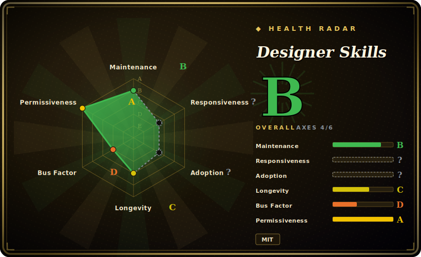

# Designer Skills

A broad design-practice skill pack — 97 skills and 30 commands across 9 plugins (research, design systems, UX strategy, UI, interaction, prototyping/testing, design ops, toolkit, visual critique) installed into Claude Code or Gemini CLI via a plugin marketplace.

## When to use

You're a product designer (or a developer doing design work) running Claude Code, and your agent keeps producing design output that is competent in syntax but shallow in craft: a UI with no real layout-grid discipline, a "design system" that's just a color list, a usability test plan with no method behind it, a critique that says "looks clean" instead of naming hierarchy and affordance problems. You want the agent to reason like a trained designer across the *whole* lifecycle — frame the research, justify the IA, defend type and color choices, run a heuristic evaluation, write the handoff spec — not just generate a pretty screen. Designer Skills gives you that as a marketplace bundle: install with `/plugin marketplace add Owl-Listener/designer-skills`, then enable the plugins you need (e.g. `ui-design`, `design-systems`, `visual-critique`), and the agent loads the relevant skill on demand when it does design work.

You reach for it when you want *breadth* — one install that covers research → systems → UI → interaction → ops → critique — rather than hand-assembling separate single-purpose design skills. In this repo's framing, *skills are nouns* (domain-knowledge units like "color systems" or "Gestalt principles") and *commands are verbs* (workflows that chain skills into a complete job), so you get both reusable knowledge and ready-made procedures. It also ships a `.gemini/extensions/` layout, so the same packs work in Gemini CLI via a clone-and-copy install.

## When NOT to use

- **You already run a focused design skill you trust.** If you have a dedicated critique or design-system skill wired in, layering this broad pack on top invites overlapping guidance and double-routing — e.g. two competing definitions of "good hierarchy". Pick one source of truth per concern.
- **You only need one slice.** Wanting just visual critique, or just a design-system contract, makes a 97-skill / 9-plugin bundle heavier than the job — a single-purpose sibling skill is lighter to reason about and maintain. Enable only the plugins you use, or prefer a narrower pack.
- **You're not on a supported harness.** Activation depends on Claude Code's plugin/skill loader or the Gemini CLI extension mechanism. On an unsupported or bespoke agent there's no loader to fire the skills, and the markdown alone won't auto-activate. [推断]
- **You need enforcement, not advice.** Behavior lives in prompt/markdown skills the agent reads; nothing is a hard gate. The agent can ignore or partially apply a skill, and "do X" is an instruction, not a guarantee. [推断]
- **You need a pinned, stable surface.** There's no tagged release; the skill/command set changes over time on `main`, and the maintainer explicitly closes PRs (new skills / structural changes) that lack a corresponding issue — upstream evolves on the maintainer's terms. Pin a commit if you need reproducibility.

## Comparison

| Alternative | In index | Our verdict | Tradeoff |
|---|---|---|---|
| [stitch-skills](stitch-skills.md) | ✅ | Use this page for its stated niche; choose stitch-skills when you need compare on scope: Stitch-oriented pack vs. | Compare on scope: Stitch-oriented pack vs. this broad full-lifecycle design suite. If your need is narrow, the focused pack is lighter; Designer Skills wins on breadth. |
| [ui-ux-pro-max](ui-ux-pro-max.md) | ✅ | Use this page for its stated niche; choose ui-ux-pro-max when you need another UI/UX skill pack. | Another UI/UX skill pack; overlaps heavily on the "polished interface" surface. Pick by which one's UI/interaction guidance matches your taste and which install path fits your harness. |
| [taste-skill](taste-skill.md) | ✅ | Use this page for its stated niche; choose taste-skill when you need centers visual *taste*/judgment. | Centers visual *taste*/judgment; narrower than this multi-discipline suite. Use it for critique-flavored taste calls; use Designer Skills when you also need research/systems/ops. |
| [make-interfaces-feel-better](make-interfaces-feel-better.md) | ✅ | Use this page for its stated niche; choose make-interfaces-feel-better when you need aimed at interaction polish / "feel". | Aimed at interaction polish / "feel"; overlaps Designer Skills' `interaction-design` plugin. The narrow pack is sharper on micro-interaction; Designer Skills covers the rest of the lifecycle too. |
| Anthropic's official / built-in skills | 未收录 | Use this page for its stated niche; choose Anthropic's official / built-in skills when you need the platform's own skill ecosystem. | The platform's own skill ecosystem; Designer Skills is a third-party bundle layered on top, so it can duplicate or conflict with native skills. |
| Companion collections (AI product design, UX program mgmt, design leadership, inclusive design) | 未收录 | Use this page for its stated niche; choose Companion collections (AI product design, UX program mgmt, design leadership, inclusive design) when you need same author's sibling repos in the family. | Same author's sibling repos in the family; this entry covers only the "design practice" collection. Reach for the others for adjacent disciplines. |

## Health & viability

- **Maintenance (2026-06):** active on `main` — last pushed 2026-06, not archived — but with **no tagged release** at all, so there's no stable, versioned surface to pin to; the skill/command set evolves continuously and the maintainer closes PRs lacking a matching issue.
- **Governance / bus factor:** single-maintainer, `User`-owned repo (`Owl-Listener`) at ~1.7k stars, part of a larger personal family of design collections. One person's roadmap; no org or foundation backing.
- **Age & Lindy verdict:** very young (created 2026-03, ~3 months old) — **unproven**. Brand-new and unversioned means no track record and no reproducibility anchor; pin a commit if you need stability.
- **Risk flags:** advisory-only prompt/markdown (no runtime enforcement), Claude-Code-first with README-claimed Gemini CLI support, and self-reported skill counts. No relicense/CVE concerns for a skill bundle, but the no-release + single-author + breadth combination is the real fragility.

## Caveats (unverified)

- [未验证] License MIT, primary language Markdown, not archived, last pushed 2026-06-14, and no tagged release (latestRelease null) per GitHub metadata as of 2026-06-26 — re-verify before relying on a specific commit's behavior.
- [未验证] Star count (~1,659 per GitHub on 2026-06-26) is unreliable and date-sensitive; treat as indicative only, not a quality signal.
- [未验证] Counts — 97 skills, 30 commands, 9 plugins (this collection), and a 5-collection / 239-skill family — are from the project README and not independently audited file-by-file here; the live `main` tree may differ.
- [未验证] The plugin list (design-research, design-systems, ux-strategy, ui-design, interaction-design, prototyping-testing, design-ops, designer-toolkit, visual-critique) is from the README; verify against the current directory rather than relying on this list.
- [推断] Because skills are prompt/markdown loaded by the agent, enforcement is advisory — "do X" steps are instructions, not hard guarantees, and activation fidelity varies per harness (Claude Code vs Gemini CLI).
- [推断] Gemini CLI support via `.gemini/extensions/` clone-and-copy is described in the README but not confirmed working here; treat cross-harness parity with Claude Code as unverified.
