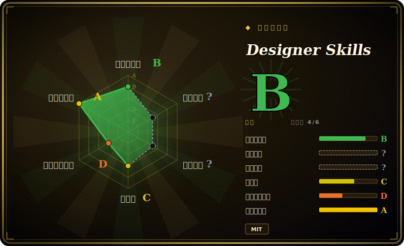

# Designer Skills

一个覆盖面很广的设计实践 skill pack——9 个 plugin 下共 97 个 skill、30 个 command（涵盖用户研究、设计系统、UX 策略、UI、交互、原型/测试、design ops、工具箱、视觉批评），通过 plugin marketplace 装进 Claude Code 或 Gemini CLI。

## 何时使用

你是产品设计师（或在做设计工作的开发者），跑在 Claude Code 上，但 agent 产出的设计在语法上像样、在功底上很浅：UI 没有真正的布局栅格纪律，所谓「设计系统」只是一串颜色，可用性测试计划背后没有方法，批评只会说「看起来挺干净」而不点出层级和可供性的问题。你希望 agent 在*整条*生命周期上像受过训练的设计师那样推理——框定研究、论证信息架构、为字体和配色辩护、跑启发式评估、写交付规范——而不只是生成一个好看的页面。Designer Skills 把这套能力作为一个 marketplace bundle 提供：用 `/plugin marketplace add Owl-Listener/designer-skills` 安装，再启用你需要的 plugin（比如 `ui-design`、`design-systems`、`visual-critique`），agent 在做设计工作时按需加载相应的 skill。

当你要的是*广度*——一次安装就覆盖 研究 → 系统 → UI → 交互 → ops → 批评——而不想手工拼装多个单一用途的设计 skill 时，就用它。按这个 repo 的说法，*skill 是名词*（像「色彩系统」「格式塔原则」这样的领域知识单元），*command 是动词*（把多个 skill 串成完整工作的工作流），所以你既拿到可复用知识、也拿到现成流程。它还带了一套 `.gemini/extensions/` 布局，因此同一批包通过 clone-and-copy 方式也能在 Gemini CLI 里用。

## 何时不用

- **你已有一个信任的聚焦设计 skill。** 如果你已经接好了一个专门的批评或设计系统 skill，再在上面叠这个大而全的包，会引入相互重叠的指引和双重路由——比如对「好的层级」给出两套互相打架的定义。每个关注点只保留一个事实源。
- **你只需要其中一片。** 只想要视觉批评、或只想要一份设计系统 contract，却拉来 97 个 skill / 9 个 plugin 的大包，比任务本身重得多——单一用途的同类 skill 推理和维护起来更轻。只启用你用到的 plugin，或选更窄的包。
- **你不在受支持的 harness 上。** 激活依赖 Claude Code 的 plugin/skill 加载器或 Gemini CLI 的 extension 机制。在不受支持或自研的 agent 上没有加载器来触发这些 skill，光有 markdown 不会自动激活。[推断]
- **你需要强制执行，而非建议。** 行为存在于 agent 读取的 prompt/markdown skill 里，没有任何硬闸门。agent 可以忽略或只部分应用某个 skill，「做 X」是一条指令，不是保证。[推断]
- **你需要一个固定、稳定的接口面。** 没有打 tag 的 release；skill/command 集合在 `main` 上随时间变化，且维护者明确会关闭没有对应 issue 的 PR（新增 skill / 结构性改动）——上游按维护者的节奏演进。需要可复现就 pin 一个 commit。

## 横向对比

| 替代方案 | 已收录 | 取舍 |
|---|---|---|
| [stitch-skills](stitch-skills.md) | ✅ | 比的是范围：面向 Stitch 的包 vs. 这套覆盖全生命周期的设计套件。需求窄时聚焦包更轻；要广度则 Designer Skills 胜。 |
| [ui-ux-pro-max](ui-ux-pro-max.md) | ✅ | 另一个 UI/UX skill pack；在「打磨界面」这一面重叠很多。按哪一个的 UI/交互指引更对你胃口、哪种安装路径更适配你的 harness 来选。 |
| [taste-skill](taste-skill.md) | ✅ | 聚焦视觉*品味*/判断；比这套多学科套件窄。要带品味色彩的批评判断用它；同时还需要研究/系统/ops 时用 Designer Skills。 |
| [make-interfaces-feel-better](make-interfaces-feel-better.md) | ✅ | 面向交互打磨 /「手感」；与 Designer Skills 的 `interaction-design` plugin 重叠。窄包在微交互上更锋利；Designer Skills 还覆盖生命周期其余部分。 |
| Anthropic 官方 / 内置 skills | 未收录 | 平台自带的 skill 生态；Designer Skills 是叠在上面的第三方 bundle，可能与原生 skill 重复或冲突。 |
| 家族里的姊妹合集（AI 产品设计、UX 项目管理、设计领导力、包容性设计） | 未收录 | 同作者家族里的姊妹 repo；本条目只覆盖「设计实践」这一合集。相邻学科去用其它几个。 |

## 健康度与可持续性

- **维护（2026-06）：** 在 `main` 上活跃——最后 push 于 2026-06，未归档——但**完全没有打 tag 的 release**，所以没有稳定、带版本的接口面可 pin；skill/command 集合持续演进，维护者会关闭没有对应 issue 的 PR。
- **治理 / bus factor：** 单人维护、`User` 所有的仓库（`Owl-Listener`），约 1.7k stars，是一个更大的个人设计合集家族的一部分。路线图由一个人定；无组织或基金会背书。
- **年龄与 Lindy 判断：** 非常年轻（创建于 2026-03，约 3 个月）——**未经验证**。全新且无版本意味着没有记录、也没有可复现的锚点；需要稳定就 pin 一个 commit。
- **风险旗标：** 仅建议性的 prompt/markdown（无运行时强制）、以 Claude Code 优先且 Gemini CLI 支持是 README 声称的、skill 数量为自报。skill 包无 relicense/CVE 之忧，但「无 release + 单作者 + 大而全」这一组合才是真正的脆弱点。

## 存疑（未验证）

- [未验证] 截至 2026-06-26，GitHub 元数据显示 license MIT、主语言 Markdown、未归档、最后 push 于 2026-06-14、且无打 tag 的 release（latestRelease 为 null）——在依赖某个具体 commit 的行为前请重新核实。
- [未验证] star 数（2026-06-26 GitHub 上约 1,659）不可靠且对日期敏感；只作参考，不作质量信号。
- [未验证] 数量——97 个 skill、30 个 command、9 个 plugin（本合集），以及一个 5 合集 / 239 skill 的家族——来自项目 README，此处未逐文件独立审计；线上 `main` 树可能不同。
- [未验证] plugin 列表（design-research、design-systems、ux-strategy、ui-design、interaction-design、prototyping-testing、design-ops、designer-toolkit、visual-critique）来自 README；请以当前目录为准核实，不要直接依赖此列表。
- [推断] 由于 skill 是 agent 加载的 prompt/markdown，强制力是建议性的——「做 X」是指令、非硬保证，且各 harness（Claude Code vs Gemini CLI）的激活保真度不一。
- [推断] README 描述了通过 `.gemini/extensions/` clone-and-copy 的 Gemini CLI 支持，但此处未确认其可用；将与 Claude Code 的跨 harness 平价视为未验证。
