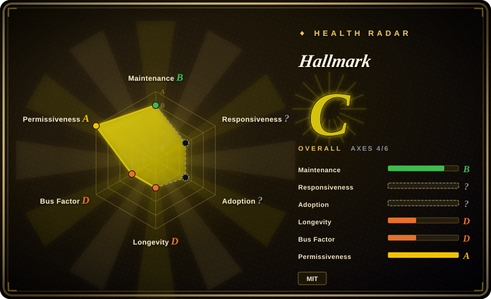

# Hallmark

An MIT-licensed design skill for Claude Code, Cursor, and Codex that steers an agent away from repetitive AI-generated UI patterns through opinionated briefs, themes, audits, redesigns, and design studies.

## When to use

You're using a supported coding agent to build or revise a web page, and technically correct output keeps collapsing into the same hero, card grid, type, and color defaults. You want one version-controlled Markdown skill that asks the agent to select a macrostructure and visual direction, check its own output against its anti-pattern rules, and leave a clearer design handoff. Pick Hallmark over a component library because it supplies an agent-facing design decision protocol, not a runtime UI kit.

Use its default build mode for a new page, `audit` for a no-edit critique, `redesign` to preserve content and information architecture while changing the visual fingerprint, or `study` to extract high-level design DNA from a screenshot or URL. It is a fit only when its opinionated visual direction is welcome.

## When NOT to use

- **You need accessible, composable production components.** Choose [shadcn/ui](https://github.com/shadcn-ui/ui) or your established design system; Hallmark ships Markdown rules, not React, Vue, or Svelte components.
- **You need a CSS compiler or utility framework.** Choose [Tailwind CSS](https://github.com/tailwindlabs/tailwindcss); Hallmark provides neither utility classes nor a CSS runtime.
- **You need deterministic visual regression or an enforceable quality gate.** Choose Playwright plus screenshot assertions, or a deterministic detector such as [Impeccable](../../ai-design-generation/impeccable.md); Hallmark's self-critique and slop tests are advisory instructions interpreted by an agent.
- **Your agent cannot load custom skills or you do not use Claude Code, Cursor, or Codex.** Choose a framework-neutral design-system document instead; Hallmark's core asset is a harness-loaded `SKILL.md`.
- **A strict brand system already specifies tokens, templates, and approval flow.** Prefer that system; Hallmark's default macrostructure and theme choices can conflict with governed brand constraints.
- **Image-heavy retail, travel, or lookbook work is the main job.** The roadmap names image-heavy briefs as a current limitation, so pair it with a dedicated art-direction/image workflow rather than using it as the only design mechanism.

## Comparison

| Alternative | In index | Our verdict | Tradeoff |
|---|---|---|---|
| [Taste-Skill](taste-skill.md) | ✅ | Choose Hallmark when its four explicit build, audit, redesign, and study verbs fit your workflow; choose Taste-Skill for a broader framework-agnostic taste pack. | Hallmark has a narrower, opinionated protocol and static demonstrations; Taste-Skill covers more aesthetic variants but remains advisory too. |
| [Designer Skills](designer-skills.md) | ✅ | Choose Designer Skills when research, UX strategy, design systems, and testing all need coverage; choose Hallmark when one compact anti-slop workflow is enough. | The broader pack has more surface area and routing complexity; Hallmark is easier to adopt but less complete. |
| [Impeccable](../../ai-design-generation/impeccable.md) | ✅ | Choose Impeccable when deterministic detection of existing frontend artifacts is required; choose Hallmark when an agent needs a generative design brief and redesign process. | Impeccable offers a CLI/detectors; Hallmark offers taste guidance without deterministic enforcement. |
| [shadcn/ui](../../web-ui/component-libraries/shadcn-ui.md) | ✅ | Choose shadcn/ui when the output must be an accessible component baseline; choose Hallmark when the missing layer is visual direction before component selection. | Components make implementation reusable; Hallmark affects the agent's design choices but supplies no component runtime. |

## Health & viability

- **Maintenance snapshot (2026-07-13):** unarchived and recently pushed at repository level, but the current `main` tip dates to 2026-06-04 and there are no GitHub Releases.
- **Governance / bus factor:** the repository is owned by a personal account. The contributor history has several contributors, but maintenance ownership and the stated Together AI relationship are not formally documented. [推断]
- **Age / Lindy:** created 2026-04, so it has under three months of history and no long-term release record. Its early attention should not be read as durability proof.
- **Risk and adoption:** MIT lowers license friction. The core behavior is prompt instruction, so output quality and adherence depend on the host agent rather than a deterministic runtime.

## Caveats (unverified)

- [未验证] The README's “20 themes” and “57 slop-test gates” are project claims; their completeness and effectiveness were not independently evaluated.
- [未验证] `npx skills add` requires the skills installer and likely Node.js/npm, while manual installation only copies Markdown assets; verify the exact installation path for your harness.
- [未验证] “Made by Together AI” does not establish a formal support, governance, or maintenance commitment from Together AI.
- [推断] With no release artifacts and an under-three-month history, pinning a reviewed commit is safer than treating the default branch as a stable versioned dependency.
