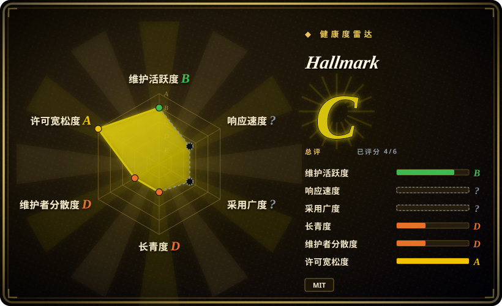

# Hallmark

一个面向 Claude Code、Cursor 和 Codex 的 MIT 许可设计技能：用有主张的 brief、主题、审计、重设计和设计研究，引导 agent 避开重复的 AI 生成式 UI 模式。

## 何时使用

你用受支持的 coding agent 构建或改造网页，功能虽正确，产物却总坍缩为同一种 hero、卡片网格、字体和配色默认值。你需要一份可版本管理的 Markdown skill，让 agent 选择宏观结构和视觉方向，按反模式规则自查产物，并留下更清晰的设计交接。此时选 Hallmark，而不是组件库，因为它提供面向 agent 的设计决策协议，不是 UI 运行时套件。

新页面用默认 build 模式，`audit` 做只读批评，`redesign` 在保留内容和信息架构的前提下替换视觉指纹，`study` 则从截图或 URL 提取高层设计 DNA。前提是你欢迎它带有主张的视觉方向。

## 何时不用

- **你需要无障碍、可组合的生产组件。**改选 [shadcn/ui](https://github.com/shadcn-ui/ui) 或已有设计系统；Hallmark 提供 Markdown 规则，不提供 React、Vue 或 Svelte 组件。
- **你需要 CSS 编译器或原子化样式框架。**改选 [Tailwind CSS](https://github.com/tailwindlabs/tailwindcss)；Hallmark 不提供 utility class，也没有 CSS runtime。
- **你需要确定性的视觉回归或可强制执行的质量闸门。**改用 Playwright 加截图断言，或 [Impeccable](../../ai-design-generation/impeccable.zh.md) 这样的确定性检测器；Hallmark 的自评与 slop test 是由 agent 解读的建议式指令。
- **你的 agent 无法加载自定义 skill，或你不使用 Claude Code、Cursor、Codex。**改用与 harness 无关的设计系统文档；Hallmark 的核心资产是由 harness 加载的 `SKILL.md`。
- **已有严格的品牌系统，已规定 token、模板和审批流。**优先遵循该系统；Hallmark 的默认宏观结构和主题选择可能与受治理的品牌约束冲突。
- **主要工作是重图片的零售、旅游或 lookbook 页面。**路线图把 image-heavy brief 列为当前限制，应与专门的美术指导、图像工作流搭配，而非把它当作唯一机制。

## 横向对比

| 替代品 | 是否收录 | 我们的评价 | 取舍 |
|---|---|---|---|
| [Taste-Skill](taste-skill.zh.md) | ✅ | 工作流正好需要 build、audit、redesign、study 四个明确动词时选 Hallmark；需要更宽泛、框架无关的审美技能包时选 Taste-Skill。 | Hallmark 的协议更窄、更有主张，并带静态演示；Taste-Skill 覆盖更多美学变体，但同样只是建议式。 |
| [Designer Skills](designer-skills.zh.md) | ✅ | 研究、UX 策略、设计系统和测试都要覆盖时选 Designer Skills；一个紧凑的反 AI 味流程足够时选 Hallmark。 | 大型技能包的覆盖面和路由复杂度更高；Hallmark 更容易采用，但不够全面。 |
| [Impeccable](../../ai-design-generation/impeccable.zh.md) | ✅ | 需要确定性检查既有前端产物时选 Impeccable；需要 agent 获得生成式设计 brief 与重设计流程时选 Hallmark。 | Impeccable 提供 CLI 与检测器；Hallmark 提供没有确定性执行力的审美指导。 |
| [shadcn/ui](../../web-ui/component-libraries/shadcn-ui.zh.md) | ✅ | 产物必须有无障碍组件基线时选 shadcn/ui；组件选择之前缺的是视觉方向时选 Hallmark。 | 组件让实现可复用；Hallmark 影响 agent 的设计选择，但不提供组件运行时。 |

## 健康度与可持续性

- **维护快照（2026-07-13）：**未归档，仓库级近期有 push，但当前 `main` 顶端提交停在 2026-06-04，且没有 GitHub Releases。
- **治理与 bus factor：**仓库归个人账号所有。贡献历史中有多名贡献者，但维护归属和其所称 Together AI 关系都没有正式文档。[推断]
- **年龄与 Lindy：**创建于 2026-04，历史不足三个月且没有长期发布记录。早期关注度不能被当作耐久性证明。
- **风险与采用：**MIT 降低许可摩擦。核心行为是提示词指令，产物质量与遵循程度取决于宿主 agent，而非确定性运行时。

## 存疑（未验证）

- [未验证] README 中“20 个主题”和“57 个 slop-test 闸门”是项目自身说法，完整性与有效性未被独立评估。
- [未验证] `npx skills add` 依赖 skills 安装器且可能需要 Node.js/npm，而手动安装只复制 Markdown 资产；应核对目标 harness 的确切安装路径。
- [未验证] “Made by Together AI”不足以证明 Together AI 提供正式支持、治理或维护承诺。
- [推断] 没有发布产物且历史不足三个月时，固定一个已审查 commit 比把默认分支当作稳定、版本化依赖更稳妥。
