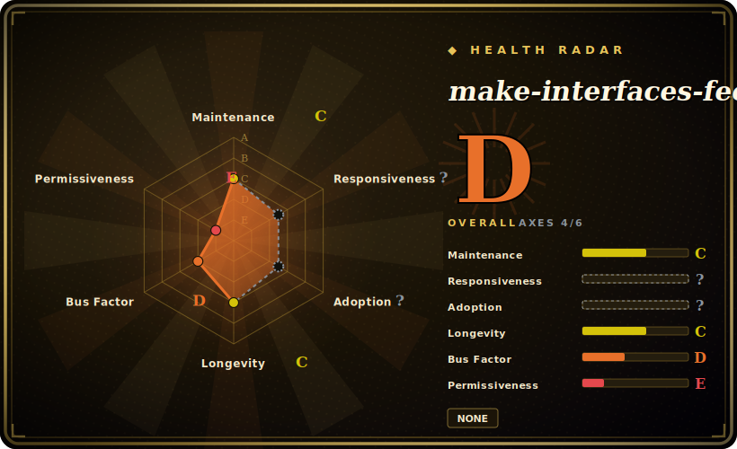

# make-interfaces-feel-better

A single, focused agent skill that injects ~16 concrete UI-polish principles — concentric border radius, interruptible transitions, tabular numbers, enter/exit animation, optical alignment, font smoothing — so your coding agent ships interfaces that *feel* finished instead of merely correct.

## When to use

You're a frontend developer (or a vibe-coder) using Claude Code to build a component or a page, and the markup is functionally right but the result feels cheap: the modal's inner corners don't nest into the outer radius, numbers jitter as they tick because the font isn't tabular, hover animations can't be interrupted so they feel laggy, an icon pops in with no enter transition, a shadow is used where a subtle border would read crisper. You know *something* is off but you don't want to hand-write the same 15-item "make it feel polished" checklist into every prompt. You install `make-interfaces-feel-better` and the agent loads a `SKILL.md` that carries those details as named, code-backed rules (with specific values like `scale(0.96)` on press and ~100ms stagger), plus a review checklist it can run against the diff it just wrote.

You reach for it specifically when the gap is *craft-level detail*, not direction. It doesn't pick your color system or invent a layout — it codifies the small mechanical fixes (typography, surfaces, animations, performance) that separate a "looks like an LLM made it" screen from one that feels intentional. The skill derives from the author's "Details that make interfaces feel better" article, and is split into four sub-files (`typography.md`, `surfaces.md`, `animations.md`, `performance.md`) the agent reads on demand for deeper guidance. [推断]

## When NOT to use

- **You already run a broader design skill pack.** If [taste-skill](taste-skill.md) or [designer-skills](designer-skills.md) is already loaded, you'll get overlapping (and possibly conflicting) instructions on motion, typography, and anti-slop — this one is narrower (detail-polish only), so layering it on top risks double-routing. Pick the one that matches the altitude you need.
- **You need design *direction*, not detail.** It won't choose a palette, build a design system, run UX research, or critique IA. If your screen is bland because it lacks a concept, a polish checklist won't save it — reach for a broader pack instead.
- **You're not on a skill-loading harness.** It activates through an agent's skill mechanism (the README ships `npx skills add jakubkrehel/make-interfaces-feel-better`). On a harness with no loader, the markdown is just an article — it won't auto-fire against your diff.
- **Enforcement is advisory.** The rules live in prompt/markdown; the agent can still skip or misapply them. "Use tabular numbers" is an instruction, not a lint gate — pair with a real CSS/UI linter if you need a hard guarantee. [推断]
- **Single-author, no releases, lower update cadence.** Last push was 2026-04 with no tagged versions; it's a thin, opinionated artifact tied to one article. If that article's opinions don't match your design language, the skill won't bend.

## Comparison

| Alternative | In index | Our verdict | Tradeoff |
|---|---|---|---|
| [taste-skill](taste-skill.md) | ✅ | Use this page for its stated niche; choose taste-skill when you need broader "anti-slop visual taste" pack: infers design direction, maps a full color/type/spacing syste. | Broader "anti-slop visual taste" pack: infers design direction, maps a full color/type/spacing system, lays in GSAP motion. This skill is narrower — mechanical detail-polish, no direction-setting. Use taste-skill when the screen is bland; use this when it's directionally fine but unrefined. |
| [designer-skills](designer-skills.md) | ✅ | Use this page for its stated niche; choose designer-skills when you need full design *lifecycle* bundle (97 skills: research, IA, design systems, critique). | Full design *lifecycle* bundle (97 skills: research, IA, design systems, critique). Heavyweight and process-oriented; this one is a single craft-detail checklist with near-zero ceremony. |
| [ui-ux-pro-max](ui-ux-pro-max.md) | ✅ | Use this page for its stated niche; choose ui-ux-pro-max when you need larger UI/UX skill bundle aimed at end-to-end interface quality. | Larger UI/UX skill bundle aimed at end-to-end interface quality. Compare on surface area: this skill is one tight article-derived rule set, not a multi-skill system. |
| [stitch-skills](stitch-skills.md) | ✅ | Use this page for its stated niche; choose stitch-skills when you need sibling design skill pack. | Sibling design skill pack; compare on which stages each enforces vs. suggests and whether the motion/typography guidance overlaps. |
| Hand-written design checklist in your own `CLAUDE.md` / prompt | 未收录 | Use this page for its stated niche; choose Hand-written design checklist in your own CLAUDE.md / prompt when you need the DIY alternative. | The DIY alternative; same advisory nature, but you maintain it. This skill packages a known-good detail list so you don't re-derive it per project. |

## Health & viability

- **Maintenance (2026-06):** low cadence and possibly quiet — last pushed 2026-04 (~2 months stale as of 2026-06), no tagged releases. That's tolerable for a thin, "finished" artifact pinned to one article, but don't expect ongoing iteration.
- **Governance / bus factor:** single-author, `User`-owned repo (`jakubkrehel`) at ~1.9k stars. It's one person's opinion crystallized from their "Details that make interfaces feel better" article — no team, no org.
- **Age & Lindy verdict:** very young (created 2026-03) — **unproven** on the Lindy axis, but the stakes are low: it's a static checklist of mechanical CSS/UX details, so "staleness" mostly means the design opinions age, not that it breaks. A narrow, frozen artifact is less Lindy-sensitive than a runtime dependency.
- **Risk flags:** advisory-only (markdown the agent may skip; pair with a real CSS/UI linter for hard guarantees); license is README-claimed MIT with no `LICENSE` file in the repo and a 404 from GitHub's license API — confirm the license before relying on it.

## Caveats (unverified)

- [未验证] License is MIT per the README, but there is no `LICENSE` file at the repo root and the GitHub license API returns 404 — the SPDX id here is from the README claim, not a detected license file; confirm before relying on it.
- [未验证] GitHub reports no primary language (it's markdown skill content); `language: Markdown` is an editorial choice, not a GitHub-detected field.
- [未验证] Star count (~1.9k per GitHub on 2026-06-26) is unreliable and date-sensitive; treat as indicative only, not a quality signal.
- [未验证] The skill structure (one `SKILL.md` plus `typography.md` / `surfaces.md` / `animations.md` / `performance.md`) and the "~16 principles" / "14-item checklist" counts are from inspecting the repo tree and a fetched read of `SKILL.md` on 2026-06-26; re-check the current files rather than relying on these counts.
- [未验证] Install command `npx skills add jakubkrehel/make-interfaces-feel-better` is quoted from the README; actual activation fidelity per harness (Claude Code vs. others) is not independently confirmed here.
- [推断] Because behavior lives in markdown loaded by the agent, "rules" and "checklist" are advisory prompt instructions, not enforced gates — the agent can deviate.
