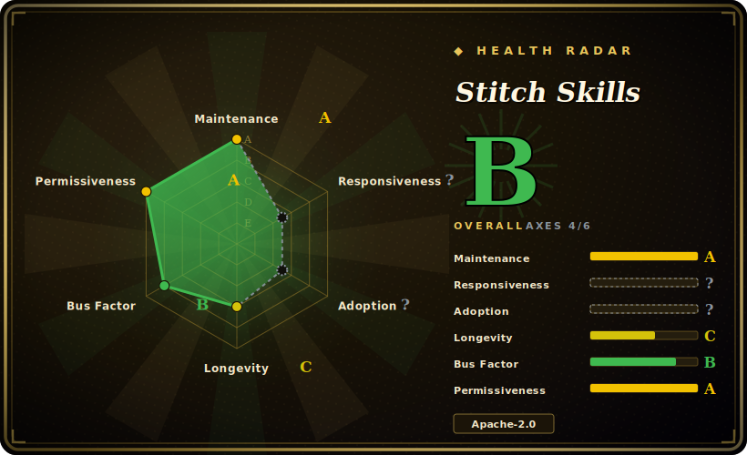

# Stitch Skills

A library of Agent Skills (Agent Skills open standard) that drive Google's **Stitch** MCP server — generating UI screens from text/images, converting code↔design, extracting a `DESIGN.md`, and shipping React / React Native / shadcn components out of a Stitch project.

## When to use

You're a frontend or full-stack engineer who's been handed "make this look like a real product, not a Bootstrap demo" and you don't have a designer on the team. You already use Stitch (Google Labs' AI UI design tool) to sketch screens, but inside your coding agent you keep manually shuttling between the Stitch web UI, copy-pasted HTML, and your React codebase — generate a screen, eyeball it, hand-translate it into components, lose the design tokens, repeat. The round-trip is the pain, and your agent has no idea Stitch exists.

You install Stitch Skills so the agent itself can run the loop. With the Stitch MCP server configured, the skills give your agent verbs it didn't have: `generate-design` (screens from a prompt or reference image), `code-to-design` / `extract-static-html` (pull your running app's HTML back *into* Stitch), `extract-design-md` / `taste-design` (distill a semantic `DESIGN.md` that enforces non-generic UI standards), and `react-components` / `react-native` / `shadcn-ui` (turn Stitch screens into validated component systems). You install once via `npx plugins add google-labs-code/stitch-skills` (or `npx skills add …` for selective install), and the brainstorm-to-component path becomes something the agent narrates and executes instead of you babysitting tabs.

## When NOT to use

- **You don't (and won't) run the Stitch MCP server.** These are skills *for Stitch* — they assume `stitch.withgoogle.com`'s MCP server is registered with credentials/env vars set. Without it the skills are inert prompts that reference tools the agent can't call. This is hard coupling to one vendor's hosted product, not a portable design methodology. [推断]
- **You want vendor-neutral "design taste" guidance.** Pure critique/taste skill packs (e.g. taste-skill, make-interfaces-feel-better, ui-ux-pro-max in this same leaf) shape *judgment* with no backend dependency. Stitch Skills is a control surface for a specific generation engine — overlapping intent, very different lock-in.
- **You already have a design-system / DESIGN.md skill you trust.** Several skills here (`extract-design-md`, `design-md`, `taste-design`, `manage-design-system`) overlap with generic `DESIGN.md` tooling; running both invites two competing sources of truth for tokens and theme.
- **You're not on a supported harness.** README lists Antigravity, Gemini CLI, Claude Code, Cursor, Codex. On other agents there's no loader to activate the SKILL.md files. [未验证]
- **You need the work to outlive the product.** Maturity is early (v1.0, single org-backed Google Labs repo); skill behavior and the Stitch MCP API can move together. Pin and re-verify after upgrades.
- **Skills are advisory, not enforced.** Behavior lives in SKILL.md prompts the agent loads; "validation" steps (e.g. `react-components`) are prompt-level, and the agent can still deviate.

## Comparison

| Alternative | In index | Tradeoff |
|---|---|---|
| [designer-skills](designer-skills.md) | ✅ | Generic designer-persona skill pack for UI/UX taste; no required backend. Stitch Skills is heavier (needs the MCP server) but actually *generates and converts* designs rather than only advising. |
| [ui-ux-pro-max](ui-ux-pro-max.md) | ✅ | Broad UI/UX skill collection focused on guidance and critique; vendor-neutral. Choose it when you want portable taste, Stitch Skills when you're committed to the Stitch generation loop. |
| taste-skill | 未收录 | Pure "taste"/anti-generic critique pack; overlaps only with Stitch's `taste-design` slice, with none of the code↔design plumbing or lock-in. |
| make-interfaces-feel-better | 未收录 | Interaction/polish-focused skills; advisory micro-improvements. Stitch Skills operates at the screen-generation and component-export layer instead. |
| Stitch MCP server itself (`stitch.withgoogle.com`) | 未收录 (hosted, not a repo) | The actual engine these skills call; it's a hosted product, not an indexable repo. This repo is just the agent-facing skill wrappers around it. |
| v0 / Lovable / other AI UI generators | 未收录 | Competing AI design-to-code products, mostly hosted SaaS rather than agent-skill repos; different unit of consumption (you drive their UI, not your agent). |

## Health & viability

- **Maintenance (2026-06):** active and early — v1.0 release (2026-05), last pushed 2026-06, not archived. First stable tag just landed; expect the skill set and the underlying Stitch MCP API to move together for a while.
- **Governance / bus factor:** `Organization`-owned by **`google-labs-code`** — org backing, not a lone maintainer, which lifts the bus factor. The flip side is **vendor risk**: Google Labs is an experimental arm with a documented history of sunsetting projects, so org backing here is not a longevity guarantee. `[推断]`
- **Age & Lindy verdict:** young (created 2026-01, ~5 months old) — **unproven**. Worse, its viability is *tethered to a hosted product* (`stitch.withgoogle.com`): if Stitch is deprecated, these skills are inert regardless of repo health. Lindy here is the product's, not the repo's.
- **Risk flags:** hard coupling to one vendor's hosted MCP server (skills are inert without it and its credentials), advisory-only enforcement, and a stated inter-skill dependency graph that selective installs can break. The deprecation risk of a Google Labs product is the dominant flag.

## Caveats (unverified)

- [未验证] Latest release tagged v1.0 (published 2026-05-18) with the repo last pushed 2026-06-17; license Apache-2.0 and primary language TypeScript per GitHub metadata as of 2026-06-26 — re-verify before relying on a specific version's behavior or skill set.
- [未验证] Star count (~6.2k per GitHub on 2026-06-26) is unreliable and date-sensitive; treat as indicative only, not as a quality signal.
- [未验证] The exact skill inventory (stitch-design: code-to-design, generate-design, manage-design-system, extract-design-md, extract-static-html, upload-to-stitch; stitch-build: react-components, remotion, react-native, shadcn-ui; stitch-utilities: design-md, enhance-prompt, stitch-loop, taste-design) is read from the README/`plugins/` tree and changes release-to-release; inspect the current `plugins/` directory rather than trusting this list.
- [未验证] Supported-agent list (Antigravity, Gemini CLI, Claude Code, Cursor, Codex) is from the README; per-harness activation fidelity is not independently confirmed here.
- [未验证] The README states skills "often have inter-dependencies"; selective installs may break if required dependency skills are omitted — the precise dependency graph is not enumerated here.
- [推断] The skills require credentials/env vars for the Stitch MCP server and likely a Google account or API access to the Stitch product; exact auth requirements were not confirmed from the docs.
- [推断] Because behavior lives in agent-loaded SKILL.md prompts, enforcement is advisory — "validation"/"automated" steps are prompt-level instructions, not hard guarantees.
