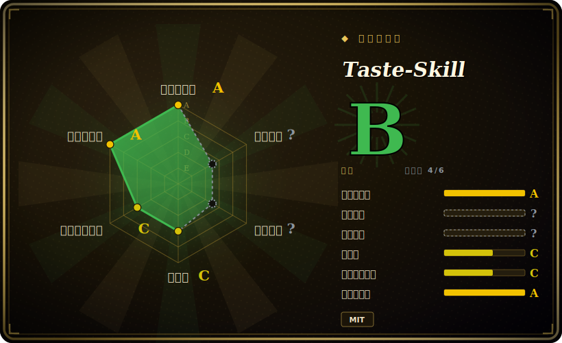

# Taste-Skill

一套可移植、与框架无关的 agent skill 集合，唯一目标是给你的 coding agent 注入「审美 / taste」——阻止它生成千篇一律、平庸的「AI slop」前端，转而产出有意图的布局、排版、动效与留白。

## 何时使用

你是一名开发者，或一名「vibe-coding」的玩家，正在用 Claude Code、Codex、Cursor 或 ChatGPT 快速搭一个落地页或 web 应用。可每次 agent 生成的 UI 都长一个样：居中 hero、三张功能卡片、紫到蓝的渐变、默认 Tailwind 间距、零动效。结果在技术上没错，但视觉上毫无生气——一眼就能看出「这是 LLM 写的」。你既不想每条 prompt 都手写 2000 字的设计 brief，手上也没有可供 agent 参照的设计系统。于是你用上 Taste-Skill：安装后，agent 会加载一份 `SKILL.md`，注入一套有主见的 taste 协议——从你的 brief 推断设计方向，映射到一致的设计系统（配色 / 字阶 / 间距尺度），铺入 GSAP 动效骨架，并执行 anti-repetition 检查，让下一屏不再克隆上一屏。

它还带可调旋钮——`DESIGN_VARIANCE`、`MOTION_INTENSITY`、`VISUAL_DENSITY`，1–10 档 [未验证]——让你不必重写 prompt 就能指定「张扬且多动效」还是「克制且高密度」。除默认前端 skill 外，这套包还含命名的美学变体（`soft`、`minimalist`、`brutalist`）、一个 `image-to-code` skill、一个 `redesign-existing-projects` skill，以及用于先出参考图再写代码的图像生成 skill（`imagegen-frontend-web/mobile`、`brandkit`）。用 `npx skills add` 装一次，agent 即可按需激活对应 skill。

## 何时不用

- **你已有一套信任的 design-taste / UI-critique skill。** 它与同 leaf 的姊妹包（designer-skills、stitch-skills、ui-ux-pro-max）高度重叠。叠两套有主见的「让它好看」skill 会产生指令冲突与双重路由——只保留一个 taste 事实源。
- **你已有真实的设计系统或品牌规范。** 当配色、字阶、组件、token 已被强约束时，一套靠推断驱动的 taste skill 会与你的约束打架而非服务于它；直接把系统落成约束（如 `DESIGN.md`），跳过这层猜测。
- **后端、CLI、数据或非视觉工作。** 这套包只塑造前端 / 视觉输出，对 API、迁移脚本或 TUI 毫无作用。
- **没有 skill loader 的 harness。** 它靠 agent 消费 `SKILL.md` 激活（Claude Code、Codex、Cursor、ChatGPT）；在没有 skill 加载机制的自研 agent 上，markdown 不会自动触发，你只能手动粘贴 prompt。
- **是建议，不是强制。** taste 写在 agent 可能忽略或稀释的 prompt 文本里；「anti-slop 协议」是指令，不是 lint 闸门。若要确定性强制，请配一个 artifact 静态检查器，而非只依赖该 skill。
- **维护风险。** 单作者仓库、无 tagged release；v2 默认项被标注为实验性，skill 在不同 push 之间会被改名 / 重组。需要稳定就钉一个 commit。[推断]

## 横向对比

| 替代品 | 是否收录 | 我们的评价 | 取舍 |
|---|---|---|---|
| [designer-skills](designer-skills.md) | ✅ | 当前页用于它的主场景；如果更看重“同 leaf 的姊妹 design-taste 包”，再选 designer-skills。 | 同 leaf 的姊妹 design-taste 包；按各自覆盖的美学变体、支持的 harness，以及协议是否贴合你的输出风格来选。 |
| [stitch-skills](stitch-skills.md) | ✅ | 当前页用于它的主场景；如果更看重“同 design leaf 的姊妹 skill 包”，再选 stitch-skills。 | 同 design leaf 的姊妹 skill 包；目标同样是「改进 agent 的 UI 输出」，但 skill 原语不同——按安装目标与变体覆盖度来选。 |
| [ui-ux-pro-max](ui-ux-pro-max.md) | ✅ | 当前页用于它的主场景；如果更看重“偏向更宽泛 UI/UX 指导的姊妹包”，再选 ui-ux-pro-max。 | 偏向更宽泛 UI/UX 指导的姊妹包；Taste-Skill 更窄，聚焦 anti-slop 前端生成，并带可调的 variance / motion / density 旋钮。 |
| make-interfaces-feel-better | 未收录 | 当前页用于它的主场景；如果更看重“被列为 leaf 姊妹但尚无页面”，再选 make-interfaces-feel-better。 | 被列为 leaf 姊妹但尚无页面；按它强调交互打磨、还是 Taste-Skill 的生成期美学来对比。 |
| Anthropic / 内置 agent skills | 未收录 | 当前页用于它的主场景；如果更看重“宿主 harness 自带的 skill 生态”，再选 Anthropic / 内置 agent skills。 | 宿主 harness 自带的 skill 生态；Taste-Skill 是叠加其上的第三方包，可能与原生设计 skill 重复或冲突。 |

## 健康度与可持续性

- **维护（2026-06）：** 活跃——最后 push 于 2026-06，未归档，但完全没有 tagged release，所谓「版本」只是一个移动的 commit。当作尽力而为，而非有版本承诺的产品。
- **治理与 bus factor：** 单作者 `User` 仓库（`Leonxlnx`）背着约 52k stars——典型的 bus-factor 警讯：超额采用全压在一个维护者身上，没有 foundation 或厂商背书。
- **年龄与 Lindy：** 创建于 2026-02，截至 2026-06 不足一年——年轻且被 star 炒热，v2 默认项仍被标为实验性、skill 在不同 push 间被改名重组。Lindy 维度上未经检验；star 数说明不了寿命。
- **风险标记：** 仅建议性约束（prompt/markdown，而非 lint 闸门）＋无 semver ＋单维护者 ⇒ 需要稳定行为就钉一个 commit。

## 存疑（未验证）

- [未验证] 截至 2026-06-26，GitHub 元数据显示 license 为 MIT、主语言为 JavaScript；仓库最后 push 于 2026-06-20，无 tagged release（`latestRelease` 为 null）——依赖某具体版本行为前请复核。
- [未验证] star 数（2026-06-26 GitHub 显示约 51.2k）不可靠且对日期敏感，仅作参考，绝不可当质量信号。
- [未验证] skill 清单（taste-skill / taste-skill-v1 / gpt-tasteskill / image-to-code-skill / redesign-skill / soft / minimalist / brutalist / imagegen-frontend-web / imagegen-frontend-mobile / brandkit / stitch / output）读自 README 与 `skills/` 目录树；install 名与「v2 实验性」状态在不同 push 间可能变化——请核对当前 `skills/` 目录。
- [未验证] 可调旋钮（`DESIGN_VARIANCE`、`MOTION_INTENSITY`、`VISUAL_DENSITY`，1–10）及 GSAP 动效 / 设计系统映射等行为出自 README；其对输出的真实影响未在此独立验证。
- [未验证] 支持的 agent（ChatGPT、Codex、Cursor、Claude Code）与 `npx skills add` 安装路径均来自项目 README；各 harness 的激活保真度未经验证。
- [推断] 因为 taste 协议存在于 agent 加载的 prompt/markdown skill 中，其执行是建议性的——agent 仍可能产出 slop；「anti-slop」步骤是 prompt 层指令，而非硬保证。
