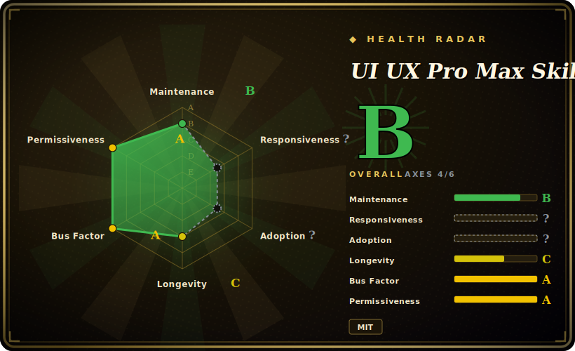

# UI UX Pro Max Skill

A design-intelligence skill pack that gives your coding agent UI/UX taste — a local retrieval engine over hundreds of industry reasoning rules, UI styles, color palettes, and font pairings that fires when you ask it to build an interface, plus a pre-delivery quality checklist.

## When to use

You're a backend-leaning developer (or a generalist) shipping a SaaS product, and you ask your coding agent to "build a landing page" or "make a settings screen." What comes back is technically correct but visually generic — default Tailwind spacing, emoji icons, no real hierarchy, the same gradient hero every AI produces. You can tell it looks like AI slop, but you don't have the design vocabulary to say *why* or to direct a fix. You want the agent to make defensible design decisions on its own: pick a style that fits a fintech vs. a beauty-spa product, choose a palette and type pairing with intent, respect WCAG contrast and reduced-motion, and avoid known anti-patterns.

UI UX Pro Max installs that judgment into the agent. You run `npm install -g ui-ux-pro-max-cli` then `uipro init --ai claude` (or cursor, windsurf, copilot, codex, kiro…), which drops a skill directory with markdown manifests plus a bundled Python `search.py` over CSV databases (161 reasoning rules, 67 styles, 161 palettes, 57 font pairings per the README). After that, when you make a natural UI/UX request the skill auto-activates: it does a multi-domain lookup (product type → patterns, color mood, typography, anti-patterns), generates a design system you can persist to `design-system/MASTER.md`, and runs a checklist (WCAG AA contrast, 375–1440px breakpoints, focus states, no-emoji-icons) before declaring done. Power users can also call `search.py` directly. It runs fully local — only Python 3 as a prerequisite, no server or external API. [推断]

## When NOT to use

- **You already run a UI/design skill or design-system contract you trust.** This pack is opinionated about styles, palettes, and "rules"; layering it over an existing taste skill or a project `DESIGN.md` invites two sources of truth and conflicting directives. Pick one design authority.
- **You want a component library or a finished UI you can import.** It ships *design intelligence and generation guidance*, not React/Vue components — there's nothing to `import`. The output is code the agent writes plus a markdown design system, not a packaged UI kit.
- **Your harness can't load the skill or run Python.** Activation depends on each platform's skill-loading mechanism, and the retrieval backend needs Python 3 on the machine. On a harness with no skill loader, or a sandbox without Python, the markdown alone won't auto-fire and the search engine won't run.
- **You need enforcement, not suggestion.** The checklist (contrast, breakpoints, no emoji) and style rules are advisory prompt-level guidance the agent *should* follow — they are not a hard gate, linter, or CI check. The agent can still ship something that violates them. [推断]
- **Fast-moving single-vendor upstream.** Frequent releases (v2.8.x) and behavior baked into prompts/CSV data mean a version bump can change which styles, rules, or checklist items apply. Pin a version if you need reproducible design output.

## Comparison

| Alternative | In index | Tradeoff |
|---|---|---|
| designer-skills | 未收录 | Sibling UI/UX design skill pack in this leaf; compare on whether it ships a retrieval engine + rule database vs. pure prompt guidance. |
| stitch-skills | 未收录 | Sibling design skill pack; different generation surface — weigh which targets your stack (HTML/Tailwind/React) and harness. |
| taste-skill | 未收录 | Sibling skill focused on visual *taste*/critique; pairs with rather than replaces a generation-oriented pack like this one. |
| make-interfaces-feel-better | 未收录 | Sibling skill aimed at polish/feel of existing interfaces; narrower scope than this pack's product-type-to-design-system pipeline. |
| Anthropic / built-in agent skills and slash commands | 未收录 | The platform's native skill ecosystem; this is a third-party bundle layered on top, so it can duplicate or conflict with native design helpers. |
| Hand-written project `DESIGN.md` design system | 未收录 | A bespoke per-project design contract you maintain; more tailored and stable, but you build and enforce it yourself instead of getting a 161-rule starter. |

## Health & viability

- **Maintenance (2026-06):** active and fast-moving — last push 2026-06, latest release v2.8.8, frequent v2.8.x cadence, not archived. Disciplined semver is a plus, but the rapid cadence means a bump can shift which styles/rules/checklist items apply.
- **Governance & backing:** `Organization`-owned (`nextlevelbuilder`), but functionally a single-vendor project — one org owns the roadmap, styles, and the CSV rule data; no foundation. [推断]
- **Age & Lindy:** created 2025-11, so well under a year old as of 2026-06 — young and heavily star-hyped (~97k). Unproven on Lindy; the star count is not a durability signal.
- **Risk flags:** advisory enforcement (prompt/markdown + a local CSV search step, not a hard gate); behavior baked into prompts/CSV ⇒ pin a version for reproducible design output.

## Caveats (unverified)

- [未验证] Latest release reported as v2.8.8 (published 2026-06-26) with the repo last pushed 2026-06-26; license MIT and primary language Python per GitHub metadata as of 2026-06-26 — re-verify before relying on a specific version's behavior.
- [未验证] Star count (~96.6k per GitHub on 2026-06-26) is unreliable and date-sensitive; treat as indicative only, not as a quality signal.
- [未验证] The dataset sizes (161 reasoning rules, 67 UI styles, 161 color palettes, 57 font pairings, 99 UX guidelines, 25 chart types) and the supported-harness list (Claude Code, Cursor, Windsurf, Antigravity, GitHub Copilot, Kiro, Codex CLI, Continue, Gemini CLI, and others) are taken from the project README and not independently counted/confirmed here.
- [未验证] Install path is an npm package `ui-ux-pro-max-cli` that generates skill files; that the generated skill internally calls `search.py` (rather than the user always calling it) is per the README's described architecture, not separately validated.
- [推断] Because the design rules and pre-delivery checklist live in prompt/markdown skills and a local CSV-backed search step, enforcement is advisory — the agent can still deviate or ship non-conforming UI; "checklist" items are guidance, not hard guarantees.
- [推断] "Runs fully local with only Python 3, no external dependencies" is from the README; actual behavior on a given sandbox (Python availability, file-write permissions for the generated skill dir) is not confirmed here.
