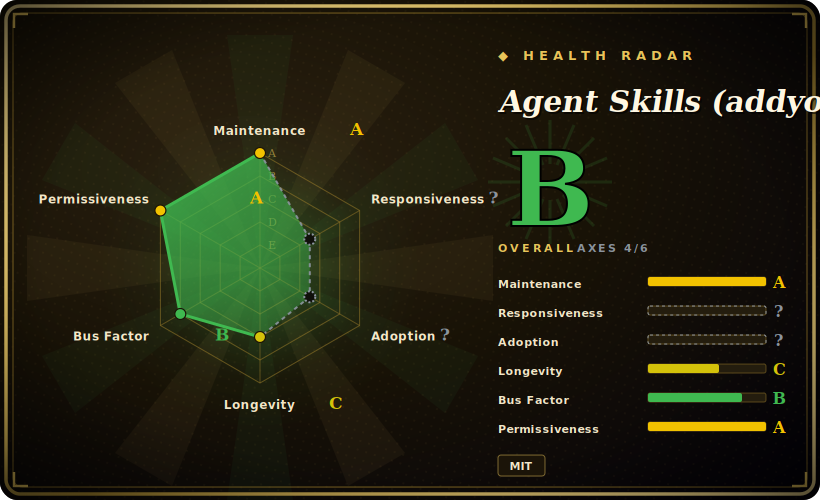

# Agent Skills (addyosmani)

A curated pack of ~24 production-engineering skills — the workflows, quality gates, and review checklists senior engineers use — installed into your coding agent and routed through ~8 lifecycle slash commands (`/spec`, `/plan`, `/build`, `/test`, `/review`, `/webperf`, `/code-simplify`, `/ship`).

## When to use

You're an engineer running an AI coding agent (Claude Code, Cursor, Antigravity, Gemini CLI, Windsurf, Copilot, OpenCode, Kiro…) on a real codebase, and the agent's *engineering hygiene* is the weak link: it ships 500-line diffs with no tests, "optimizes" performance without ever opening DevTools, rubber-stamps its own code review, and skips the security and migration steps a human reviewer would insist on. You don't want a generic "be a good engineer" prompt — you want the actual senior-engineer playbook: test pyramid and red-green-refactor, OWASP-style hardening, Core Web Vitals and bundle profiling, contract-first API design, ADRs, observability, safe deprecation/migration, and small-change discipline drawn from *Software Engineering at Google* (≈100-line changes, trunk-based, anti-rationalization tables).

You reach for this pack when you want that engineering discipline to fire on demand rather than only when you remember to ask. Install it once via your agent's marketplace/plugin mechanism, and the skills surface through ~8 slash commands mapped to the SDLC — Define (`interview-me`, `spec-driven-development`), Build (`test-driven-development`, `frontend-ui-engineering`, `api-and-interface-design`), Verify (`browser-testing-with-devtools`, `debugging-and-error-recovery`), Review (`code-review-and-quality`, `security-and-hardening`, `performance-optimization`), and Ship (`git-workflow-and-versioning`, `ci-cd-and-automation`, `observability-and-instrumentation`). It also ships pre-built personas (code-reviewer, test-engineer, security-auditor, web-performance-auditor) and reference checklists so the agent has concrete criteria to check against, not vibes.

## When NOT to use

- **You already run a methodology skill pack.** This overlaps heavily with broader SDLC packs (brainstorm → plan → TDD → verify). Stacking it on top of an existing methodology layer invites conflicting "mandatory" instructions and double-routing on the same lifecycle stages — pick one source of truth.
- **You want a runtime/CLI/library.** There is nothing to `import` or run standalone — it's markdown skills + slash commands + per-platform config. Outside a supporting agent harness it does nothing.
- **Your agent has no skill/plugin loader.** It activates through each platform's native skill-loading (marketplace, `agy plugin install`, `gemini skills install`, rules files). On a bespoke or unsupported agent there's no loader to fire the skills, and the markdown won't auto-apply.
- **Enforcement must be hard-gated.** The quality gates live in prompt/markdown; they *advise* the agent, they don't block a merge. The agent can still skip a step or rationalize around it — if you need CI-enforced gates, wire real tooling (linters, test gates, CI) instead. [推断]
- **Throwaway scripts / non-code tasks.** The full spec→build→review→ship ceremony is overhead for a one-line script or a config tweak.
- **Single-maintainer, fast-moving upstream.** Pre-1.0 (v0.6.x) with frequent releases; skill names, routing, and slash-command mapping can shift between versions. Pin a tag if you need stability.

## Comparison

| Alternative | In index | Our verdict | Tradeoff |
|---|---|---|---|
| [web-quality-skills (addyosmani)](addyosmani-web-quality.md) ✅ | indexed | Use this page for its stated niche; choose web-quality-skills (addyosmani) ✅ when you need narrower sibling focused specifically on web performance / accessibility / quality auditing. | Narrower sibling focused specifically on web performance / accessibility / quality auditing. This pack subsumes that theme (`/webperf`, web-performance-auditor) inside a full SDLC; use the focused one if you only need web-quality auditing. |
| [scientific-agent-skills](scientific-agent-skills.md) ✅ | indexed | Use this page for its stated niche; choose scientific-agent-skills ✅ when you need skill pack for scientific/research engineering workflows. | Skill pack for scientific/research engineering workflows; different domain. Pick by whether your work is general software engineering vs. scientific computing. |
| [Waza](waza.md) ✅ | indexed | Use this page for its stated niche; choose Waza ✅ when you need another engineering-oriented skill collection in this leaf. | Another engineering-oriented skill collection in this leaf; compare on which lifecycle stages each actually defines and how prescriptive the workflows are. |
| [vercel-labs/agent-skills](vercel-agent-skills.md) ✅ | indexed | Use this page for its stated niche; choose vercel-labs/agent-skills ✅ when you need vendor-curated skill set. | Vendor-curated skill set; compare breadth (full SDLC here vs. vendor-scoped), harness coverage, and maintenance cadence. |
| Superpowers | 未收录 (other leaf) | Use this page for its stated niche; choose Superpowers when you need methodology-first pack centered on brainstorm→plan→TDD→verify discipline. | Methodology-first pack centered on brainstorm→plan→TDD→verify discipline; this one leads with concrete engineering practice areas (quality/security/perf/API/ship) and lifecycle slash commands rather than a TDD/subagent spine. Overlapping goal, different center of gravity. |
| Each agent's built-in skills / slash commands | 未收录 | Use this page for its stated niche; choose Each agent's built-in skills / slash commands when you need the platform's own skill ecosystem. | The platform's own skill ecosystem; this is a third-party bundle layered on top, so it can duplicate or conflict with native skills. |

## Health & viability

- **Maintenance (2026-06):** active — last push 2026-06, latest release v0.6.2, frequent pre-1.0 releases, not archived. Versioned, but still v0.x so routing and slash-command mapping can shift between bumps.
- **Governance & bus factor:** single-maintainer `User` repo (Addy Osmani) carrying ~67k stars — strong individual reputation, but a real bus-factor concentration with no org/foundation backing the roadmap. [推断]
- **Age & Lindy:** created 2026-02, so only a few months old as of 2026-06 — young and star-hyped; unproven on Lindy. The author's standing is the main signal, not track record of this repo.
- **Risk flags:** advisory-only "quality gates" (prompt/markdown, not a merge/CI block) + pre-1.0 churn ⇒ pin a tag for stable routing. [推断]

## Caveats (unverified)

- [未验证] Latest release reported as v0.6.2 (published 2026-06-11) with the repo last pushed 2026-06-25; license MIT and primary language Shell per GitHub metadata as of 2026-06-26 — re-verify before relying on a specific version's behavior.
- [未验证] Star count (~66.9k per GitHub on 2026-06-26) is unreliable and date-sensitive; treat as indicative only, not as a quality signal.
- [未验证] Skill inventory ("~24 skills") and the lifecycle grouping (Define/Plan/Build/Verify/Review/Ship/Meta) plus the ~8 slash commands are read from the README on 2026-06-26; the actual `skills/` directory and command set change release-to-release — inspect the current repo rather than trusting this list.
- [未验证] The supported-harness list (Claude Code, Antigravity, Gemini CLI, Cursor, Windsurf, GitHub Copilot, OpenCode, Kiro) and the per-platform install commands are from the README; activation fidelity varies per harness and is not independently confirmed here.
- [推断] Because behavior lives in prompt/markdown skills loaded by the agent, "quality gates" are advisory — the agent can deviate; they are prompt-level instructions, not hard guarantees.
- [推断] Provenance claims (practices drawn from *Software Engineering at Google*, OWASP, Core Web Vitals) are README framing for the skill content, not verified citations of those sources here.
