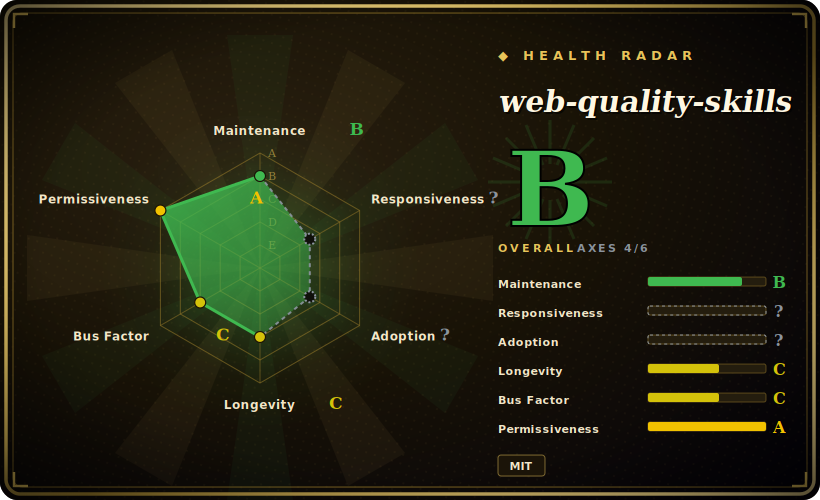

# web-quality-skills

A six-skill agent pack that encodes Lighthouse / Core Web Vitals / WCAG / SEO best practices as on-demand instruction sets, so a coding agent can audit and fix web-quality issues without you hand-feeding it the rules.

## When to use

You're a frontend or full-stack developer working in Claude Code (or Codex / Gemini CLI) on a web app, and someone asks you to "make the site faster" or "fix our Lighthouse score." You know roughly what matters — LCP under 2.5s, INP under 200ms, CLS under 0.1, alt text, `font-display: swap`, structured data — but spelling all of that out to the agent every time is tedious, and the agent tends to give generic advice that drifts from current Lighthouse guidance (which reorganized into Performance Insight Audits in late 2025). You want the agent to already *know* the checklist and apply it to your actual code.

You install this pack (`npx skills add addyosmani/web-quality-skills`, or via the Claude Code / Codex plugin marketplace, or as a Gemini CLI extension) and it adds six skills — `web-quality-audit`, `performance`, `core-web-vitals`, `accessibility`, `seo`, `best-practices` — that activate when your request matches their description. Ask "audit my site" and the agent loads the audit skill, categorizes findings by severity, and proposes concrete fixes with code examples; the `web-quality-audit` skill also ships a read-only `analyze.sh` helper that greps HTML for missing doctype/viewport/lang/alt and emits structured JSON. It's the curated knowledge you'd otherwise paste in by hand, packaged so the agent pulls it in just-in-time.

## When NOT to use

- **You already run a frontend-quality skill/command system you trust.** This pack is opinionated and will route on prompts like "audit my site"; layering it over your own UI/perf skills (e.g. an internal `fe-audit`) risks double-routing and conflicting recommendations. Pick one source of truth.
- **You're not on a supported harness.** Activation depends on a skill loader — Claude Code, Codex, or Gemini CLI per the README. On a bespoke or unsupported agent there's nothing to fire the `SKILL.md` files, and the markdown alone won't auto-apply.
- **You need an actual measurement tool / CI gate.** This is advice, not instrumentation. It does not run a real Lighthouse pass, collect field RUM, or block a build; the bundled `analyze.sh` is a lightweight static HTML grep, not a profiler. For numeric budgets in CI you still need Lighthouse CI or WebPageTest.
- **Guidance can drift from upstream Lighthouse.** The skills encode a snapshot of audit names and thresholds; Lighthouse already migrated Performance to Insight Audits (Oct 2025+), and the SKILL files carry compatibility notes rather than live data. Re-verify against current Lighthouse output. [推断]
- **Maintenance is single-author and lightly versioned.** It's a personal repo (Addy Osmani) with a `plugin.json` version but no tagged GitHub releases; treat it as best-effort, not a supported product. [推断]

## Comparison

| Alternative | In index | Our verdict | Tradeoff |
|---|---|---|---|
| [Agent Skills (addyosmani)](addyosmani-agent-skills.md) | ✅ | Use this page for its stated niche; choose Agent Skills (addyosmani) when you need same author's broader, general-purpose agent-skills pack. | Same author's broader, general-purpose agent-skills pack; this one is the narrow web-quality vertical. Use both if you want general + web-quality coverage, but watch for routing overlap. |
| [Scientific Agent Skills](scientific-agent-skills.md) | ✅ | Use this page for its stated niche; choose Scientific Agent Skills when you need sibling skill-pack for scientific/eng workflows, not web quality. | Sibling skill-pack for scientific/eng workflows, not web quality — complementary, different domain. |
| [Waza](waza.md) | ✅ | Use this page for its stated niche; choose Waza when you need another engineering skill collection in this leaf. | Another engineering skill collection in this leaf; compare on which lifecycle stages each actually covers. |
| [Vercel Agent Skills](vercel-agent-skills.md) | ✅ | Use this page for its stated niche; choose Vercel Agent Skills when you need vercel's agent-skills set, deploy/Next. | Vercel's agent-skills set, deploy/Next.js-leaning; overlaps on web perf but framed around their platform. |
| Lighthouse CI / WebPageTest | 未收录 | Use this page for its stated niche; choose Lighthouse CI / WebPageTest when you need real measurement + CI gating tools (not skill packs). | Real measurement + CI gating tools (not skill packs). Use these when you need numbers and build-blocking budgets; this pack is the advisory layer that interprets and fixes, not the meter. |
| Pasting the rules into context yourself | n/a | Use this page for its stated niche; choose Pasting the rules into context yourself when you need zero install, full control, but tedious and goes stale. | Zero install, full control, but tedious and goes stale; the pack's whole value is packaging the checklist for just-in-time loading. |

## Health & viability

- **Maintenance (2026-06):** active — last push 2026-06, not archived, but only a `plugin.json` v1.0.0 with no tagged GitHub releases, so versioning is light. Best-effort, not a supported product.
- **Governance & bus factor:** single-author `User` repo (Addy Osmani); modest ~2k stars, so adoption is low and the whole thing rests on one maintainer — no foundation/vendor backing.
- **Age & Lindy:** created 2026-01, so under a year old as of 2026-06 — young; unproven on Lindy. Unlike the author's larger pack, it doesn't even carry star-hype to lean on.
- **Risk flags:** advisory-only (encodes a point-in-time Lighthouse snapshot, not a live meter); upstream Lighthouse already moved Performance to Insight Audits, so the encoded audit names can drift — re-verify against current Lighthouse. [推断]

## Caveats (unverified)

- [未验证] GitHub metadata as of 2026-06-26: license MIT, primary language Shell, last pushed 2026-06-14, not archived, `latestRelease` null (no tagged GitHub release) though `.claude-plugin/plugin.json` declares version 1.0.0 — re-verify before relying on a specific version's behavior.
- [未验证] Star count (~2.4k per GitHub on 2026-06-26) is unreliable and date-sensitive; treat as indicative only, not a quality signal.
- [未验证] Skill inventory is six skills (`web-quality-audit`, `performance`, `core-web-vitals`, `accessibility`, `seo`, `best-practices`) with `analyze.sh` only under `web-quality-audit/scripts`; counts and contents change upstream — inspect the current `skills/` directory rather than trusting this list.
- [未验证] Supported harnesses (Claude Code plugin marketplace, Codex, Gemini CLI extension, claude.ai manual paste) and the `npx skills add` install path are from the project README; activation fidelity per harness is not independently confirmed here.
- [推断] Because behavior lives in prompt/markdown skills loaded by the agent, enforcement is advisory — the agent can deviate and recommendations are not a substitute for a real Lighthouse/RUM measurement.
- [推断] The encoded Lighthouse audit names and Core Web Vitals thresholds reflect a point-in-time snapshot; Lighthouse's move to Performance Insight Audits means some names this pack references are merged/removed upstream.
