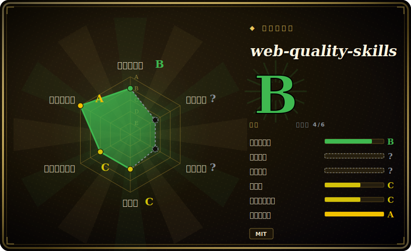

# web-quality-skills

一个含六个技能的 agent 技能包，把 Lighthouse / Core Web Vitals / WCAG / SEO 的最佳实践编码成按需加载的指令集，让 coding agent 不靠你逐条喂规则就能审计并修复 web 质量问题。

## 何时使用

你是一名前端或全栈开发者，在 Claude Code（或 Codex / Gemini CLI）里做一个 web 应用，有人让你「把站点提速」或「修一下 Lighthouse 分数」。你大概知道哪些指标要紧 —— LCP 低于 2.5s、INP 低于 200ms、CLS 低于 0.1、alt 文本、`font-display: swap`、结构化数据 —— 但每次都把这些讲给 agent 听很烦，而且 agent 往往只给泛泛建议，还会偏离当前的 Lighthouse 指引（2025 年末 Lighthouse 已把性能审计重组为 Performance Insight Audits）。你希望 agent 本身就「知道」这份清单，并把它应用到你真实的代码上。

你装上这个包（`npx skills add addyosmani/web-quality-skills`，或经 Claude Code / Codex 插件市场，或作为 Gemini CLI extension），它会加入六个技能 —— `web-quality-audit`、`performance`、`core-web-vitals`、`accessibility`、`seo`、`best-practices` —— 当你的请求匹配技能描述时自动触发。说「audit my site」，agent 就加载审计技能，按严重程度（Critical/High/Medium/Low）归类问题，并给出带代码示例的具体修复；`web-quality-audit` 技能还附带一个只读的 `analyze.sh` 脚本，用 grep 扫 HTML 是否缺 doctype/viewport/lang/alt 并输出结构化 JSON。它就是你本来要手动粘贴进上下文的那份知识，打包成 agent 能即时调用的形式。

## 何时不用

- **你已有一套信任的前端质量技能 / 命令体系。** 这个包很有主见，会在「audit my site」这类提示上抢路由；把它叠在你自己的 UI/性能技能（比如内部 `fe-audit`）之上，会造成双重路由和相互冲突的建议。选一个单一事实源。
- **你不在受支持的 harness 上。** 触发依赖技能加载器 —— 据 README 为 Claude Code、Codex 或 Gemini CLI。在自研或不受支持的 agent 上没有东西去点燃这些 `SKILL.md`，光有 markdown 不会自动生效。
- **你需要的是真正的测量工具 / CI 闸门。** 这是建议，不是仪表。它不会真跑 Lighthouse、不采集线上 RUM、也不会卡构建；自带的 `analyze.sh` 是轻量静态 HTML grep，不是 profiler。要在 CI 里跑数值预算，仍需 Lighthouse CI 或 WebPageTest。
- **指引可能与上游 Lighthouse 漂移。** 技能编码的是某一时刻的审计名与阈值；Lighthouse 已把性能迁到 Insight Audits（2025-10 起），SKILL 文件携带的是兼容性说明而非实时数据。请对照当前 Lighthouse 输出复核。[推断]
- **维护是单作者、版本标注很轻。** 这是个人仓库（Addy Osmani），有 `plugin.json` 版本号但没有 GitHub tagged release；当成尽力而为的项目，而非有支持承诺的产品。[推断]

## 横向对比

| 替代方案 | 已收录 | 取舍 |
|---|---|---|
| [Agent Skills (addyosmani)](addyosmani-agent-skills.zh.md) | ✅ | 同作者更宽的通用 agent-skills 包；本包是窄的 web 质量垂类。想要通用 + web 质量都覆盖可两个都装，但留意路由重叠。 |
| [Scientific Agent Skills](scientific-agent-skills.zh.md) | ✅ | 面向科研 / 工程工作流的姊妹技能包，与 web 质量无关 —— 互补，不同领域。 |
| [Waza](waza.zh.md) | ✅ | 本 leaf 下另一个工程技能集；按各自实际覆盖的生命周期阶段比较。 |
| [Vercel Agent Skills](vercel-agent-skills.zh.md) | ✅ | Vercel 的 agent-skills 集，偏部署 / Next.js；在 web 性能上有重叠，但围绕其平台组织。 |
| Lighthouse CI / WebPageTest | 未收录 | 真正的测量 + CI 卡门工具（不是技能包）。需要数字和卡构建的预算时用它们；本包是解释并修复的建议层，不是仪表。 |
| 自己把规则粘进上下文 | n/a | 零安装、完全可控，但很烦且会过期；这个包的全部价值就是把清单打包成可即时加载。 |

## 健康度与可持续性

- **维护（2026-06）：** 活跃——最后 push 于 2026-06，未归档，但只有 `plugin.json` 的 v1.0.0、无 GitHub tagged release，版本标注很轻。尽力而为，而非有支持承诺的产品。
- **治理与 bus factor：** 单作者 `User` 仓库（Addy Osmani）；约 2k stars，采用量低，整体压在一个维护者身上，无 foundation 或厂商背书。
- **年龄与 Lindy：** 创建于 2026-01，截至 2026-06 不足一年——年轻；Lindy 维度未经检验。与作者那个更大的包不同，它连可倚仗的 star 热度都没有。
- **风险标记：** 仅建议性（编码的是某一时点的 Lighthouse 快照，不是实时仪表）；上游 Lighthouse 已把性能迁到 Insight Audits，所编码的审计名可能漂移——请对照当前 Lighthouse 复核。[推断]

## 存疑（未验证）

- [未验证] 2026-06-26 GitHub 元数据：license MIT，主语言 Shell，最后 push 于 2026-06-14，未归档，`latestRelease` 为 null（无 GitHub tagged release），但 `.claude-plugin/plugin.json` 声明版本 1.0.0 —— 依赖某个具体版本行为前请复核。
- [未验证] 星标数（2026-06-26 GitHub 约 2.4k）不可靠且对日期敏感；仅作参考，不作为质量信号。
- [未验证] 技能清单为六个（`web-quality-audit`、`performance`、`core-web-vitals`、`accessibility`、`seo`、`best-practices`），`analyze.sh` 仅在 `web-quality-audit/scripts` 下；数量与内容上游会变 —— 请查当前 `skills/` 目录而非依赖此列表。
- [未验证] 受支持的 harness（Claude Code 插件市场、Codex、Gemini CLI extension、claude.ai 手动粘贴）与 `npx skills add` 安装路径取自项目 README；各 harness 的触发保真度未在此独立确认。
- [推断] 由于行为活在被 agent 加载的 prompt/markdown 技能里，强制力是建议性的 —— agent 可能偏离，且这些建议不能替代真实的 Lighthouse/RUM 测量。
- [推断] 所编码的 Lighthouse 审计名与 Core Web Vitals 阈值是某一时点的快照；Lighthouse 迁到 Performance Insight Audits 意味着本包引用的部分名称在上游已被合并/移除。
