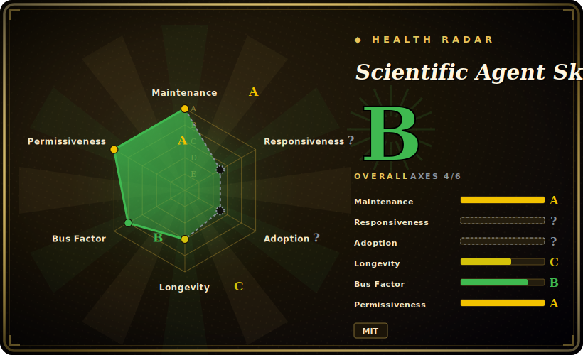

# Scientific Agent Skills

A large skill pack (~147 skills as of this check) that turns a coding agent into a research assistant for biology, chemistry, medicine, and drug discovery — each skill wraps a scientific Python library or database with a documented `SKILL.md` the agent loads on demand.

## When to use

You're a computational biologist or research engineer driving Claude Code (or Cursor, Codex, Antigravity, Pi…) through a real scientific workflow — say a single-cell RNA-seq analysis, a virtual-screening campaign, or a clinical-variant lookup. The agent technically *can* call Scanpy, RDKit, or query PubChem, but it doesn't know the idiomatic pipeline, the right preprocessing defaults, or which of 100+ databases answers your question — so it improvises, hallucinates an API surface, or wires the steps together wrong. You want it to follow the conventions a domain expert would, with curated docs and worked examples in front of it.

You reach for this pack to drop in a domain library: install once (`npx skills add K-Dense-AI/scientific-agent-skills`, `gh skill install`, or clone into `~/.agents/skills/`), and the agent gains on-demand skills for bioinformatics (Scanpy, BioPython, pysam, scVelo), cheminformatics/drug discovery (RDKit, Datamol, DeepChem, DiffDock, OpenMM), ML (PyTorch Lightning, scikit-learn, PyMC), data viz (Matplotlib, GeoPandas, NetworkX), materials/physics (Pymatgen, Qiskit), lab automation (Opentrons, Benchling), and a unified database-lookup skill fronting PubChem, ChEMBL, UniProt, COSMIC, FDA, ClinicalTrials.gov and dozens more. Each skill ships a `SKILL.md` with examples; the agent pulls in only the ones a task needs.

## When NOT to use

- **You already curate a scientific skill/prompt stack you trust.** This pack is broad and opinionated about conventions; layering ~147 skills on top of your own can produce conflicting guidance and double-routing. Pick one source of truth per domain.
- **Your work isn't in its covered domains.** It targets life sciences, chemistry, medicine, materials, and adjacent ML/data work. General software engineering, web, or non-science tasks get no benefit — the skills won't fire usefully.
- **You're on a harness with no skill loader.** It activates through the open Agent Skills standard (Claude Code, Cursor, Codex, Antigravity, Pi, etc.). On a bespoke agent with no loader, the `SKILL.md` files are inert markdown and won't auto-activate.
- **You need the heavy scientific runtimes preinstalled.** The skills document *how* to use Scanpy/RDKit/OpenMM/PyTorch — they don't bring the Python environment, CUDA, or large reference datasets. You still provision and manage those yourself.
- **You want guaranteed-correct science.** Skill docs are advisory prompt context, not validated pipelines; the agent can still deviate, and individual skills may carry their own licenses. [推断]

## Comparison

| Alternative | In index | Our verdict | Tradeoff |
|---|---|---|---|
| [addyosmani/agent-skills](addyosmani-agent-skills.md) | ✅ | Use this page for its stated niche; choose addyosmani/agent-skills when you need general-purpose / web-leaning engineering skill collection. | General-purpose / web-leaning engineering skill collection; broad coding utility, not domain-science. This pack is narrowly scientific (omics, cheminformatics, lab) and far larger. |
| [web-quality-skills](addyosmani-web-quality.md) | ✅ | Use this page for its stated niche; choose web-quality-skills when you need web-performance / quality-focused skills. | Web-performance / quality-focused skills; orthogonal domain. Choose by whether your task is frontend quality vs. wet-lab/computational science. |
| [Waza](waza.md) | ✅ | Use this page for its stated niche; choose Waza when you need engineering-workflow skill pack. | Engineering-workflow skill pack; overlapping "install skills into your agent" shape, different (non-science) subject matter. |
| [vercel-labs/agent-skills](vercel-agent-skills.md) | ✅ | Use this page for its stated niche; choose vercel-labs/agent-skills when you need vendor/web-platform engineering skills. | Vendor/web-platform engineering skills; useful for app/deploy workflows, not for bioinformatics or drug discovery. |
| Bespoke per-library prompting (write your own SKILL.md) | 未收录 | Use this page for its stated niche; choose Bespoke per-library prompting (write your own SKILL.md) when you need maximum control and zero unused surface, but you rebuild and maintain curated docs for every library. | Maximum control and zero unused surface, but you rebuild and maintain curated docs for every library yourself instead of installing a vetted bundle. |

## Health & viability

- **Maintenance (2026-06):** very active — last push 2026-06, latest release v2.53.0, high release cadence, not archived. The version churn implies the skill set shifts often (skill count already drifts 140↔147).
- **Governance & backing:** `Organization`-owned (`K-Dense-AI`), so a team/vendor rather than a lone maintainer, but a single company owns the roadmap; no foundation. The README's "160,000+ scientists / #1" framing is marketing, not a governance signal. [推断]
- **Age & Lindy:** created 2025-10, so under a year old as of 2026-06 — young; unproven on Lindy despite ~29k stars.
- **Adoption/ecosystem:** broad surface (~147 skills across omics/cheminformatics/ML/labs) is the draw, but breadth ≠ depth — each skill is advisory markdown, not a validated pipeline.
- **Risk flags:** individual skills "may carry different licenses" than the repo's MIT, and a referenced Cisco AI Defense scan is not a security guarantee — verify the license/safety of any specific skill you depend on. [推断]

## Caveats (unverified)

- [未验证] Metadata as of 2026-06-26 (GitHub): latest release v2.53.0 (published 2026-06-23), repo last pushed 2026-06-23, license MIT, primary language Python, not archived — re-verify before relying on a specific version's behavior or skill list.
- [未验证] Star count (~29.4k per GitHub on 2026-06-26) and the README's "160,000+ scientists" / "#1 library" claims are marketing/usage signals, unreliable and date-sensitive; treat as indicative only, not as a quality guarantee.
- [未验证] Skill count (README says 147; description says 140) and the per-domain breakdown (e.g. 23 bioinformatics, 27 scientific-communication) come from the project README and shift release-to-release; inspect the current `skills/` directory rather than trusting this list.
- [未验证] The "100+ scientific databases" behind the unified database-lookup skill and the supported-agent list (Claude Code, Cursor, Codex, Antigravity, Pi, OpenClaw…) are from the README; actual coverage and per-harness activation fidelity are not independently confirmed here.
- [未验证] README states skills are scanned with Cisco AI Defense Skill Scanner and that individual skills "may have different licenses" than the repo's MIT — verify the license of any specific skill you depend on, and don't treat the scan as a security guarantee.
- [推断] Because skills are markdown docs loaded into the agent, their guidance is advisory — the agent can still write incorrect or non-idiomatic scientific code; these are not validated, reproducible pipelines.
