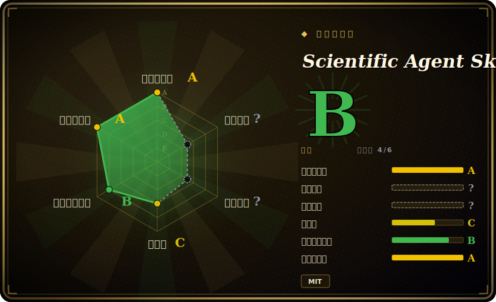

# Scientific Agent Skills

一个大型 skill 包（本次核查约 147 个 skill），把 coding agent 变成生物、化学、医学、药物发现领域的科研助手——每个 skill 用一份带文档的 `SKILL.md` 封装一个科学 Python 库或数据库，agent 按需加载。

## 何时使用

你是一名计算生物学家或科研工程师，正在用 Claude Code（或 Cursor、Codex、Antigravity、Pi……）跑一条真实的科研流程——比如单细胞 RNA-seq 分析、虚拟筛选，或临床变异查询。agent 技术上*能*调用 Scanpy、RDKit 或查询 PubChem，但它不懂地道的流水线、不知道正确的预处理默认值，也分不清 100+ 个数据库里哪个能回答你的问题——于是它随意发挥、臆造 API、或把步骤接错。你希望它按领域专家的惯例来做，眼前摆着经过整理的文档和可运行示例。

你拿它来给 agent 装上一个领域库：装一次（`npx skills add K-Dense-AI/scientific-agent-skills`、`gh skill install`，或克隆进 `~/.agents/skills/`），agent 就获得按需加载的 skill——生物信息（Scanpy、BioPython、pysam、scVelo）、化学信息/药物发现（RDKit、Datamol、DeepChem、DiffDock、OpenMM）、机器学习（PyTorch Lightning、scikit-learn、PyMC）、数据可视化（Matplotlib、GeoPandas、NetworkX）、材料/物理（Pymatgen、Qiskit）、实验室自动化（Opentrons、Benchling），以及一个统一的 database-lookup skill，前接 PubChem、ChEMBL、UniProt、COSMIC、FDA、ClinicalTrials.gov 等数十个库。每个 skill 都带一份含示例的 `SKILL.md`；agent 只拉取任务需要的那些。

## 何时不用

- **你已有一套自己信任的科研 skill/prompt 体系。** 这个包覆盖面广、对惯例有强观点；在你自己的体系上再叠 ~147 个 skill 会产生冲突指引和双重路由。每个领域只留一个事实源。
- **你的工作不在它覆盖的领域内。** 它面向生命科学、化学、医学、材料及相邻的 ML/数据工作。通用软件工程、Web 或非科学任务得不到收益——这些 skill 不会有效触发。
- **你的 harness 没有 skill loader。** 它通过开放的 Agent Skills 标准激活（Claude Code、Cursor、Codex、Antigravity、Pi 等）。在没有 loader 的自研 agent 上，`SKILL.md` 只是惰性 markdown，不会自动激活。
- **你需要预装好的重型科学运行时。** 这些 skill 只讲*怎么*用 Scanpy/RDKit/OpenMM/PyTorch——它们不带来 Python 环境、CUDA 或大型参考数据集。这些仍需你自己准备和维护。
- **你想要保证正确的科研结果。** skill 文档是建议性的 prompt 上下文，不是经过验证的流水线；agent 仍可能偏离，单个 skill 也可能带自己的许可证。[推断]

## 横向对比

| 替代品 | 已收录 | 取舍 |
|---|---|---|
| [addyosmani/agent-skills](addyosmani-agent-skills.md) | ✅ | 通用/偏 Web 的工程 skill 集合；编码通用性广，但非领域科学。本包窄聚焦于科学（组学、化学信息、实验室）且规模大得多。 |
| [web-quality-skills](addyosmani-web-quality.md) | ✅ | 偏 Web 性能/质量的 skill；领域正交。按任务是前端质量还是湿实验/计算科学来选。 |
| [Waza](waza.md) | ✅ | 工程工作流 skill 包；同样是「把 skill 装进 agent」的形态，主题（非科学）不同。 |
| [vercel-labs/agent-skills](vercel-agent-skills.md) | ✅ | 厂商/Web 平台向的工程 skill；适合 app/部署工作流，不适合生信或药物发现。 |
| 自写逐库 prompt（自己写 SKILL.md） | 未收录 | 控制力最大、无冗余面，但你得为每个库自行重建并维护整理好的文档，而不是装一个经审查的成套包。 |

## 健康度与可持续性

- **维护（2026-06）：** 非常活跃——最后 push 于 2026-06，最新 release v2.53.0，发版节奏很高，未归档。版本频繁变动意味着 skill 集合常变（skill 数已在 140↔147 间漂移）。
- **治理与背书：** 仓库归 `Organization`（`K-Dense-AI`）所有，是团队／厂商而非孤身维护者，但路线图由单一公司掌控，无 foundation。README 的「160,000+ 科学家／#1」属营销措辞，不是治理信号。[推断]
- **年龄与 Lindy：** 创建于 2025-10，截至 2026-06 不足一年——年轻；尽管约 29k stars，Lindy 维度仍未经检验。
- **采用与生态：** 覆盖面广（约 147 个 skill，横跨组学／化学信息／ML／实验室）是卖点，但广度不等于深度——每个 skill 都是建议性 markdown，而非经验证的流水线。
- **风险标记：** 单个 skill「可能带与仓库 MIT 不同的许可证」，且所引用的 Cisco AI Defense 扫描不构成安全保证——对你依赖的任一具体 skill 请核验其许可证与安全性。[推断]

## 存疑（未验证）

- [未验证] 2026-06-26 的元数据（GitHub）：最新发布 v2.53.0（2026-06-23 发布），仓库最后推送 2026-06-23，许可 MIT，主语言 Python，未归档——依赖某个具体版本的行为或 skill 列表前请重新核验。
- [未验证] star 数（2026-06-26 GitHub 约 29.4k）以及 README 中「160,000+ 科学家」「#1 库」等说法属营销/使用量信号，不可靠且对日期敏感；仅作参考，非质量保证。
- [未验证] skill 数量（README 称 147，仓库描述称 140）及各领域细分（如生信 23、科学传播 27）来自项目 README，且随版本变动；请查看当前 `skills/` 目录，而非依赖此列表。
- [未验证] 统一 database-lookup skill 背后的「100+ 科学数据库」与受支持 agent 列表（Claude Code、Cursor、Codex、Antigravity、Pi、OpenClaw……）来自 README；实际覆盖与各 harness 的激活保真度在此未独立确认。
- [未验证] README 称 skill 经 Cisco AI Defense Skill Scanner 扫描，且单个 skill「可能带与仓库 MIT 不同的许可证」——对你依赖的任一具体 skill 请核验其许可证，且不要把该扫描当作安全保证。
- [推断] 由于 skill 是加载进 agent 的 markdown 文档，其指引是建议性的——agent 仍可能写出不正确或不地道的科学代码；这些不是经过验证、可复现的流水线。
