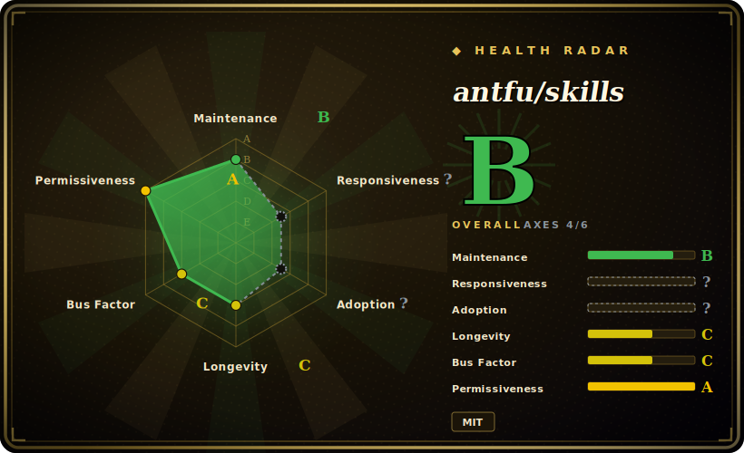

# antfu/skills

Anthony Fu's personal, curated agent-skill collection for the Vue/Vite/Nuxt ecosystem — his ESLint/pnpm/Vitest/UnoCSS preferences plus auto-generated and vendored skills for Vue, Nuxt, Pinia, Vite, VitePress, Vitest, UnoCSS, Slidev, VueUse and more, installed via the `skills` CLI.

## When to use

You're a frontend engineer living in Anthony Fu's stack — Vue 3, Nuxt, Vite, Vitest, UnoCSS, pnpm, his `@antfu/eslint-config` — and your coding agent keeps writing code that *works* but doesn't match how the ecosystem's own maintainers actually build things: wrong test idioms for Vitest, UnoCSS used like Tailwind, ESLint/formatting that fights your config, Vue patterns that ignore composition-API best practice. You don't want to hand-author a rule set for every tool in that stack. You want the opinions of the person who maintains a big chunk of it, applied automatically when the task matches.

You run `pnpx skills add antfu/skills --skill='*'` (add `-g` for global) and your agent gains a menu of on-demand skills it loads when relevant: two hand-maintained ones (`antfu` for app/library project preferences, `antfu-design` for UnoCSS-centered design), eight generated from official docs (Vue, Nuxt, Pinia, Vite, VitePress, Vitest, UnoCSS, pnpm), and a set of vendored skills (Slidev, tsdown, Turborepo, VueUse functions, Vue best-practices, Vue Router, Vue testing guidelines, web-design-guidelines). Because it ships in the [skills.sh](https://skills.sh/) / agentskills.io `SKILL.md` format, the `skills` CLI installs into your harness's own skills directory (`.claude/skills/`, `.agents/skills/`, etc.), so the same pack travels across Claude Code, Cursor, OpenCode, Codex and other supported agents. You reach for it when your stack *is* the antfu stack and you'd rather inherit his conventions than reinvent them. The repo also doubles as a template: edit `meta.ts` and regenerate to build your own collection.

## When NOT to use

- **You're not on the Vue/antfu stack.** The value is concentrated in Vue/Nuxt/Vite/UnoCSS/Vitest and antfu's personal ESLint/pnpm conventions. On React/Svelte/Astro or a non-antfu toolchain, most skills don't apply and the design/lint opinions may actively conflict with yours.
- **You already run a curated skill stack for this stack.** Layering another opinionated Vue/web-design pack on top risks conflicting rule sets and double-routing during review — pick one source of truth per concern.
- **You want vendor-neutral or community-consensus rules.** These are explicitly *one person's* preferences (ESLint style, design choices); valuable if you share them, friction if you don't.
- **Your harness has no skills loader.** It activates through the `skills` CLI writing into each agent's skills directory; on a bespoke or unsupported agent there's nothing to fire the `SKILL.md` files and the markdown won't auto-apply.
- **You need enforcement, not advice.** Rules live in prompt/markdown the agent *should* follow; nothing blocks a merge or fails CI. It's advisory guidance, not a gate. [推断]
- **You need version stability.** No tagged releases as of this check — you track a moving `main`, and the generated/vendored skills are regenerated from upstream docs, so rule sets and skill boundaries can shift between pulls.

## Comparison

| Alternative | In index | Tradeoff |
|---|---|---|
| [Vercel Agent Skills](../engineering/vercel-agent-skills.md) ✅ | indexed | Vercel's official pack for the *React/Next.js/Vercel* ecosystem, distributed through the same `skills` CLI/format. Mirror image of antfu's: pick by which framework world (Vue vs. React) is yours; both are opinionated vendor/maintainer rule sets, not vendor-neutral. |
| [Agent Skills (addyosmani)](../engineering/addyosmani-agent-skills.md) ✅ | indexed | Addy Osmani's personal full-SDLC engineering pack (spec→build→review→ship, web-perf, security). Broader lifecycle scope and framework-agnostic; antfu's is narrower and stack-specific (Vue toolchain conventions) rather than a methodology spine. |
| [web-quality-skills (addyosmani)](../engineering/addyosmani-web-quality.md) ✅ | indexed | Focused web performance/accessibility/quality auditing, vendor-neutral. Overlaps antfu's `web-design-guidelines` vendored skill but is dedicated and travels off the Vue stack. |
| Dimillian/Skills, gstack, ljg-skills, khazix-skills, taches-cc-resources (other personal collections) | 未收录 | Same genre — individual maintainers' curated skill/harness bundles — but each reflects a different person's stack and conventions; compare on whose toolchain and opinions you actually share. |
| Each agent's built-in skills / slash commands | 未收录 | The platform's own skill ecosystem; antfu/skills is a third-party bundle layered on top, so it can duplicate or conflict with native skills. |

## Health & viability

- **Maintenance (2026-06):** active — last pushed 2026-06, only ~9 open issues. No tagged releases, so you track a moving `main` with no semver checkpoints. Active, not coasting.
- **Governance & bus factor:** a single high-profile maintainer's personal repo (antfu), `User`-owned, no foundation or vendor backing. ~5k stars on a one-person collection is a classic bus-factor flag — direction and continuity depend entirely on one person's continued interest.
- **Age & Lindy verdict:** created 2026-01, so ~6 months old as of 2026-06 — young and currently hyped, not yet Lindy-proven. Antfu's long track record across the Vue/Vite ecosystem is reassuring, but *this pack* has no longevity history; don't treat its age as a safety signal.
- **Risk flags:** generated/vendored skills are regenerated from upstream docs, so rule sets can shift between pulls; no release pinning. Advisory-only (no enforcement gate). Vendored skills retain their own upstream licenses despite the MIT repo license.

## Caveats (unverified)

- [未验证] License is MIT per GitHub metadata on 2026-06-26 (the README also notes vendored skills retain their original upstream licenses); primary language reported as TypeScript — that reflects the generation/automation tooling and `meta.ts`, not a runnable app, since the substance is markdown `SKILL.md` files.
- [未验证] No tagged releases / `latestRelease` is null as of 2026-06-26; "maturity" is inferred from last push (2026-06-23) and activity, not a semver. Repo is not archived.
- [未验证] Star count (~5,409 per GitHub on 2026-06-26) is unreliable and date-sensitive; treat as indicative only, not a quality signal.
- [未验证] The skill inventory (hand-maintained `antfu`/`antfu-design`; generated Vue/Nuxt/Pinia/Vite/VitePress/Vitest/UnoCSS/pnpm; vendored Slidev/tsdown/Turborepo/VueUse/Vue-best-practices/Vue-Router/Vue-testing/web-design-guidelines) and the `sources/`, `vendor/`, `instructions/`, `scripts/`, `meta.ts` structure are read from the README/repo listing on 2026-06-26; the generated and vendored sets are regenerated from upstream, so verify the live `skills/` directory rather than trusting this snapshot.
- [未验证] Install via the third-party `skills` CLI (`pnpx skills add antfu/skills --skill='*'`, `-g` for global) and its supported-harness/target-directory behavior (Claude Code `.claude/skills/`, Cursor/OpenCode/Codex `.agents/skills/`, etc.) are properties of the vercel-labs `skills` tool, not of this repo; activation fidelity per harness is not independently confirmed here.
- [推断] Because behavior lives in prompt/markdown skills the agent loads, enforcement is advisory — the agent can deviate; the conventions are prompt-level instructions, not hard guarantees.
- [推断] Skills encode one maintainer's personal preferences; "best practice" framing is his opinion (and, for generated skills, a snapshot of official docs at generation time), not an independently verified standard.
