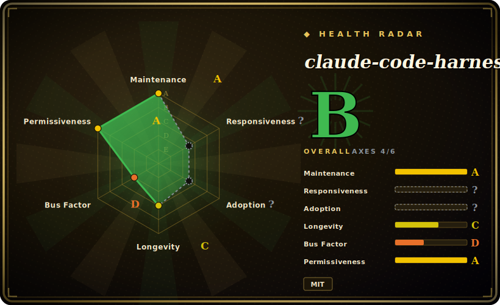

# claude-code-harness

A personal Claude Code harness that installs a governed plan → work → review → release loop — spec-first contracts, TDD-gated execution, and independent review — as a plugin, with a Go-native `doctor` CLI for diagnosing plugin-cache and skill drift.

## When to use

You're a developer who lives in Claude Code and keeps watching the agent do the same thing: it skips writing a spec, jumps straight into code, "fixes" bugs by guessing, lets review and tests happen retroactively (or not at all), and then declares the feature done. You want the agent to behave like a disciplined delivery team — write a spec you approve, break it into a plan, only then implement under TDD, run an independent review pass, and package evidence before it calls anything shipped. You install this harness via Claude Code's plugin marketplace, run `/harness-setup` once, and now you have named verbs — `/harness-plan` (generate `spec.md` + `Plans.md` as the source of truth), `/harness-work` (execute approved tasks inside the plan), `/harness-review` (independent verification), and `/harness-release` (package verified artifacts) — that turn ad-hoc agent coding into a repeatable, contract-driven cycle.

You reach for it specifically when you want the *whole* plan-to-release spine to be opinionated and enforced through generated contracts you approve or correct, rather than assembling your own skill stack. The repo also ships a Go-native `bin/harness doctor --migration-report` that inventories duplicate skills, plugin caches, and stale symlinks without deleting anything, so you can keep a multi-plugin Claude Code install from rotting. Codex CLI, Cursor, and OpenCode get setup scripts (`scripts/setup-codex.sh`, `setup-cursor.sh`, `setup-opencode.sh`) for partial cross-harness use. [推断]

## When NOT to use

- **You already run a curated workflow/methodology stack.** This harness is prescriptive (spec-before-code, TDD-gated work, mandatory review verb). Layering it over an existing plan→ship methodology — gstack, Superpowers, your own commands — invites conflicting routing and double-governance; pick one source of truth.
- **You want hard, binary enforcement.** Governance here is advisory: the harness generates `spec.md`/`Plans.md` contracts you approve and keeps work "inside the plan" through prompt-level guidance, not a runtime blockade. The Go binary's demonstrated job is diagnostic (`doctor` reporting), not blocking actions — the agent can still deviate. [未验证]
- **You're not primarily on Claude Code.** It installs and activates through Claude Code's plugin/slash-command system (v2.1+). Codex/Cursor/OpenCode get setup scripts but are described as internal-compatible/candidate, so fidelity is lower and unconfirmed; on an unsupported agent there's no loader to fire the verbs.
- **One-off scripts, spikes, non-code tasks.** The plan→work→review→release ceremony is overhead when you just want a quick fix or config tweak; it assumes a real software-change loop with artifacts worth gating.
- **Fast-moving single-maintainer upstream.** At v4.16.x with frequent releases and behavior baked into prompts and skill routing, a version bump can shift what the verbs enforce. Pin and re-check after upgrades. [推断]

## Comparison

| Alternative | In index | Tradeoff |
|---|---|---|
| [gstack](gstack.md) | ✅ | Garry Tan's personal Claude Code setup driving a similar plan → build → review → ship loop, but via ~23 role-playing persona commands (CEO/designer/QA/security). claude-code-harness is fewer, named verbs with explicit `spec.md`/`Plans.md` contracts and a Go `doctor` utility; gstack leans on personas over a contract artifact. |
| [shaping-skills](shaping-skills.md) | ✅ | Ryan Singer's Shape Up "shaping" pack covers only the *define-what-to-build* front end. This harness covers the full define→implement→review→release spine, so they're complementary rather than substitutes. |
| [Superpowers](../../agent-dev-methodology/superpowers.md) | ✅ | Cross-harness skills library with the same brainstorm/plan→TDD→verify spine, packaged for many agents (Claude, Codex, Cursor, Kimi, OpenCode, Pi). claude-code-harness centers Claude Code, adds explicit spec/plan contract files and a Go diagnostic CLI; Superpowers is leaner methodology, broader harness reach. |
| harness-mem (optional companion) | 未收录 | An optional cross-session memory add-on referenced by this project; separate concern (agent memory), not a workflow substitute. |
| Claude Code's native skills / built-in slash commands | 未收录 | The platform's own skill ecosystem; this is a third-party bundle layered on top, so it can duplicate or conflict with native commands. |

## Health & viability

- **Maintenance (2026-06):** active and fast-moving — last pushed 2026-06, at v4.16.3 with frequent releases, only ~2 open issues. Unlike most personal packs here it actually cuts tagged releases, so you *can* pin a version. Active, not coasting.
- **Governance & bus factor:** single-maintainer `User`-owned repo (Chachamaru127), no foundation or vendor. ~2k stars is modest, which lowers the bus-factor exposure relative to the headline packs, but the project still rests entirely on one person; roadmap and continuity are theirs alone.
- **Age & Lindy verdict:** created 2025-12, so ~6 months old as of 2026-06 — young and unproven on longevity. The rapid v4.x release churn signals energy but also instability; behavior baked into prompts/skill routing can shift across version bumps. Not yet a Lindy-safe bet.
- **Risk flags:** governance is advisory (spec/plan contracts + prompt guidance), not a hard CI gate — the Go `doctor` binary is diagnostic only. Cross-harness support (Codex/Cursor/OpenCode) is via setup scripts and unconfirmed; fidelity off Claude Code is lower. Pin and re-check after upgrades.

## Caveats (unverified)

- [未验证] Latest release reported as v4.16.3 (published 2026-06-24), repo last pushed 2026-06-24, created 2025-12-12; license MIT, primary language Shell per GitHub metadata as of 2026-06-26 — re-verify before relying on a specific version's behavior.
- [未验证] Star count (~2,870 per GitHub on 2026-06-26) is unreliable and date-sensitive; treat as indicative only, not a quality signal.
- [未验证] Enforcement is described as advisory (contract approval + prompt guidance), with the Go `bin/harness` binary's demonstrated role being diagnostic (`doctor --migration-report`); whether any step hard-blocks an action is not independently confirmed here.
- [未验证] The language split (Shell ~45%, Go ~33%, JS/TS ~20%, Python ~1%) and the presence of a Go workspace (`go.work`, `go/`, `bin/`) come from README/repo listing; exact module layout and what is compiled vs. source was not inspected file-by-file.
- [未验证] Supported-harness claims (Claude Code v2.1+ primary; Codex CLI, Cursor, OpenCode via setup scripts; GitHub Copilot CLI candidate) are from the README; actual activation fidelity per non-Claude harness is not verified.
- [推断] The verb set (`/harness-setup`, `/harness-plan`, `/harness-work`, `/harness-review`, `/harness-release`) and skill routing change release-to-release; verify the current `skills/` directory rather than relying on this list.
- [推断] Because the workflow lives in prompt/markdown skills loaded by the agent, "mandatory" steps (spec-first, TDD) are prompt-level instructions, not hard guarantees — the agent can still skip or shortcut them.
