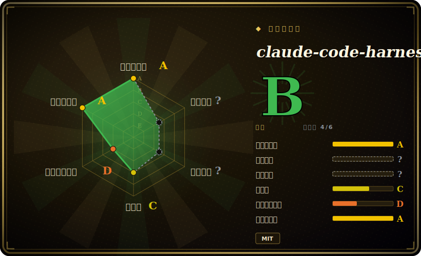

# claude-code-harness

一套个人化的 Claude Code harness：以插件形式装入受治理的 plan → work → review → release 循环——spec 优先的契约、TDD 门控的执行、独立 review——并附带一个 Go 原生 `doctor` CLI，用于诊断插件缓存与 skill 漂移。

## 何时使用

你是个长期泡在 Claude Code 里的开发者，反复看到 agent 做同一件事：跳过写 spec、直接上手写代码、靠猜来「修」bug、让 review 和测试事后补（甚至根本不做），然后就宣布功能完成。你想让 agent 表现得像一支有纪律的交付团队——先写一份你批准的 spec、拆成计划、然后才在 TDD 下实现、跑一遍独立 review、并在声称「已交付」前打包好证据。你通过 Claude Code 的插件市场装上这套 harness，跑一次 `/harness-setup`，于是就有了一组命名好的动词——`/harness-plan`（生成 `spec.md` + `Plans.md` 作为事实源）、`/harness-work`（在计划范围内执行已批准任务）、`/harness-review`（独立验证）、`/harness-release`（打包已验证产物）——把临时拼凑的 agent 编码变成一个可重复、契约驱动的循环。

当你想让整条从规划到发布的脊柱都是固定主张、并通过你批准或修正的生成式契约来落地（而不是自己攒一套 skill 栈）时，就选它。仓库还附带一个 Go 原生的 `bin/harness doctor --migration-report`，可以在不删除任何东西的前提下盘点重复 skill、插件缓存和失效软链，让多插件的 Claude Code 安装不至于烂掉。Codex CLI、Cursor、OpenCode 也提供了 setup 脚本（`scripts/setup-codex.sh`、`setup-cursor.sh`、`setup-opencode.sh`）做部分跨 harness 使用。[推断]

## 何时不用

- **你已经在跑一套精选的工作流/方法论栈。** 这套 harness 是强主张的（spec 先于代码、work 受 TDD 门控、强制 review 动词）。把它叠在已有的 plan→ship 方法论上——gstack、Superpowers，或你自己的命令——会引发路由冲突和双重治理；只能选一个事实源。
- **你想要硬性的二元强制。** 这里的治理是建议性的：harness 生成 `spec.md`/`Plans.md` 契约让你批准，并通过 prompt 级引导把工作「留在计划内」，而非运行时硬拦截。Go 二进制被演示的职责是诊断（`doctor` 报告），不是拦截动作——agent 仍可偏离。[未验证]
- **你的主力不是 Claude Code。** 它通过 Claude Code 的插件/slash-command 系统安装并激活（v2.1+）。Codex/Cursor/OpenCode 有 setup 脚本，但被描述为内部兼容/候选，保真度更低且未经证实；在不受支持的 agent 上没有 loader 去触发这些动词。
- **一次性脚本、spike、非代码任务。** 当你只想快速改一处或调个配置时，plan→work→review→release 这套仪式是负担；它假定一个有值得门控产物的真实软件变更循环。
- **快速演进的单维护者上游。** 处于 v4.16.x，发版频繁，行为烤进了 prompt 与 skill 路由，一次版本跳变可能改变这些动词所强制的内容。请 pin 版本并在升级后重新核对。[推断]

## 横向对比

| 替代项 | 已收录 | 取舍 |
|---|---|---|
| [gstack](gstack.md) | ✅ | Garry Tan 的个人 Claude Code 配置，驱动一个类似的 plan → build → review → ship 循环，但靠 ~23 个角色扮演 persona 命令（CEO/设计师/QA/安全官）。claude-code-harness 是更少、命名清晰的动词，带显式的 `spec.md`/`Plans.md` 契约和一个 Go `doctor` 工具；gstack 更依赖 persona 而非契约产物。 |
| [shaping-skills](shaping-skills.md) | ✅ | Ryan Singer 的 Shape Up「shaping」包只覆盖*定义要造什么*这个前端环节。本 harness 覆盖完整的 定义→实现→review→发布 脊柱，因此二者互补而非互替。 |
| [Superpowers](../../agent-dev-methodology/superpowers.md) | ✅ | 跨 harness 的 skills 库，具备相同的 brainstorm/plan→TDD→verify 脊柱，并打包给多种 agent（Claude、Codex、Cursor、Kimi、OpenCode、Pi）。claude-code-harness 以 Claude Code 为中心，加了显式的 spec/plan 契约文件和一个 Go 诊断 CLI；Superpowers 是更精简的方法论、更广的 harness 覆盖。 |
| harness-mem（可选配套） | 未收录 | 本项目引用的一个可选跨会话记忆插件；属于另一关切（agent 记忆），不是工作流替代品。 |
| Claude Code 原生 skills / 内置 slash 命令 | 未收录 | 平台自带的 skill 生态；本项目是叠在其上的第三方 bundle，可能与原生命令重复或冲突。 |

## 健康度与可持续性

- **维护（2026-06）：** 活跃且高速演进——最后 push 于 2026-06，处于 v4.16.3 且发版频繁，仅约 2 个 open issue。与本叶子里多数个人 pack 不同，它确实打 tag 发版，因此你*可以* pin 版本。是活跃而非半荒废。
- **治理与 bus factor：** 单一维护者的 `User` 仓库（Chachamaru127），无基金会或厂商。约 2k star 体量不大，相对那些头部 pack 降低了 bus-factor 暴露，但项目仍完全压在一个人身上；路线图与延续性仅由其一人决定。
- **年龄与 Lindy 判断：** 创建于 2025-12，截至 2026-06 约半岁——年轻且存续性未经验证。v4.x 的高频发版透着冲劲，也意味着不稳定；行为烤进 prompt 与 skill 路由，版本跳变间可能改变。尚不是 Lindy 意义上的安全押注。
- **风险标记：** 治理为建议性（spec/plan 契约 + prompt 引导），不是 CI 硬闸门——Go 的 `doctor` 二进制只做诊断。跨 harness 支持（Codex/Cursor/OpenCode）靠 setup 脚本且未经证实；脱离 Claude Code 保真度更低。升级后请 pin 并重核。

## 存疑（未验证）

- [未验证] 最新发布报为 v4.16.3（2026-06-24 发布），仓库最近 push 于 2026-06-24，创建于 2025-12-12；许可证 MIT、主语言 Shell，均来自 2026-06-26 的 GitHub 元数据——依赖某个具体版本行为前请重新核实。
- [未验证] Star 数（2026-06-26 GitHub 上约 2,870）不可靠且对日期敏感；仅作参考，不作质量信号。
- [未验证] 强制方式被描述为建议性（契约批准 + prompt 引导），Go 的 `bin/harness` 二进制被演示的角色是诊断（`doctor --migration-report`）；是否有任何步骤硬拦截动作，本页未独立证实。
- [未验证] 语言占比（Shell ~45%、Go ~33%、JS/TS ~20%、Python ~1%）以及 Go 工作区（`go.work`、`go/`、`bin/`）的存在来自 README/仓库列表；具体模块布局、哪些是编译产物 vs 源码，未逐文件核对。
- [未验证] 支持的 harness 声明（Claude Code v2.1+ 为主；Codex CLI、Cursor、OpenCode 通过 setup 脚本；GitHub Copilot CLI 为候选）来自 README；各非 Claude harness 的实际激活保真度未经验证。
- [推断] 动词集合（`/harness-setup`、`/harness-plan`、`/harness-work`、`/harness-review`、`/harness-release`）和 skill 路由会随版本变化；请核对当前 `skills/` 目录，而非依赖此清单。
- [推断] 由于工作流存在于 agent 加载的 prompt/markdown skill 中，「强制」步骤（spec 先行、TDD）是 prompt 级指令而非硬保证——agent 仍可跳过或走捷径。
