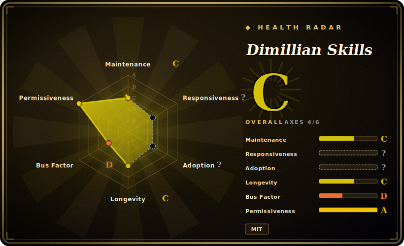

# Dimillian Skills

One developer's personal, curated set of 16 self-contained Codex skills, heavily weighted toward Apple-platform work (SwiftUI / iOS / macOS) plus a handful of generic engineering swarms (diff review, bug hunt, refactor orchestration).

## When to use

You're an iOS / macOS engineer who runs OpenAI Codex as your daily coding agent, and you keep re-typing the same long prompts: "build and launch this app on the simulator and capture the logs", "refactor this 800-line SwiftUI view into smaller subviews with proper Observation", "audit this view tree for invalidation storms", "write App Store release notes from the git log since the last tag". You want those recurring Apple-platform workflows to become first-class, on-demand skills the agent loads when the task matches, instead of living in your head or a scratch notes file. You drop these skill folders under `$CODEX_HOME/skills`, and Codex picks them up via its native skill-loading mechanism — each skill is a `SKILL.md` with triggers, workflow, examples and reference material.

You reach for this pack specifically when your work is Apple-flavored: it ships `swiftui-liquid-glass` (iOS 26+ Liquid Glass APIs), `swift-concurrency-expert` (Swift 6.2+ actor/`Sendable` fixes), `swiftui-view-refactor`, `swiftui-performance-audit`, `macos-menubar-tuist-app`, `macos-spm-app-packaging`, `ios-debugger-agent` (XcodeBuildMCP-driven). The non-Apple skills (`github`, `review-swarm`, `bug-hunt-swarm`, `review-and-simplify-changes`, `orchestrate-batch-refactor`, `react-component-performance`, `project-skill-audit`) are useful but more generic — the differentiator is the SwiftUI/Swift depth, which most general agent-skill packs don't have.

## When NOT to use

- **You don't write Apple-platform code.** Strip out the Swift/SwiftUI/macOS skills and what's left (review swarms, github, refactor orchestration, react perf) overlaps heavily with more general packs — you'd be installing a mostly-iOS bundle for its few generic skills.
- **You're not on Codex.** Install is explicitly "place these skill folders under `$CODEX_HOME/skills`" — the format and loader target OpenAI Codex. On Claude Code, Cursor, or another harness the `SKILL.md` folders won't auto-fire without porting, and the swarm/MCP-dependent skills (XcodeBuildMCP, multi-agent dispatch) assume Codex's runtime. [推断]
- **You already run a trusted review/refactor stack.** `review-swarm`, `bug-hunt-swarm`, and `review-and-simplify-changes` will double-route against any existing review or simplify command you have — pick one source of truth rather than layering two diff-review opinions.
- **You need a maintenance guarantee.** This is a single-author personal collection with no tagged releases and last pushed 2026-03; the Liquid Glass / Swift 6.2 skills track fast-moving Apple betas and can go stale between pushes. Treat it as a snapshot, not a maintained product.
- **You want enforced behavior.** Skills are advisory prompt + reference markdown loaded by the agent; "audit", "refactor", "review" are guidance the model can still deviate from, not hard gates.

## Comparison

| Alternative | In index | Tradeoff |
|---|---|---|
| [antfu/skills](antfu-skills.md) | ✅ | Another single-author personal skill collection (web/TS-leaning). Different domain center of gravity — Dimillian's is uniquely deep on Swift/SwiftUI/Apple platforms. |
| [wshobson/agents](../subagent-collections/wshobson-agents.md) | ✅ | Large subagent-persona collection; broad role coverage but generalist, no Apple-platform specialization. |
| awesome-claude-code-subagents | 未收录 | Curated Claude Code subagent directory; targets a different harness and is broader/shallower than this pack's Swift depth. |
| karpathy-skills | 未收录 | Personal skill collection from a different author/domain; compare on whether your work is Apple-flavored — if not, neither pack's specialty applies. |
| Your harness's built-in review / simplify commands | 未收录 | Codex/Claude already ship generic diff-review and simplify flows; the generic skills here (`review-swarm`, `review-and-simplify-changes`) overlap with those — the unique value is the SwiftUI/iOS skills, not the generic ones. |

## Health & viability

- **Maintenance (2026-06):** coasting — last pushed 2026-03, i.e. ~3 months stale as of 2026-06, with ~9 open issues and no tagged releases. That staleness is a real risk *here* because the SwiftUI/Swift-6.2/Liquid-Glass skills track fast-moving Apple betas and rot quickly between pushes. Treat as a snapshot, not a maintained product.
- **Governance & bus factor:** single-author `User`-owned personal collection (Dimillian, a known iOS developer). No team, foundation, or vendor; ~3k stars on a one-person pack is a bus-factor flag. Roadmap is entirely the author's.
- **Age & Lindy verdict:** created 2025-12, ~6 months old as of 2026-06 — young *and* already coasting. Young + not-currently-active is the weak quadrant: no longevity to lean on and recent activity has stalled. Don't bank on it staying current.
- **Risk flags:** Codex-only install target (`$CODEX_HOME/skills`); other harnesses need porting. MCP/swarm skills assume tooling that may be absent. Advisory-only, no enforcement.

## Caveats (unverified)

- [未验证] License MIT, primary language Shell (84.6% Shell / 12.8% Python / 2.6% Swift per GitHub), not archived, no tagged releases, last pushed 2026-03-29 — all per GitHub metadata as of 2026-06-26; re-verify before relying on a specific commit's behavior.
- [未验证] Star count (~3.7k per GitHub on 2026-06-26) is unreliable and date-sensitive; treat as indicative only, not a quality signal.
- [未验证] The 16-skill list and their folder names are from the README as of this check; the actual `skills/` contents and `SKILL.md` triggers can change between pushes — read the repo directly rather than relying on this list.
- [推断] Install target is OpenAI Codex (`$CODEX_HOME/skills`); activation on other harnesses (Claude Code, Cursor) is not confirmed and would require porting.
- [推断] MCP/swarm-dependent skills (`ios-debugger-agent` via XcodeBuildMCP, `review-swarm`, `bug-hunt-swarm` multi-agent) assume tooling/runtime that may not be present in your environment; their effectiveness is environment-dependent and not independently verified here.
- [未验证] Of the leaf-sibling pages referenced in Comparison, antfu/skills and wshobson/agents exist in this leaf at time of writing (linked); awesome-claude-code-subagents and karpathy-skills are not yet indexed, hence shown without links — index state is concurrent and may change.
