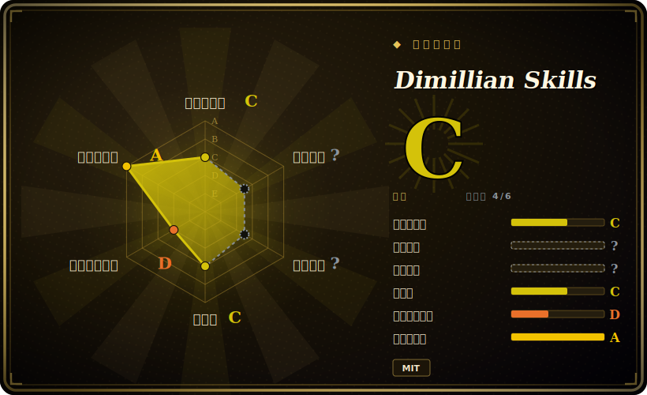

# Dimillian Skills

某位开发者个人精选的 16 个自包含 Codex skill，重心明显压在 Apple 平台（SwiftUI / iOS / macOS），外加几个通用工程 swarm（diff 评审、bug 搜捕、重构编排）。

## 何时使用

你是一名 iOS / macOS 工程师，日常用 OpenAI Codex 当编码 agent，于是你一遍遍重复敲同样的长 prompt：「在模拟器上 build 并启动这个 app，把日志抓回来」「把这个 800 行的 SwiftUI view 拆成更小的子视图、用对 Observation」「审一遍这棵 view 树有没有 invalidation 风暴」「按上一个 tag 之后的 git log 写 App Store 更新说明」。你想把这些反复出现的 Apple 平台工作流变成一等的、按需加载的 skill——任务匹配时 agent 自己拉起来，而不是靠你脑子里记或散在便签里。你把这些 skill 文件夹丢进 `$CODEX_HOME/skills`，Codex 通过它原生的 skill 加载机制识别它们——每个 skill 是一份带触发条件、工作流、示例和参考资料的 `SKILL.md`。

你专门为「Apple 味」的活儿伸手拿它：包里有 `swiftui-liquid-glass`（iOS 26+ Liquid Glass API）、`swift-concurrency-expert`（Swift 6.2+ actor / `Sendable` 修复）、`swiftui-view-refactor`、`swiftui-performance-audit`、`macos-menubar-tuist-app`、`macos-spm-app-packaging`、`ios-debugger-agent`（基于 XcodeBuildMCP）。其余非 Apple 的 skill（`github`、`review-swarm`、`bug-hunt-swarm`、`review-and-simplify-changes`、`orchestrate-batch-refactor`、`react-component-performance`、`project-skill-audit`）也有用，但更通用——真正的差异化在 SwiftUI / Swift 的深度，这是大多数通用 agent-skill 包没有的。

## 何时不用

- **你不写 Apple 平台代码。** 把 Swift / SwiftUI / macOS 那批 skill 抽掉，剩下的（评审 swarm、github、重构编排、react 性能）与更通用的包高度重叠——等于为了那几个通用 skill 装了一整套以 iOS 为主的包。
- **你不在 Codex 上。** 安装方式被明确写成「把 skill 文件夹放到 `$CODEX_HOME/skills`」——格式和加载器都瞄准 OpenAI Codex。在 Claude Code、Cursor 或别的 harness 上，这些 `SKILL.md` 文件夹不经移植不会自动触发，而依赖 swarm / MCP 的 skill（XcodeBuildMCP、多 agent 派发）默认的是 Codex 运行时。[推断]
- **你已有信任的评审 / 重构栈。** `review-swarm`、`bug-hunt-swarm`、`review-and-simplify-changes` 会和你既有的评审或 simplify 命令双重路由——选一个事实源，别叠两套 diff 评审意见。
- **你需要维护保证。** 这是单作者的个人收藏，没有打 tag 的 release，最后一次 push 在 2026-03；其中 Liquid Glass / Swift 6.2 这类 skill 跟着快速变动的 Apple beta 走，两次 push 之间就可能过时。把它当一份快照，不是一个被维护的产品。
- **你想要被强制执行的行为。** skill 是 agent 加载的、建议性的 prompt + 参考 markdown，「audit」「refactor」「review」是模型仍可偏离的指引，不是硬闸门。

## 横向对比

| 替代方案 | 已收录 | 取舍 |
|---|---|---|
| antfu/skills | 未收录 | 另一份单作者个人 skill 集（偏 web / TS）。重心不同——Dimillian 这份在 Swift / SwiftUI / Apple 平台上独有深度。 |
| [wshobson/agents](../subagent-collections/wshobson-agents.zh.md) | ✅ | 大型 subagent 人格集；角色覆盖广但偏通才，无 Apple 平台专精。 |
| awesome-claude-code-subagents | 未收录 | 面向 Claude Code 的 subagent 目录；瞄准不同 harness，比本包广而浅，缺 Swift 深度。 |
| karpathy-skills | 未收录 | 来自另一位作者 / 领域的个人 skill 集；按你的活儿是否「Apple 味」来选——若不是，两份各自的专长都用不上。 |
| 你 harness 自带的 review / simplify 命令 | 未收录 | Codex / Claude 本就内置通用 diff 评审与 simplify 流程；本包里的通用 skill（`review-swarm`、`review-and-simplify-changes`）与之重叠——独有价值在 SwiftUI / iOS skill，不在通用那几个。 |

## 健康度与可持续性

- **维护（2026-06）：** 半荒废——最后 push 于 2026-03，截至 2026-06 已停滞约 3 个月，约 9 个 open issue，且无打 tag 的 release。这种停滞在*这里*是实打实的风险，因为 SwiftUI/Swift-6.2/Liquid-Glass 这些 skill 跟着快速变动的 Apple beta 走，两次 push 之间就会快速过时。应视为一份快照，而非被维护的产品。
- **治理与 bus factor：** 单作者的 `User` 个人合集（Dimillian，一位知名 iOS 开发者）。无团队、基金会或厂商；一人 pack 约 3k star，是 bus-factor 风险信号。路线图完全由作者决定。
- **年龄与 Lindy 判断：** 创建于 2025-12，截至 2026-06 约半岁——既年轻*又*已半荒废。年轻 + 当前不活跃属于弱象限：既无存续可依，近期活动又已停滞。别指望它持续跟上最新。
- **风险标记：** 安装目标仅限 Codex（`$CODEX_HOME/skills`）；其它 harness 需移植。MCP/swarm 类 skill 默认了你环境里可能不存在的工具。仅为建议性，无强制。

## 存疑（未验证）

- [未验证] License MIT、主语言 Shell（GitHub 显示 Shell 84.6% / Python 12.8% / Swift 2.6%）、未归档、无打 tag 的 release、最后 push 于 2026-03-29——均为 GitHub 元数据，截至 2026-06-26；依赖某个具体 commit 的行为前请重新核对。
- [未验证] star 数（2026-06-26 GitHub 上约 3.7k）不可靠且对日期敏感，仅作参考，不作质量信号。
- [未验证] 这 16 个 skill 的清单与文件夹名取自本次核对时的 README；实际 `skills/` 内容与 `SKILL.md` 触发条件会随 push 变化——请直接读仓库，别只信此清单。
- [推断] 安装目标是 OpenAI Codex（`$CODEX_HOME/skills`）；在其他 harness（Claude Code、Cursor）上的激活未经确认，需要移植。
- [推断] 依赖 MCP / swarm 的 skill（`ios-debugger-agent` 走 XcodeBuildMCP，`review-swarm`、`bug-hunt-swarm` 多 agent）默认了你环境里可能不存在的工具 / 运行时；其效果取决于环境，此处未独立验证。
- [未验证] 横向对比中引用的 leaf 同级页里，wshobson/agents 的中文页在撰写时已存在（已链接）;antfu/skills、awesome-claude-code-subagents、karpathy-skills 尚未收录（或中文页未就绪），故不附链接——索引状态为并发产出，可能变化。
