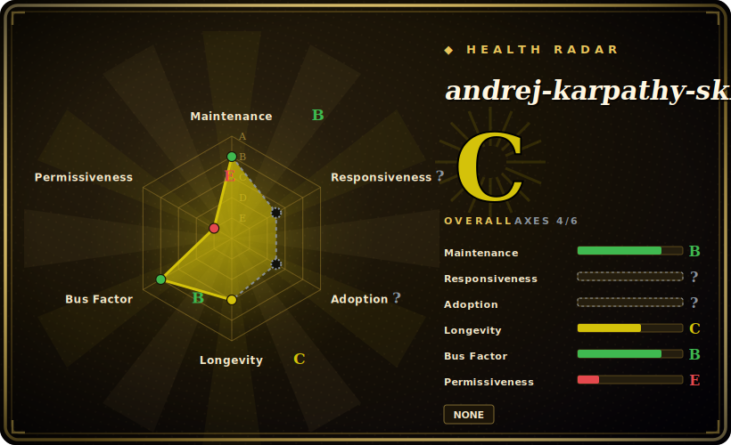

# andrej-karpathy-skills

A single behavioral-guidelines pack — one `CLAUDE.md` (plus a Cursor variant and a thin `skills/karpathy-guidelines/` wrapper) distilling Andrej Karpathy's observations on LLM coding pitfalls into four principles: Think Before Coding, Simplicity First, Surgical Changes, Goal-Driven Execution.

## When to use

You're a developer running Claude Code (or Cursor) and your agent keeps making the same well-known LLM coding mistakes: it dives straight into code before clarifying what you actually asked, over-engineers a one-line fix into a speculative framework, rewrites unrelated files "while it's in there," and declares done without a verifiable success criterion. You've seen Karpathy's critique of these failure modes and you want that exact discipline merged into your agent's base instructions — without authoring your own rule set from scratch. This pack is a short, opinionated `CLAUDE.md` that tells the agent to surface assumptions and tradeoffs first, write the minimum code that solves the stated problem, touch only what's necessary and clean up only its own mess, and turn the task into a checkable goal before claiming completion.

You reach for it as a drop-in base layer rather than a big multi-skill collection. Install it as a Claude Code marketplace plugin (`/plugin install andrej-karpathy-skills@karpathy-skills`) or just curl the `CLAUDE.md` into a project; for Cursor there's a parallel `CURSOR.md` / `.cursor/rules/` rule file. It's deliberately tiny (the core file is ~65 lines) and framed as guidance to be combined with your project-specific instructions, with an explicit "for trivial tasks, use judgment" escape hatch.

## When NOT to use

- **You already run a strong, opinionated global ruleset.** Four broad principles ("simplicity first," "surgical changes") overlap heavily with most teams' existing `CLAUDE.md` / global agent config and with methodology packs like Superpowers; layering it on duplicates or contradicts what you already enforce.
- **You want enforced behavior, not advice.** This is advisory prose injected into context, not a hook/gate. The agent can ignore every line; nothing blocks an over-broad diff or an unverified "done." If you need hard enforcement, you need hooks/CI, not a `CLAUDE.md`.
- **You're not on Claude Code or Cursor.** The packaging targets those two harnesses (marketplace plugin + Cursor rules). On other agents you'd be hand-porting plain prose, at which point the value over copying four bullet points yourself is small.
- **You want breadth (many skills, commands, subagents).** This is essentially one principles file, not a library of task-specific skills. If you came looking for SwiftUI/Vue/testing skills or a command suite, this isn't that.
- **Maintenance / provenance is thin.** No tagged releases, last pushed 2026-04, and the content is a third party's distillation of Karpathy's public remarks — not authored or endorsed by Karpathy himself. Treat the name as attribution of inspiration, not authorship.

## Comparison

| Alternative | In index | Tradeoff |
|---|---|---|
| [shaping-skills](shaping-skills.md) | ✅ | Also a single-author Claude Code discipline pack, but scoped to *shaping* (problem-framing before code) via Shape Up; this one is broader, generic coding-hygiene principles rather than a product-definition workflow. |
| [TÂCHES CC Resources](taches-cc-resources.md) | ✅ | A full personal extension bundle (commands, meta-skills, subagents, hooks). Karpathy-skills is the opposite end: one tiny principles file, no commands or generators. Pick TÂCHES for breadth, this for a minimal base layer. |
| [antfu/skills](antfu-skills.md) | ✅ | Stack-specific (Vue/Vite/Nuxt) auto-applied skills via a CLI. This pack is stack-agnostic behavioral guidance, not framework knowledge. |
| [Superpowers](../../agent-dev-methodology/superpowers.md) | ✅ | A full SDLC methodology library (brainstorm→plan→TDD→verify) with many composable skills and per-harness manifests. Karpathy-skills covers a similar "make the agent disciplined" goal in four lines instead of a skill graph — far lighter, far less prescriptive. |
| Your own global `CLAUDE.md` / Anthropic built-in guidance | 未收录 | If you already maintain opinionated global agent instructions, that's the same surface; this would be additive prose competing for the same context. |

## Health & viability

- **Maintenance (2026-06):** lightly maintained / near-coasting — last pushed 2026-04, ~2 months stale as of 2026-06, with ~126 open issues and no tagged releases. For a ~65-line principles file there's little to maintain, but staleness + open issues suggest attention has tapered.
- **Governance & bus factor:** `Organization`-owned (multica-ai), not a single personal account, which is marginally better for continuity than the User-owned packs here — but it's still a small org and a thin single-file pack. The content is a third party's distillation of Karpathy's public remarks, **not authored or endorsed by Karpathy**; the name is attribution of inspiration, not authorship.
- **Age & Lindy verdict:** created 2026-01, ~5 months old as of 2026-06 — young, and its ~183k stars reflect the famous name far more than any proven longevity. Star count ≠ Lindy: there's no track record, and the substance is four generic principles. Unproven.
- **Adoption note:** ~183k stars is a name-driven popularity signal on a tiny repo, not a maturity or correctness signal — read it skeptically.
- **Risk flags:** advisory prose injected into context (no hook/gate); overlaps heavily with most teams' existing global `CLAUDE.md`. License auto-detect returned `null` despite a stated MIT — confirm before relying on it.

## Caveats (unverified)

- [未验证] License reported as MIT by the README footer and a LICENSE file is listed in the repo, but the GitHub repo-metadata API returned `licenseInfo: null` (no auto-detected SPDX) as of 2026-06-26 — confirm the LICENSE file contents before relying on MIT.
- [未验证] No tagged releases (`latestRelease: null`); last pushed 2026-04-20 per GitHub metadata as of 2026-06-26. Re-verify freshness and content before relying on a specific version.
- [未验证] Reported star count (~182k per GitHub on 2026-06-26) is unreliable and date-sensitive; treat as indicative only, not a quality or correctness signal.
- [未验证] File structure (`CLAUDE.md`, `CURSOR.md`, `EXAMPLES.md`, `.claude-plugin/`, `.cursor/rules/karpathy-guidelines.mdc`, `skills/karpathy-guidelines/`) and the marketplace install command are from the README and a directory read, not independently exercised here.
- [未验证] Primary language is reported as "Markdown" here because GitHub's metadata returned no `primaryLanguage`; the repo is documentation/config, so there is no real implementation language.
- [推断] Because the content is advisory prose loaded into agent context, enforcement is best-effort — the agent can deviate; the "principles" are instructions, not hard guarantees.
- [推断] The "Karpathy" attribution reflects inspiration from his public observations, not authorship or endorsement by him; the maintainer is the multica-ai organization.
