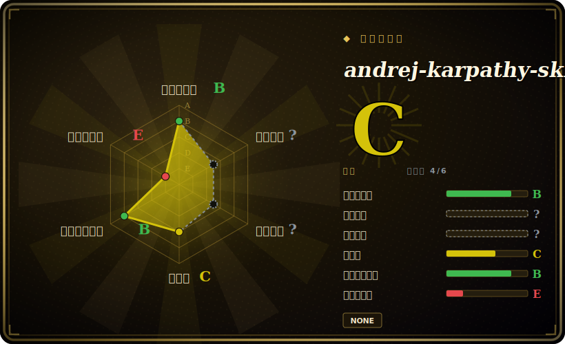

# andrej-karpathy-skills

一个行为准则包——单个 `CLAUDE.md`（外加 Cursor 变体和一层很薄的 `skills/karpathy-guidelines/` 包装），把 Andrej Karpathy 关于 LLM 编码陷阱的观察提炼成四条原则：先想后写（Think Before Coding）、简单优先（Simplicity First）、外科式改动（Surgical Changes）、目标驱动执行（Goal-Driven Execution）。

## 何时使用

你是一名用 Claude Code（或 Cursor）的开发者，你的 agent 总在犯那些众所周知的 LLM 编码错误：还没搞清你真正要什么就直接开写；把一行修复过度工程成一套臆想的框架；“顺手”重写一堆不相关的文件；没有可验证的成功标准就宣布完成。你看过 Karpathy 对这些失败模式的批评，想把这套纪律直接并入 agent 的基础指令——又不想从零自己写一套规则。这个包就是一份简短、有主见的 `CLAUDE.md`，它要求 agent 先暴露假设与权衡，只写能解决既定问题的最小代码，只动必须动的部分、只清理自己制造的烂摊子，并在声称完成前把任务变成一个可核查的目标。

你把它当作一个 drop-in 的基础层来用，而不是一个庞大的多技能集合。可以作为 Claude Code marketplace 插件安装（`/plugin install andrej-karpathy-skills@karpathy-skills`），或直接把 `CLAUDE.md` curl 进项目；Cursor 侧有对应的 `CURSOR.md` / `.cursor/rules/` 规则文件。它刻意做得很小（核心文件约 65 行），定位为“与你项目特定指令合并使用”的指引，并显式留了“琐碎任务自行判断”的逃生口。

## 何时不用

- **你已经在跑一套强势、有主见的全局规则。** 四条宽泛原则（“简单优先”“外科式改动”）和大多数团队已有的 `CLAUDE.md` / 全局 agent 配置、以及像 Superpowers 这样的方法论包高度重叠；叠在上面只会重复或与你已经在强制的东西冲突。
- **你想要强制行为，而非建议。** 这是注入上下文的建议性散文，不是 hook / 闸门。agent 可以无视每一行；没有任何东西能拦住一次过宽的 diff 或一句未经验证的“完成”。要硬强制，得用 hooks / CI，而不是 `CLAUDE.md`。
- **你不在 Claude Code 或 Cursor 上。** 打包方式针对这两个 harness（marketplace 插件 + Cursor 规则）。在别的 agent 上你得手工移植纯文本，此时它相对于你自己抄四条要点的增量价值就很小。
- **你想要广度（很多技能、命令、子 agent）。** 这本质上是一份原则文件，不是任务特定技能的库。如果你是来找 SwiftUI/Vue/测试技能或一套命令的，这不是。
- **维护与出处都偏薄。** 没有打 tag 的 release，最后推送 2026-04，内容是第三方对 Karpathy 公开言论的提炼——并非 Karpathy 本人撰写或背书。把这个名字当作灵感来源的署名，而非作者署名。

## 横向对比

| 替代品 | 已收录 | 取舍 |
|---|---|---|
| [shaping-skills](shaping-skills.md) | ✅ | 同样是单作者的 Claude Code 纪律包，但范围限于*塑形*（Shape Up，先框定问题再写代码）；本包更宽，是通用的编码卫生原则，而非产品定义工作流。 |
| [TÂCHES CC Resources](taches-cc-resources.md) | ✅ | 一整套个人扩展包（命令、元技能、子 agent、hooks）。Karpathy-skills 是另一极端：一份极小的原则文件，没有命令或生成器。要广度选 TÂCHES，要极简基础层选本包。 |
| [antfu/skills](antfu-skills.md) | ✅ | 栈特定（Vue/Vite/Nuxt）、经 CLI 自动应用的技能。本包是与技术栈无关的行为指引，不是框架知识。 |
| [Superpowers](../../agent-dev-methodology/superpowers.md) | ✅ | 一整套 SDLC 方法论库（brainstorm→plan→TDD→verify），含众多可组合技能与各 harness 的清单。Karpathy-skills 用四行覆盖类似的“让 agent 更有纪律”目标，而非一张技能图——轻得多，也克制得多。 |
| 你自己的全局 `CLAUDE.md` / Anthropic 内置指引 | 未收录 | 如果你已经维护着有主见的全局 agent 指令，那就是同一块表面；本包只是争夺同一段上下文的附加散文。 |

## 健康度与可持续性

- **维护（2026-06）：** 维护偏轻 / 近乎半荒废——最后 push 于 2026-04，截至 2026-06 停滞约 2 个月，约 126 个 open issue，且无打 tag 的 release。对一份约 65 行的原则文件而言本就没多少要维护，但停滞加 open issue 显示投入在减弱。
- **治理与 bus factor：** 由 `Organization`（multica-ai）所有，而非单一个人账号，对延续性而言比本叶子里 User 所有的 pack 略好——但它仍是个小 org、薄薄一份单文件 pack。内容是第三方对 Karpathy 公开言论的提炼，**并非 Karpathy 本人撰写或背书**；这个名字是灵感来源的署名，而非作者署名。
- **年龄与 Lindy 判断：** 创建于 2026-01，截至 2026-06 约 5 个月——年轻，而其约 183k star 反映的远多是名人效应，而非任何经验证的存续。star 数不等于 Lindy：没有履历，实质只是四条通用原则。未经验证。
- **采用度提示：** 约 183k star 是一个小仓库上由名气驱动的人气信号，而非成熟度或正确性信号——请审慎看待。
- **风险标记：** 注入上下文的建议性散文（无 hook/闸门）；与大多数团队已有的全局 `CLAUDE.md` 高度重叠。尽管声称 MIT，许可证自动识别却返回 `null`——依赖前请确认。

## 存疑（未验证）

- [未验证] README 页脚报告 license 为 MIT，仓库也列出了 LICENSE 文件，但 GitHub 仓库元数据 API 在 2026-06-26 返回 `licenseInfo: null`（未自动识别出 SPDX）——依赖 MIT 前请确认 LICENSE 文件内容。
- [未验证] 无打 tag 的 release(`latestRelease: null`);GitHub 元数据（截至 2026-06-26）显示最后推送 2026-04-20。依赖某一版本前请重新核验新鲜度与内容。
- [未验证] 报告的 star 数（2026-06-26 GitHub 约 182k）不可靠且对日期敏感；仅作参考，不代表质量或正确性。
- [未验证] 文件结构（`CLAUDE.md`、`CURSOR.md`、`EXAMPLES.md`、`.claude-plugin/`、`.cursor/rules/karpathy-guidelines.mdc`、`skills/karpathy-guidelines/`）与 marketplace 安装命令来自 README 和目录读取，未在此独立运行验证。
- [未验证] 此处把主语言记为 "Markdown"，因为 GitHub 元数据未返回 `primaryLanguage`；该仓库是文档/配置，没有真正的实现语言。
- [推断] 由于内容是注入 agent 上下文的建议性散文，强制力是尽力而为——agent 可以偏离；这些“原则”是指令，不是硬保证。
- [推断] "Karpathy" 署名反映的是对其公开观察的灵感来源，而非他本人撰写或背书；维护方是 multica-ai 组织。
