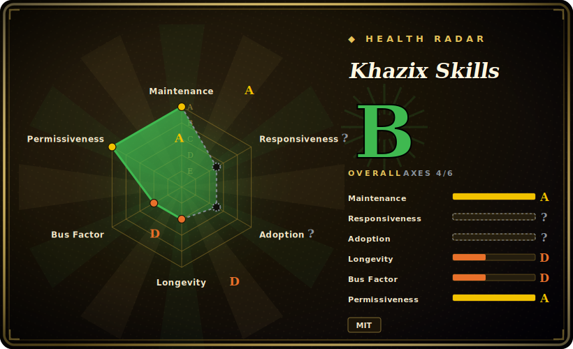

# Khazix Skills

A small, personally-curated collection of SKILL.md-format Agent Skills from 数字生命卡兹克 (Khazix) — five practical, mostly Chinese-language skills (disk cleanup, AI-news lookup, doc/memory reconciliation, long-form research reports, WeChat-style writing) that drop into a SKILL.md-capable agent.

## When to use

You're a Chinese-speaking developer or content creator running Claude Code (or Codex / OpenCode / Cursor / Gemini CLI) as your daily driver, and you keep hitting small, repetitive chores that the base agent does clumsily: your disk is full and you want a triaged, one-click cleanup report instead of `du -sh` archaeology; you want "what happened in AI today" pulled from a live feed instead of the model hallucinating from stale training data; after a long session you want CLAUDE.md / AGENTS.md / project docs reconciled with what the code actually became; or you want a 10k–30k-word research PDF, or a long WeChat article written in a specific author voice. Each of these is a single SKILL.md (plus a few `references/`, `scripts/`, `assets/`) that the agent loads on demand and follows.

You reach for this pack when you'd rather install one author's battle-tested, ready-made skill than write the SKILL.md yourself. The skills are SKILL.md-standard, so they're meant to be harness-portable; installation is a natural-language ask ("帮我安装这个 skill：https://github.com/KKKKhazix/khazix-skills/tree/main/<skill-name>") that lets the agent clone the directory into the right place, and the `aihot` skill additionally ships a `curl -fsSL https://aihot.virxact.com/aihot-skill/install.sh | bash` one-liner for a China-friendly install. It's a grab-bag of independent tools, not a methodology framework — take only the one or two skills you need.

## When NOT to use

- **You don't read Chinese.** Trigger descriptions, report output, and the writing skills (`khazix-writer`, `hv-analysis`) are Chinese-first; `khazix-writer` specifically emulates one author's WeChat voice and is useless for English content or any other voice.
- **You want a coherent methodology, not a grab-bag.** These five skills are unrelated tools by one person; there's no shared workflow spine. If you need brainstorm→plan→TDD→verify discipline, a curated SDLC pack (see Comparison) fits better.
- **Overlap with skills you already run.** `neat-freak` (doc/memory reconciliation) and a disk/storage analyzer overlap with many personal harness setups — layering them on top of an existing memory-sync or cleanup routine invites double-routing and conflicting instructions; pick one.
- **You need an enforced guarantee.** Behavior lives in prompts/markdown the agent reads; "read-only scan", routing rules, and self-review layers are advisory instructions, not enforced gates. The agent can still deviate.
- **The `aihot` skill depends on a third-party hosted service.** It curls `aihot.virxact.com` (the author's own site); if that endpoint changes, rate-limits, or goes away, the skill stops working. Avoid if you need a self-contained, no-external-dependency tool.
- **You need version stability.** No tagged release; you install from `main`, so behavior can shift on any push. Pin a commit if you need reproducibility. [推断]

## Comparison

| Alternative | In index | Our verdict | Tradeoff |
|---|---|---|---|
| [antfu/skills](antfu-skills.md) | ✅ | Use this page for its stated niche; choose antfu/skills when you need another single-author personal skill collection. | Another single-author personal skill collection; antfu's leans web/JS-tooling and is English-first. Khazix's is Chinese-first and tilts toward content/ops chores (writing, AI-news, cleanup). |
| [Dimillian/Skills](dimillian-skills.md) | ✅ | Use this page for its stated niche; choose Dimillian/Skills when you need personal collection skewed to Apple/Swift dev. | Personal collection skewed to Apple/Swift dev. Khazix's overlaps little — different domain and language. |
| [ljg-skills](ljg-skills.md) | ✅ | Use this page for its stated niche; choose ljg-skills when you need sibling personal collection in this leaf. | Sibling personal collection in this leaf; compare by which specific chores each author automates and whether the trigger language matches yours. |
| [qiushi-skill](qiushi-skill.md) | ✅ | Use this page for its stated niche; choose qiushi-skill when you need another Chinese-language personal skill set. | Another Chinese-language personal skill set; pick by overlap with your actual tasks. |
| [Superpowers](../../agent-dev-methodology/superpowers.md) | ✅ | Use this page for its stated niche; choose Superpowers when you need an opinionated SDLC *methodology* pack (TDD/subagent discipline). | An opinionated SDLC *methodology* pack (TDD/subagent discipline) — different unit of consumption. Khazix's is independent utility skills, not a workflow framework. |
| Anthropic's official / built-in Agent Skills | 未收录 | Use this page for its stated niche; choose Anthropic's official / built-in Agent Skills when you need the platform's first-party skill ecosystem. | The platform's first-party skill ecosystem; Khazix's is a third-party personal bundle layered on top and can duplicate or conflict with native skills. |

## Health & viability

- **Maintenance (2026-06):** active — last pushed 2026-06, ~31 open issues, no tagged releases, so you install from `main` with no version to pin. Active, not coasting.
- **Governance & bus factor:** single-author `User`-owned pack (KKKKhazix / 数字生命卡兹克, a content creator). No team or foundation; ~16k stars on a one-person grab-bag is a bus-factor flag, and the writing skills emulate this one author's voice specifically.
- **Age & Lindy verdict:** created 2026-04, only ~2 months old as of 2026-06 — the youngest in this batch, hyped, with essentially no track record. Fails the Lindy test on age alone; treat every skill as a fresh snapshot that can change on any push.
- **Risk flags:** the `aihot` skill depends on a **third-party hosted service** (`aihot.virxact.com`, the author's own site) — if it changes, rate-limits, or disappears, that skill breaks. Chinese-first content; advisory-only ("read-only scan"/routing are prompt instructions, not gates).

## Caveats (unverified)

- [未验证] License MIT and primary language Python per GitHub metadata; repo description "数字生命卡兹克开源的 AI Skills 合集", last pushed 2026-06-14, not archived (as of 2026-06-26). Python is GitHub's detected primary language (likely from the bundled `scripts/`); the skills themselves are SKILL.md markdown — re-verify before relying on this.
- [未验证] Star count (~16k per GitHub on 2026-06-26) is unreliable and date-sensitive; treat as indicative only, not a quality signal.
- [未验证] No tagged release / `latestRelease` is null; "active / last pushed 2026-06" is the only maturity signal. You install from `main`.
- [未验证] The repo contains five skill directories (`aihot`, `hv-analysis`, `khazix-writer`, `neat-freak`, `storage-analyzer`); the README mentions "6" (one via a badge) but only five are present/detailed at this check — verify the current directory listing.
- [未验证] Supported-harness list (Claude Code, Codex, OpenCode, OpenClaw, Cursor, Gemini CLI, Cline, Windsurf) is from the README; actual activation fidelity per harness is not independently confirmed here.
- [未验证] The `aihot` skill requires a browser User-Agent to hit `aihot.virxact.com/api/public/*` (nginx UA blocklist) and depends on that third-party service staying available; reliability and longevity are not guaranteed.
- [推断] Because behavior is prompt/markdown the agent loads, "read-only scan", routing priorities, and multi-layer self-review are advisory, not enforced — the agent can deviate.
