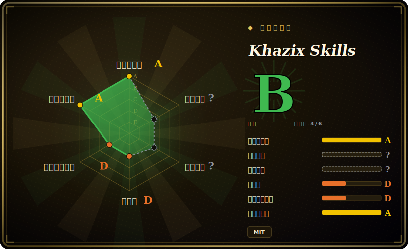

# Khazix Skills

数字生命卡兹克（Khazix）开源的一份个人精选 Agent Skills 合集——五个 SKILL.md 标准格式、以中文为主的实用 skill（磁盘清理、AI 资讯查询、文档/记忆同步、长文研究报告、公众号风格写作），可直接装进任何支持 SKILL.md 的 agent。

## 何时使用

你是一名以中文为主的开发者或内容创作者，日常用 Claude Code（或 Codex / OpenCode / Cursor / Gemini CLI）干活，老是被一些零碎的重复活卡住：磁盘满了，你想要一份分级、可一键清理的报告，而不是手动 `du -sh` 考古；你想知道“今天 AI 圈发生了什么”并且要从实时源拉取，而不是让模型拿过时训练数据瞎编；一段长会话结束后，你想把 CLAUDE.md / AGENTS.md / 项目文档跟代码实际变成的样子对齐；或者你要产出一份一两万到三万字的研究报告 PDF，或一篇特定作者声音的公众号长文。这些每一项都是一个 SKILL.md（外加少量 `references/`、`scripts/`、`assets/`），agent 按需加载并照着执行。

当你宁愿装一个作者已经跑过、现成的 skill，也不想自己写 SKILL.md 时，就用这个合集。这些 skill 是 SKILL.md 标准格式，意在跨 harness 可移植；安装方式是一句自然语言（“帮我安装这个 skill：https://github.com/KKKKhazix/khazix-skills/tree/main/<skill-name>”），让 agent 自己把目录 clone 到正确位置；`aihot` 这个 skill 另外提供了 `curl -fsSL https://aihot.virxact.com/aihot-skill/install.sh | bash` 一行安装（对国内网络友好）。它是一袋互相独立的工具，不是方法论框架——只取你需要的那一两个 skill 即可。

## 何时不用

- **你不读中文。** 触发描述、报告输出以及写作类 skill（`khazix-writer`、`hv-analysis`）都以中文为先；`khazix-writer` 专门模仿某一位作者的公众号声音，对英文内容或任何其他声音都没用。
- **你要的是一套连贯方法论，而不是大杂烩。** 这五个 skill 是一个人写的互不相关的工具，没有共享工作流主干。如果你要的是 brainstorm→plan→TDD→verify 这种纪律，选一个精选的 SDLC 包更合适（见横向对比）。
- **和你已有的 skill 重叠。** `neat-freak`（文档/记忆同步）和磁盘/存储分析这类，跟很多人个人 harness 里已有的设置重叠——叠在已有的记忆同步或清理流程之上会引发双路由和指令冲突；二选一。
- **你需要强制保证。** 行为都活在 agent 读取的 prompt/markdown 里；“只读扫描”“路由规则”“多层自审”都是建议性指令，不是强制闸门。agent 仍可能偏离。
- **`aihot` skill 依赖第三方托管服务。** 它 curl `aihot.virxact.com`（作者自己的站点）；一旦该端点变更、限流或下线，skill 就失效。如果你需要自包含、无外部依赖的工具，请避开。
- **你需要版本稳定。** 没有打 tag 的 release；你从 `main` 安装，任何一次 push 都可能改变行为。需要可复现就 pin 一个 commit。[推断]

## 横向对比

| 替代品 | 是否收录 | 我们的评价 | 取舍 |
|---|---|---|---|
| [antfu/skills](antfu-skills.md) | ✅ | 当前页用于它的主场景；如果更看重“另一份单作者个人 skill 合集”，再选 antfu/skills。 | 另一份单作者个人 skill 合集；antfu 的偏 web/JS 工具链且英文为先。卡兹克的中文为先，偏向内容/运维杂务（写作、AI 资讯、清理）。 |
| [Dimillian/Skills](dimillian-skills.md) | ✅ | 当前页用于它的主场景；如果更看重“个人合集偏 Apple/Swift 开发”，再选 Dimillian/Skills。 | 个人合集偏 Apple/Swift 开发。和卡兹克的重叠很小——领域和语言都不同。 |
| [ljg-skills](ljg-skills.md) | ✅ | 当前页用于它的主场景；如果更看重“本叶子下的同类个人合集”，再选 ljg-skills。 | 本叶子下的同类个人合集；按各作者自动化了哪些具体杂务、触发语言是否匹配你来选。 |
| [qiushi-skill](qiushi-skill.md) | ✅ | 当前页用于它的主场景；如果更看重“另一份中文个人 skill 集”，再选 qiushi-skill。 | 另一份中文个人 skill 集；按和你实际任务的重叠度来选。 |
| [Superpowers](../../agent-dev-methodology/superpowers.zh.md) | ✅ | 当前页用于它的主场景；如果更看重“一个有主张的 SDLC*方法论*包（TDD/subagent 纪律）”，再选 Superpowers。 | 一个有主张的 SDLC*方法论*包（TDD/subagent 纪律）——消费单元不同。卡兹克的是各自独立的实用 skill，不是工作流框架。 |
| Anthropic 官方 / 内置 Agent Skills | 未收录 | 当前页用于它的主场景；如果更看重“平台自带的一方 skill 生态”，再选 Anthropic 官方 / 内置 Agent Skills。 | 平台自带的一方 skill 生态；卡兹克的是叠在其上的第三方个人合集，可能与原生 skill 重复或冲突。 |

## 健康度与可持续性

- **维护（2026-06）：** 活跃——最后 push 于 2026-06，约 31 个 open issue，无打 tag 的 release，因此你从 `main` 安装，没有可 pin 的版本。是活跃而非半荒废。
- **治理与 bus factor：** 单作者的 `User` 合集（KKKKhazix / 数字生命卡兹克，一位内容创作者）。无团队或基金会；一人大杂烩却有约 16k star，是 bus-factor 风险信号，且写作类 skill 专门模仿这一位作者的声音。
- **年龄与 Lindy 判断：** 创建于 2026-04，截至 2026-06 仅约 2 个月——本批次里最年轻，热度高，几乎没有履历。仅凭年龄即未通过 Lindy 检验；应把每个 skill 都当作可能在任意一次 push 改变的全新快照。
- **风险标记：** `aihot` skill 依赖**第三方托管服务**（`aihot.virxact.com`，作者自己的站点）——一旦它变更、限流或下线，该 skill 即失效。内容以中文为先；仅为建议性（「只读扫描」/路由是 prompt 指令，而非闸门）。

## 存疑（未验证）

- [未验证] License 为 MIT、主语言 Python 来自 GitHub 元数据；仓库描述“数字生命卡兹克开源的 AI Skills 合集”，最后 push 于 2026-06-14，未归档（截至 2026-06-26）。Python 是 GitHub 检测出的主语言（多半来自附带的 `scripts/`），skill 本身是 SKILL.md markdown——依赖前请复核。
- [未验证] 星标数（GitHub 上约 16k，2026-06-26）不可靠且随时间变动；仅作参考，不当质量信号。
- [未验证] 没有打 tag 的 release / `latestRelease` 为 null；“active / 最后 push 2026-06”是唯一的成熟度信号。你从 `main` 安装。
- [未验证] 仓库含五个 skill 目录（`aihot`、`hv-analysis`、`khazix-writer`、`neat-freak`、`storage-analyzer`）；README 提到“6”（其一来自徽章），但本次检查只见到/详述了五个——请核对当前目录列表。
- [未验证] 支持的 harness 列表（Claude Code、Codex、OpenCode、OpenClaw、Cursor、Gemini CLI、Cline、Windsurf）来自 README；各 harness 上的实际激活保真度本页未独立确认。
- [未验证] `aihot` skill 调 `aihot.virxact.com/api/public/*` 需带浏览器 User-Agent（nginx UA 黑名单），并依赖该第三方服务持续可用；可靠性与存续不作保证。
- [推断] 因为行为是 agent 加载的 prompt/markdown，“只读扫描”“路由优先级”“多层自审”都是建议性的、非强制——agent 可能偏离。
