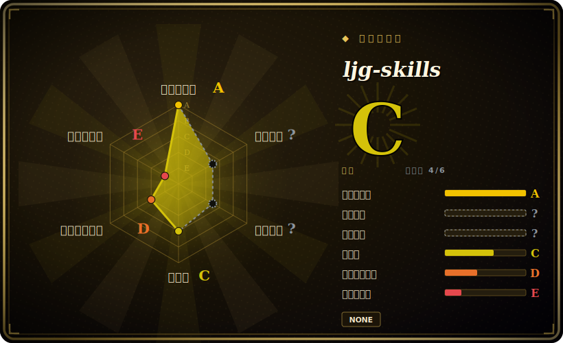

# ljg-skills

李继刚的个人 Claude Code 技能合集（20+ 个 skill），面向中文知识工作——读论文/拆书、概念分析、大白话改写、把内容渲染成可分享的 PNG 卡片，通过 `skills` CLI 安装。

## 何时使用

你是中文母语的知识工作者、研究者或内容创作者，平时读论文、读书、读长文，越来越想让 coding agent 干「脑力活」而不是写代码：把一篇密集的论文讲给外行听、围绕核心问题拆解一本书、把一个绕口的概念改写到 12 岁也能懂、或者把笔记做成一张可分享的信息卡片。开箱即用的 agent 对这些都没有成型方法——总结得很平庸，产物也不可复用。你想要一套别人已经为这些任务打磨过的、结构化的知识类提示词。

你执行 `npx skills add lijigang/ljg-skills -g --all`（如果你用 Obsidian/VSCode/Notion 而非 Emacs/Denote 的 org-mode，在末尾加 `#md` 切到 Markdown 分支），agent 随即获得一组按需加载的技能：`ljg-paper`（把论文要点提炼给普通读者）、`ljg-book`（以问题为中心拆书）、`ljg-learn`（从八个维度分析一个概念）、`ljg-plain`（改写到 12 岁能懂）、`ljg-read`/`ljg-reads`（带翻译和跨学科分析的伴读）、`ljg-card`/`ljg-library`（把内容渲染成视觉 PNG 卡片、带插画的书单卡）、`ljg-qa`（把文章变成结构化问答链）、`ljg-travel`、`ljg-invest`，以及写作、字词分析、关系诊断、结构化辩论、演示设计等更多技能。还有预置 workflow 把多个技能串起来（比如先读论文，再生成卡片）。因为它采用 `skills` CLI 的 `SKILL.md` 格式，技能包会装进你 harness 的技能目录，所以同一套技能能在 Claude Code 等该 CLI 支持的 agent 之间迁移。

## 何时不用

- **你要的是代码/工程技能。** 这个包是知识工作和内容创作，不是研发流程。TDD、review、重构、框架约定请用面向代码的技能包（见横向对比），这些技能帮不了你交付软件。
- **你不主要用中文工作。** 技能用中文撰写（夹英文术语），按中文知识工作的语感调过；在英文优先的任务上，框架和输出风格可能不贴合。
- **你已经有一套信任的知识/写作技能栈。** 在上面再叠一套有主张的阅读/分析提示词，会带来方法冲突和双重路由——每类关切只留一个事实源。
- **你的 harness 没有技能加载器。** 它靠第三方 `skills` CLI 把 `SKILL.md` 写进 agent 的技能目录来激活；在自研或不支持的 agent 上没有东西触发它们，markdown 不会自动生效。
- **你需要强制或确定性。** 产物是 agent *生成*的提示词式分析，没有任何东西校验提炼是否准确。这是方法，不是闸门——内容请自己核验。[推断]
- **你需要版本稳定。** 截至本次核查没有打 tag 的 release——你跟的是移动的分支，而且 org-mode（`master`）/markdown（`md`）双分支和技能清单可能在每次拉取间变化。

## 横向对比

| 替代品 | 是否收录 | 我们的评价 | 取舍 |
|---|---|---|---|
| [pua](pua.zh.md) ✅ | 已收录 | 当前页用于它的主场景；如果更看重“另一个单人维护的中文技能合集”，再选 pua ✅。 | 另一个单人维护的中文技能合集；侧重点和约定不同。同一类型（一个人精选的中文技能），按作者方法和领域是否对你胃口来选。 |
| [qiushi-skill](qiushi-skill.zh.md) ✅ | 已收录 | 当前页用于它的主场景；如果更看重“单人维护的中文技能集”，再选 qiushi-skill ✅。 | 单人维护的中文技能集；同为个人合集，有自己的任务覆盖。ljg-skills 主打阅读/知识提炼和视觉卡片。 |
| [antfu/skills](antfu-skills.zh.md) ✅ | 已收录 | 当前页用于它的主场景；如果更看重“同样是维护者个人包，但面向 Vue/Vite 前端*工程*栈”，再选 antfu/skills ✅。 | 同样是维护者个人包，但面向 Vue/Vite 前端*工程*栈——领域相反。按你需要代码约定还是知识工作方法来选。 |
| [Dimillian/Skills](dimillian-skills.zh.md) ✅ | 已收录 | 当前页用于它的主场景；如果更看重“偏 Swift/Apple 开发的个人合集”，再选 Dimillian/Skills ✅。 | 偏 Swift/Apple 开发的个人合集。同为「一个人的技能」类型，领域（代码）不同。 |
| Anthropic 官方技能 / 内置 slash 命令 | 未收录 | 当前页用于它的主场景；如果更看重“平台自带的技能生态”，再选 Anthropic 官方技能 / 内置 slash 命令。 | 平台自带的技能生态；ljg-skills 是叠在上面的第三方精选包，可能与原生技能重复或冲突。 |

## 健康度与可持续性

- **维护** —— 活跃维护：最后推送 2026-06，未归档（截至 2026-06）。节奏看上去是活跃而非「吃老本」，但没有打 tag 的 release——你跟的是一条移动的分支。
- **治理与 bus factor** —— 单维护者的个人仓库（`User` 所有）。是一个人精选的方法；李继刚一旦停更，包就停。约 6k stars 也改变不了这点——这是一人 bus factor，对个人合集来说正常，但要按「fork 自管」来规划。
- **年龄与 Lindy** —— 创建于 2026-03，截至 2026-06 约 0 年：年轻，Lindy 上未经验证。它确实活跃，但太新，跨越模型/CLI 更迭还没有 track record——为方法而采用，不为长寿。
- **风险旗标** —— 截至 2026-06 未检测到 license（`NOASSERTION`）：复用/再分发权利不清，依赖前请与作者确认。内容（技能清单、org-mode/markdown 双分支）可能在每次拉取间变化。

## 存疑（未验证）

- [未验证] 2026-06-26 通过 GitHub 元数据未检测到 license 文件（`licenseInfo` 为 null）——frontmatter 记为 `NOASSERTION`；没有明确许可证，复用/再分发权利不清，依赖前请与作者确认。
- [未验证] 截至 2026-06-26 没有打 tag 的 release（`latestRelease` 为 null）；「maturity」由最后推送（2026-06-26）和活跃度推断，并非语义化版本。仓库未归档。
- [未验证] Star 数（2026-06-26 GitHub 显示约 6,237）不可靠且随时间变化；仅作参考，不当质量信号。
- [未验证] 主语言 GitHub 在 2026-06-26 报为 HTML（另有 Shell/Python/JS 占比）；这反映卡片渲染/自动化工具链，而非可运行应用——实质是 markdown/org 的 `SKILL.md` 式提示词文件。
- [未验证] 技能清单（`ljg-paper`、`ljg-book`、`ljg-learn`、`ljg-plain`、`ljg-read`/`ljg-reads`、`ljg-card`、`ljg-library`、`ljg-qa`、`ljg-travel`、`ljg-invest` 等）、「20+ 个技能」数量，以及 `master`（org-mode）/`md`（markdown）双分支结构，均来自 2026-06-26 的 README，可能在每次拉取间变化；请核查 live 的 `skills/` 目录，不要依赖此快照。
- [未验证] 通过第三方 `skills` CLI 安装（`npx skills add lijigang/ljg-skills -g --all`，`#md` 切 markdown 分支）及其支持的 harness 行为，是该 CLI 的属性而非本仓库的属性；各 harness 的激活保真度此处未独立确认。
- [推断] 因为行为存在于 agent 加载的提示词/markdown 技能中，产物是建议性的——agent 可能偏离、分析也可能出错；这些是方法提示词，不对准确性做硬保证。
- [推断] 技能编码了维护者个人的知识工作方法（如「八个维度」或以问题为中心的框架）；认同该方法则有用，不认同则成摩擦，且并非独立验证的标准。
