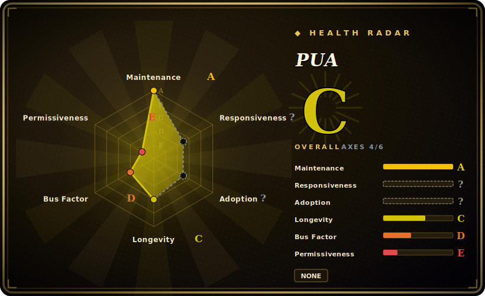

# PUA

A high-agency persona skill pack that frames your coding agent as a P8 engineer on a 30-day PIP, using "corporate PUA / PIP" rhetoric to push it to exhaust debugging approaches instead of giving up early.

## When to use

You're a developer running Claude Code (or Codex CLI, Cursor, Kiro, OpenCode…) and your agent keeps bailing too soon: it hits an error twice, shrugs, declares "this is a known limitation," and stops — or it claims a fix is done without ever re-running the failing command. You want it to behave like a stubborn senior engineer who treats "I can't" as unacceptable until every avenue is genuinely exhausted. PUA installs a persona that reframes the agent as a once-promising P8 placed on a performance-improvement plan, then escalates pressure as failures accumulate: L0 normal → L1 "switch to a fundamentally different approach" → L2 "search + read the source + form three hypotheses" → L3 "complete a 7-point checklist" → L4 "desperation mode." Layered on top are "Three Red Lines" (no false completion claims, verify facts with tools, exhaust approaches before quitting) and methodology routing that picks a debugging strategy and rotates it on repeated failure.

You reach for it when you'd rather adopt an opinionated, theatrical persistence layer than hand-write your own "don't give up" prompting, and especially when you want that nudge to follow you across harnesses. The repo ships per-platform assets (Claude Code plugin, Codex skills, Cursor `.mdc` rules, Kiro steering, VSCode/Copilot instructions, plus persona variants like `/pua:p7`, `/pua:p9`, `/pua:p10`, `/pua:yes`, `/pua:mama`). On Claude Code it goes beyond pure prompting: a v3 implementation wires `SessionStart` / `PostToolUse` / `UserPromptSubmit` hooks to inject context more deterministically than prompt text alone. [推断]

## When NOT to use

- **You already run a persistence / debugging discipline.** If your stack already enforces verification-before-completion, systematic debugging, or a "don't claim done without evidence" rule (many curated skill systems do), PUA's Three Red Lines overlap and its persona prompts can double-route or contradict yours. Pick one source of truth.
- **You want enforcement, not vibes.** Outside the Claude Code hook path, the persona is prompt injection — the agent can ignore "L4 desperation mode" the same way it ignores any instruction. It increases the odds of persistence; it does not compel it.
- **The "PUA" framing is a non-starter.** The whole pitch is psychological-pressure rhetoric (Chinese corporate-management and Western PIP culture). If you find that distasteful, want a neutral tone, or are wiring an agent for others, the theme itself is the product and can't be cleanly stripped out.
- **You're not on a supported harness.** Activation depends on each platform's loader (Claude `Skill`/plugin, Codex skills, Cursor rules, Kiro steering). On a bespoke or unsupported agent the markdown does nothing on its own.
- **Single-maintainer, fast-moving, theme-heavy.** Frequent releases (v3.x) with behavior baked into persona prompts; a version bump can shift escalation logic or which flavors exist. Pin and re-check after upgrades. [推断]

## Comparison

| Alternative | In index | Our verdict | Tradeoff |
|---|---|---|---|
| [antfu/skills](antfu-skills.md) | ✅ | Use this page for its stated niche; choose antfu/skills when you need a maintainer's personal general-purpose skill collection. | A maintainer's personal general-purpose skill collection; broad utility skills, no persona/pressure theme. PUA is single-purpose: it only adds a persistence persona, not a toolbox. |
| [awesome-claude-code-subagents](../subagent-collections/awesome-claude-code-subagents.md) | ✅ | Use this page for its stated niche; choose awesome-claude-code-subagents when you need a large catalog of role-based subagents to dispatch work to. | A large catalog of role-based subagents to dispatch work to. PUA is not a roster of specialists — it's a behavioral overlay that changes how one agent persists. |
| Superpowers | 未收录 | Use this page for its stated niche; choose Superpowers when you need full brainstorm→plan→TDD→verify SDLC methodology pack. | Full brainstorm→plan→TDD→verify SDLC methodology pack; its `verification-before-completion` / `systematic-debugging` skills overlap PUA's Red Lines but ship a whole lifecycle, where PUA is just the persistence/anti-quit layer with a persona skin. |
| Anthropic's built-in skills / native slash commands | 未收录 | Use this page for its stated niche; choose Anthropic's built-in skills / native slash commands when you need the platform's own skill surface. | The platform's own skill surface; PUA is a third-party persona bundle layered on top and can duplicate or conflict with native behavior. |

## Health & viability

- **Maintenance** — very active and fast-moving: latest release v3.5.0 (2026-06), last pushed 2026-06, not archived (as of 2026-06). Frequent v3.x releases mean escalation logic and "flavors" can shift between versions — pin and re-check after upgrades.
- **Governance & bus factor** — single-maintainer personal repo (`User`-owned); ~18k stars but one author owns the roadmap and the whole persona theme. Heavy theme + one maintainer = real key-person risk.
- **Age & Lindy** — created 2026-03, ~0 years old as of 2026-06: young and visibly hyped (high stars fast), so Lindy-unproven. Stars signal interest, not durability — treat as a bet on a trend, not a settled tool.
- **Risk flags** — the "PUA / PIP" psychological-pressure framing is the product and can't be cleanly stripped; a non-starter for neutral-tone or shared-agent setups. License recorded MIT per README but `licenseInfo` was null on 2026-06 — verify before relying on it.

## Caveats (unverified)

- [未验证] `gh` metadata on 2026-06-26 reports `licenseInfo: null` (no detected LICENSE file), but the README footer states MIT; frontmatter records MIT per the README — verify the actual license before relying on it.
- [未验证] Latest release reported as v3.5.0 (published 2026-06-12), repo last pushed 2026-06-17, primary language TypeScript, not archived, created 2026-03 — per GitHub metadata as of 2026-06-26; re-verify before relying on a specific version's behavior.
- [未验证] Star count (~18.5k per GitHub on 2026-06-26) is unreliable and date-sensitive; treat as indicative only, not as a quality signal.
- [未验证] The supported-harness list (Claude Code, Codex CLI, Cursor, Kiro, CodeBuddy, OpenClaw, Google Antigravity, OpenCode, VSCode/Copilot, plus experimental pi / Trae) and install methods (`npx skills add`, `claude plugin install`, manual curl) are from the README; per-harness activation fidelity is not independently confirmed here.
- [未验证] The command/flavor list (`/pua:pua`, `/pua:on`, `/pua:off`, `/pua:p7`, `/pua:p9`, `/pua:p10`, `/pua:yes`, `/pua:mama`, `/pua:pua-loop`, `/pua:survey`, `/pua:flavor`, `/pua:kpi`) and the L0–L4 escalation table are from the README and may change release-to-release.
- [推断] Because behavior lives in persona prompts loaded by the agent, enforcement is advisory except where Claude Code hooks inject context; "L4 desperation mode" and the Red Lines are prompt-level instructions, not hard guarantees, and actual hook coverage was not verified here.
