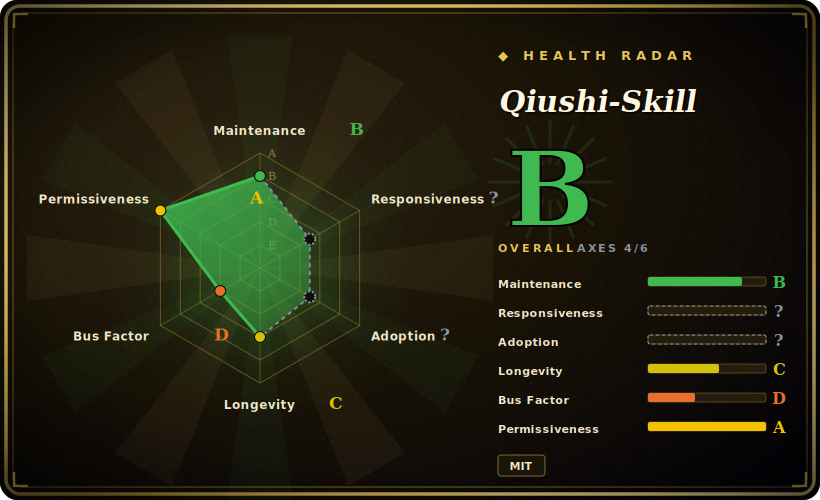

# Qiushi-Skill

A methodology skill pack (求是 Skill) that arms a coding agent with one core principle — "seek truth from facts" (实事求是) — plus nine dialectical-materialist / practice-philosophy "tools" (contradiction analysis, investigation-first, practice-cognition, mass line, criticism & self-criticism, protracted strategy, concentrate forces, spark-prairie-fire, overall planning), installable across Claude Code, Cursor, Codex, OpenCode and others via an `npx` installer.

## When to use

You're a developer (or a heavy agent user) who is tired of an obsequious assistant that agrees with whatever you say, jumps to a plausible-sounding answer, and declares victory without checking reality. You want the agent to behave like a disciplined analyst: investigate before deciding, name the *primary* contradiction instead of fixing the loudest symptom, validate hypotheses against actual practice (run it, observe it), and keep pushing until the work is genuinely done rather than nominally finished. Qiushi-Skill packages that posture as a set of on-demand skills: an "arming-thought" entry skill that injects the core principle at session start, plus nine method skills the agent loads only when a situation clearly calls for one (`/contradiction-analysis`, `/investigation-first`, etc.), with a `workflows/` layer to chain them.

You reach for it when you want a ready-made *thinking discipline* rather than building your own from scratch, and especially when you want that discipline to follow you across harnesses — the repo ships per-platform manifests (`.claude-plugin`, `.cursor-plugin`, `.codex`, `.opencode`, `.openclaw`, `.hermes`, `.nanobot`) and an `npx qiushi-skill install --target <harness>` flow, so the same "facts first, main contradiction, validate in practice" spine activates through each platform's native skill-loading mechanism.

## When NOT to use

- **You already run a curated thinking/planning skill stack.** This pack is opinionated and prescriptive (mandatory investigation-first, contradiction-naming before action). Layering its nine methods on top of an existing methodology system invites overlapping routing and competing instructions — pick one source of truth for "how the agent thinks."
- **Conceptual overlap with general dev-methodology packs.** Investigation-first, practice-cognition and criticism overlap heavily with brainstorm→plan→TDD→verify style packs; if you already have one, the added value is mostly the *contradiction / prioritization* framing, not the loop itself.
- **You're on an unsupported or bespoke harness.** Activation depends on each platform's loader; outside the shipped targets there's no mechanism to auto-fire the skills, and the markdown alone does nothing.
- **You want a runtime/library, not behavior shaping.** The `bin/` CLI is only an installer that copies skill files into your harness — there's no API or service to call; the product is prompts.
- **Enforcement is advisory.** "Mandatory" steps are prompt-level instructions the agent can still skip; this shapes behavior, it does not gate it. [推断]
- **Single-maintainer, no tagged release, naming may be a barrier.** Upstream is one maintainer with no semver release to pin, and the dialectical-materialism / historical-vocabulary framing (despite the README's "methodology, not propaganda" disclaimer) may be a non-starter for some teams or audiences.

## Comparison

| Alternative | In index | Our verdict | Tradeoff |
|---|---|---|---|
| [antfu/skills](antfu-skills.md) | ✅ | Use this page for its stated niche; choose antfu/skills when you need personal task-oriented skill set (build/repo chores) rather than a thinking methodology. | Personal task-oriented skill set (build/repo chores) rather than a thinking methodology; complementary, not a substitute — Qiushi shapes *how to reason*, antfu's shape *how to do specific jobs*. |
| [Dimillian/Skills](dimillian-skills.md) | ✅ | Use this page for its stated niche; choose Dimillian/Skills when you need another personal curated collection skewed to a specific stack/workflow. | Another personal curated collection skewed to a specific stack/workflow; overlaps as "someone's skill bundle" but not on the methodology/discipline axis. |
| [gstack](gstack.md) | ✅ | Use this page for its stated niche; choose gstack when you need personal harness-config collection. | Personal harness-config collection; same leaf, different intent — config/tooling vs. a cognitive-method spine. |
| [wshobson/agents](../subagent-collections/wshobson-agents.md) | ✅ | Use this page for its stated niche; choose wshobson/agents when you need large subagent persona library (role specialists). | Large subagent persona library (role specialists). Qiushi is a small set of *thinking methods*, not a roster of domain agents — combine rather than choose. |
| [awesome-claude-code-subagents](../subagent-collections/awesome-claude-code-subagents.md) | ✅ | Use this page for its stated niche; choose awesome-claude-code-subagents when you need breadth-first subagent catalog. | Breadth-first subagent catalog; Qiushi is depth-first on one methodology. Pick by whether you need many personas or one disciplined loop. |
| Superpowers / general SDLC methodology packs | 未收录 | Use this page for its stated niche; choose Superpowers / general SDLC methodology packs when you need brainstorm→plan→TDD→verify methodology plugins occupy the same "discipline as skills" niche. | Brainstorm→plan→TDD→verify methodology plugins occupy the same "discipline as skills" niche; Qiushi differs by leading with contradiction-analysis and prioritization rather than a test-first lifecycle. |

## Health & viability

- **Maintenance** — active: last pushed 2026-05, not archived (as of 2026-06), but no tagged release to pin — you track a moving branch. Reads active rather than abandoned, but without semver you can't lock a known-good state.
- **Governance & bus factor** — single-maintainer personal repo (`User`-owned), ~3.3k stars. One author owns the methodology and the multi-harness manifests; modest stars and a niche framing mean limited community backstop if the maintainer steps away.
- **Age & Lindy** — created 2026-03, ~0 years old as of 2026-06: young, Lindy-unproven. The *underlying* method (dialectical-materialist analysis) is old, but this packaging is new and untested across CLI churn — adopt for the discipline, not for longevity.
- **Risk flags** — the dialectical-materialism / historical-vocabulary framing (despite a "methodology, not propaganda" disclaimer) can be a non-starter for some teams or audiences; no enforcement (advisory prompts only). License recorded MIT as of 2026-06.

## Caveats (unverified)

- [未验证] GitHub metadata as of 2026-06-26: license MIT, primary language JavaScript, last pushed 2026-05-01, no tagged release (`latestRelease` null), topics `ai-agents/methodology/skills/workflow`, not archived — re-verify before relying on any of these.
- [未验证] Star count (~3.3k per GitHub on 2026-06-26) is unreliable and date-sensitive; treat as indicative only, never as a quality signal.
- [未验证] The skill inventory (1 core principle "arming-thought" + 9 methods + a `workflows/` orchestration layer) and the supported-target list (Claude Code, Cursor, Codex, OpenCode, OpenClaw, Hermes, nanobot) are from the README; the actual `skills/` directory and per-harness activation fidelity were not independently inspected file-by-file here.
- [未验证] The hook-based session injection (arming-thought auto-injecting at session start, methods loading "only when clearly applicable") is described by the README; whether it fires reliably in any given harness is not confirmed.
- [推断] Because the methods live in prompt/markdown skills loaded by the agent, enforcement is advisory — the agent can still deviate from "mandatory" investigation-first / contradiction-naming steps.
- [推断] `type` is recorded as `skill-pack` because the `npx qiushi-skill` CLI is an installer for the skill files, not a standalone runtime; if you depend on the installer as tooling, evaluate it separately.
