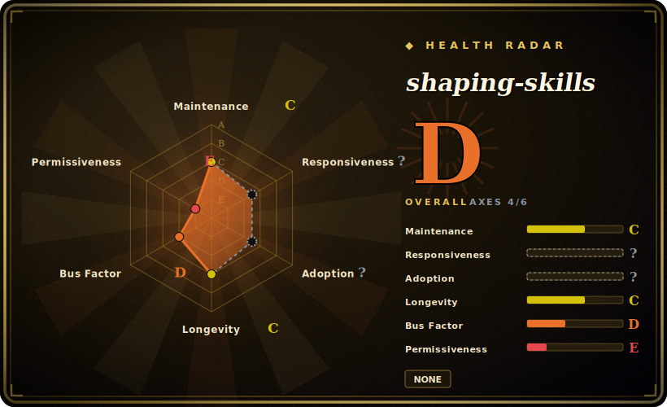

# shaping-skills

Ryan Singer's personal Claude Code skill pack that brings Shape Up "shaping" — framing problems, breadboarding affordances, and writing kickoff/framing docs — into your coding agent, so the AI helps you define *what* to build before any code gets written.

## When to use

You're a product person or solo founder working through a fuzzy idea with Claude Code, and you keep hitting the same wall: the conversation is full of good thinking, but it never crystallizes into something a builder can act on. You jump from a vague problem straight to "let's build it," skip the part where you separate the *problem* from the *solution*, and end up with implementation that solves the wrong thing. You want the AI to act like a shaping partner — to push you to frame the problem first, map a rough solution as connected affordances rather than pixel-perfect screens, and only then produce a tight doc the team can run with.

This pack gives you that as a handful of on-demand skills. `/framing-doc` and `/kickoff-doc` distill a working conversation into a problem-framing or builder-reference document; `/shaping` iterates problem and solution together before implementation; `/breadboarding` maps a system into places, affordances, and the wiring between them in the Shape Up sense. A `hooks/shaping-ripple.sh` script does a ripple/side-effect check. You install it by cloning the repo and symlinking the skill directories into `~/.claude/skills/` — the methodology then activates through Claude Code's native skill loader when a task matches.

## When NOT to use

- **You already run a planning/spec methodology you trust.** Shaping overlaps directly with brainstorm-then-plan skill packs (e.g. Superpowers' `brainstorming` + `writing-plans`). Stacking two opinionated "define before you build" flows invites conflicting routing — pick one shaping/planning source of truth.
- **You want code, not problem definition.** This pack deliberately stops *before* implementation; it produces framing and kickoff docs, not working code or tests. If your need is the build loop (TDD, debugging, refactor), it doesn't cover that.
- **Garbage-in-garbage-out is a dealbreaker.** The doc skills format and distill what you bring; the README is explicit that they don't judge whether the thinking is any good — a bad conversation yields a nicely formatted bad document.
- **You're not on Claude Code.** Activation depends on Claude Code's `~/.claude/skills/` symlink + native skill loader; on another harness there's no loader to invoke these and the markdown alone won't auto-fire. [推断]
- **You need stability or maintenance guarantees.** Personal repo, no tagged releases, last pushed 2026-04, no license file; the author flags the solo skills (`/shaping`, `/breadboarding`) as more experimental and less battle-tested. Treat it as one person's working setup, not a maintained product.
- **Enforcement is advisory.** Behavior lives in prompt/markdown skills the agent loads on demand; the shaping discipline is a suggestion the agent can still skip, not a hard gate.

## Comparison

| Alternative | In index | Tradeoff |
|---|---|---|
| [antfu/skills](antfu-skills.md) | ✅ | Personal curated Claude Code skill collection, but for the Vue/Vite frontend *build* stack (test idioms, ESLint, UnoCSS). Orthogonal: shaping-skills is upstream of code (problem/solution definition), antfu/skills is downstream (how to write the code). |
| [Dimillian/Skills](dimillian-skills.md) | ✅ | Another individual developer's Claude Code skill set; compare on domain — Dimillian's lean toward implementation/platform conventions, shaping-skills toward product shaping and docs. |
| [gstack](gstack.md) | ✅ | Personal harness/skill collection in this leaf; different focus. Cross-check which lifecycle stage each actually shapes vs. builds. |
| Superpowers (`brainstorming` / `writing-plans`) | 未收录 (in agent-dev-methodology) | A full SDLC skill library whose front end (interrogate the idea, write the plan) overlaps shaping's intent, but framed as generic software brainstorming rather than Shape Up's problem/solution/breadboard vocabulary. |
| Shape Up book / BaseCamp's own materials | 未收录 | The source methodology as prose, not an installable agent skill — this pack is one person's operationalization of it inside Claude Code. |

## Health & viability

- **Maintenance** — last pushed 2026-04, not archived (as of 2026-06): a couple of months quiet, no tagged releases. Reads as one person's working setup that's been touched recently, not a coasting or abandoned project — but cadence is low and the author flags the solo skills as experimental.
- **Governance & bus factor** — single-maintainer personal repo (`User`-owned, Ryan Singer), ~1.4k stars. One author's operationalization of Shape Up; no team or org backstop. Treat as fork-and-own, not a maintained product.
- **Age & Lindy** — created 2026-01, ~0 years old as of 2026-06: young, Lindy-unproven. The Shape Up *methodology* is well-established, but this skill packaging is new and lightly battle-tested — adopt for the method, knowing the wrapper is fresh.
- **Risk flags** — no detected license (`NOASSERTION`) as of 2026-06: reuse/redistribution rights unclear, confirm with the author. Skill inventory and SKILL.md casing can change; enforcement is advisory only.

## Caveats (unverified)

- [未验证] No license file or `licenseInfo` is exposed via GitHub metadata as of 2026-06-26 (recorded here as SPDX `NOASSERTION`); absent an explicit license, reuse/redistribution rights are unclear — verify with the author before depending on it.
- [未验证] Repo has no tagged releases and was last pushed 2026-04-10 per GitHub metadata (2026-06-26); primary language reported as Shell. Re-verify freshness before relying on current behavior.
- [未验证] Star count (~1.4k per GitHub on 2026-06-26) is unreliable and date-sensitive; treat as indicative only, not a quality signal.
- [未验证] Skill inventory (`framing-doc`, `kickoff-doc`, `shaping`, `breadboarding`, plus a `breadboard-reflection` dir and `hooks/shaping-ripple.sh`) is read from the repo tree; SKILL.md filename casing is mixed and the set can change — inspect the live tree rather than trusting this list.
- [未验证] Author identified as Ryan Singer (rjs) and the "experimental / less battle-tested" caveat on solo skills are taken from the README; not independently confirmed here.
- [推断] Because the skills are prompt/markdown loaded by Claude Code, the shaping discipline is advisory — the agent can deviate; "skills" here shape behavior, they don't enforce it.
