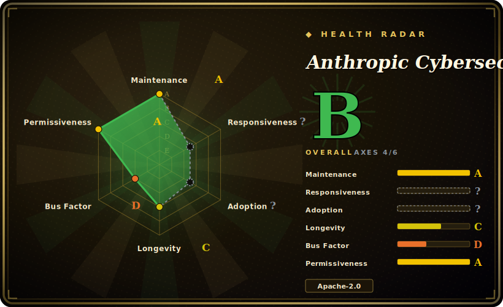

# Anthropic Cybersecurity Skills

A large cybersecurity skill pack (~817 skills as of this check) that loads structured, framework-mapped security workflows into a coding agent — each skill is a `SKILL.md` (when-to-use → prerequisites → step-by-step workflow → verification) cross-referenced to MITRE ATT&CK, NIST CSF, ATLAS, D3FEND, NIST AI RMF and MITRE F3.

## When to use

You're a security engineer, SOC analyst, or DFIR responder driving Claude Code (or GitHub Copilot, Codex CLI, Cursor, Gemini CLI…) through real defensive work — triaging an alert, hunting lateral movement, carving a memory dump, or mapping findings back to ATT&CK for the incident report. The agent can technically run Volatility, write Sigma rules, or query a SIEM, but it doesn't know the idiomatic procedure, the right flags, or which framework technique a given observation maps to — so it improvises, skips verification, or labels the wrong TTP. You want it to follow the steps a seasoned analyst would, with a vetted runbook and standards mappings in front of it.

You reach for this pack to drop in a security playbook: install once (`npx skills add mukul975/Anthropic-Cybersecurity-Skills` or `git clone`), and the agent gains on-demand skills across 29 domains — cloud security, threat hunting, threat intelligence, network security, web-app security, digital forensics, malware analysis, and more. Each skill ships a `SKILL.md` plus `references/` (framework mappings, workflows), `scripts/` (helper Python), and `assets/` (checklists, report templates); the agent pulls in only the ones a task needs and gets the workflow already mapped to ATT&CK / D3FEND / NIST so the write-up speaks the language your reviewers expect. [推断]

## When NOT to use

- **You already curate a security skill/runbook stack you trust.** This pack is broad and opinionated; layering ~817 skills on top of your own runbooks invites conflicting guidance and double-routing. Pick one source of truth per domain.
- **You're on a harness with no skill loader.** It activates through the agentskills.io / open Agent Skills standard (Claude Code, Copilot, Codex, Cursor, Gemini CLI, MCP-compatible agents). On a bespoke agent with no loader, the `SKILL.md` files are inert markdown and won't auto-activate.
- **You need the security tooling preinstalled.** The skills document *how* to use Volatility, nmap, YARA, etc. — they don't bring the binaries, a SIEM, lab data, or cloud credentials. You still provision and operate those, and you own the authorization scope for anything offensive.
- **You want enforced guardrails, not advice.** Skill docs are advisory prompt context, not a sandbox or policy engine; the agent can still run a destructive or out-of-scope command. Offensive/red-team skills carry real legal and operational risk and need explicit authorization regardless of what a skill says.
- **You need a stable, audited security baseline.** Fast-moving single-author repo (734 → 817 skills across recent releases); content and framework versions shift release-to-release, and the breadth means individual skills vary in depth and review. Pin a version and review the specific skills you depend on. [推断]

## Comparison

| Alternative | In index | Tradeoff |
|---|---|---|
| `/guard-secure`, `/guard-threat-model` style security skills in a personal/team skill stack | 未收录 | Hand-curated, harness-native security gates you already trust and can enforce in hooks; far narrower coverage. This pack trades enforceability and curation for 800+ ready-made domain workflows. |
| MITRE ATT&CK Navigator / framework docs (read the source mappings yourself) | 未收录 | Authoritative, always-current technique data, but no agent-executable workflow — you wire ATT&CK to procedure manually. This pack pre-binds workflows to (a snapshot of) those frameworks. |
| Security MCP servers (e.g. tool-wrapping SIEM/scanner MCPs) | 未收录 | Give the agent live *tool access* with structured I/O; this pack gives *procedural knowledge*, not connectivity. Complementary, not substitutes — one knows the steps, the other can execute against a system. |
| Bespoke per-task prompting (write your own `SKILL.md`) | 未收录 | Maximum control and zero unused surface, but you rebuild and maintain curated, framework-mapped runbooks for every domain yourself instead of installing a vetted bundle. |

## Health & viability

- **Maintenance** — very active and fast-moving: latest release v1.3.0 (2026-06), last pushed 2026-06, not archived (as of 2026-06). Skill count grew 734 → ~817 across recent releases, so content and framework versions shift release-to-release — pin a version and review the specific skills you depend on.
- **Governance & bus factor** — single-author community repo (`User`-owned, `mukul975`), ~22k stars. One maintainer owns 800+ security skills of uneven depth; that's a heavy single-author bus factor for safety-relevant content. The "Anthropic" in the name is **not** an endorsement — it's a community project, not an official release.
- **Age & Lindy** — created 2026-02, ~0 years old as of 2026-06: young and hyped (high stars fast), Lindy-unproven. For *security* runbooks, newness compounds the review burden — none of these workflows have a long track record.
- **Risk flags** — Apache-2.0 (clear reuse), but skills are advisory prompt context, **not** a sandbox, validated detections, or a policy engine; offensive/red-team skills carry real legal and operational risk and need explicit authorization regardless of what a skill says. Framework-version and skill-count claims are README-sourced.

## Caveats (unverified)

- [未验证] Metadata as of 2026-06-26 (GitHub): latest release v1.3.0 (published 2026-06-22), repo last pushed 2026-06-22, license Apache-2.0, primary language Python (PowerShell minority), not archived — re-verify before relying on a specific version's behavior or skill list.
- [未验证] Star count (~21.5k per GitHub on 2026-06-26) is unreliable and date-sensitive; treat as indicative only, not as a quality or trust signal.
- [未验证] Skill count (~817) and the per-domain breakdown (e.g. Cloud Security 66, Threat Hunting 58, Threat Intelligence 52) come from the project README/description and shift release-to-release; the v1.0.0 release reportedly shipped 734 skills. Inspect the current `skills/` directory rather than trusting this list.
- [未验证] Framework versions claimed (MITRE ATT&CK v19.1, NIST CSF 2.0, ATLAS v5.4, D3FEND v1.3, NIST AI RMF 1.0, MITRE F3 v1.1) and the "20+/26+ platforms" compatibility claim are from the README; actual mapping accuracy and per-harness activation fidelity are not independently confirmed here.
- [未验证] The repo provides helper Python scripts and templates but reportedly no standalone CLI or MCP server; the `agentskills.io` standard and `npx skills add` installer are external dependencies whose availability/behavior are not verified here.
- [未验证] The repo name references "Anthropic" but this is a community project by `mukul975`, not an official Anthropic release — do not treat the name as an endorsement.
- [推断] Because skills are markdown docs loaded into the agent, their guidance is advisory — the agent can still run incorrect, destructive, or out-of-scope security actions; these are not enforced controls, validated detections, or a substitute for authorization and human review.
