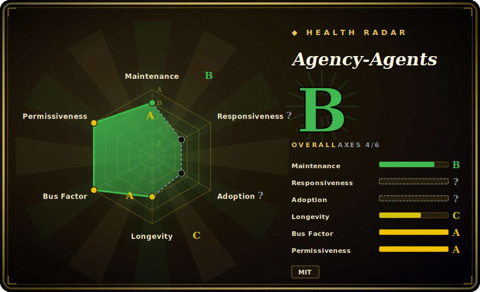

# Agency-Agents

A curated collection of ~232 specialized subagent personas (markdown) spanning 16 functional "divisions" — Engineering, Design, Marketing, Security, Game Dev, GIS and more — with install/convert scripts that deploy them into Claude Code and ~11 other agent harnesses.

## When to use

You're a solo developer or small team running Claude Code, and you keep writing the same ad-hoc system prompts over and over: a "frontend developer" persona for one task, a "security architect" for another, a "code reviewer" for a third. You want a ready-made library of role-specific subagents you can drop into `~/.claude/agents/` and invoke by name, rather than hand-rolling each persona. Agency-Agents gives you a broad bag — 232 markdown agent files organized by division — each with frontmatter (`name`, `description`, color), a defined mission, domain rules, deliverable examples, a workflow, and success metrics, so the subagent behaves consistently when your harness dispatches to it.

You reach for it especially when you want breadth across many domains at once (not just coding — it also covers sales, finance, support, spatial computing, GIS) and when you want the *same* personas to follow you across tools. The repo ships `scripts/install.sh` (interactive picker, auto-detects installed tools, supports `--division`, `--agent`, `--dry-run`, `--no-interactive`) and `scripts/convert.sh` (generates per-tool formats), targeting Claude Code, Cursor, Aider, Windsurf, OpenCode, Gemini CLI, Copilot, Codex, Kimi, Qwen and others — so you install once and select only the divisions you need.

## When NOT to use

- **You already maintain a curated subagent/skill set.** 232 personas is a lot of surface; dropping them all into `~/.claude/agents/` clutters your agent picker and can collide with names you already use. Install selectively (`--division`/`--agent`) or you trade curation for volume.
- **You want depth and methodology over breadth.** These are role *personas* (identity + workflow + success metrics), not an enforced SDLC discipline. If your real need is brainstorm→plan→TDD→verify rigor, a methodology pack fits better than a persona catalog.
- **You distrust "battle-tested / production-ready" marketing.** The README claims proven deliverables, but there's no test harness or QA process in-repo [推断]; personas range from high-stakes (incident response, security) to deliberately whimsical (a "Whimsy Injector"), and quality is uneven across 232 files.
- **You need enforcement, not suggestion.** Like any prompt pack, behavior is advisory — the markdown shapes a subagent's framing but the harness/model can still ignore it. There are no hard guarantees.
- **Cross-tool fidelity matters and you're not on Claude Code.** The canonical format is Claude-style `.md`; the converters emit other tools' formats, but conversion fidelity for 11 non-Claude harnesses is not independently confirmed here.

## Comparison

| Alternative | In index | Our verdict | Tradeoff |
|---|---|---|---|
| [wshobson/agents](wshobson-agents.md) | ✅ | Use this page for its stated niche; choose wshobson/agents when you need another large Claude Code subagent collection, coding-focused. | Another large Claude Code subagent collection, coding-focused. Agency-Agents is broader (16 non-coding divisions too) and ships multi-tool converters; wshobson stays closer to engineering roles. Pick by whether you need cross-domain breadth or a tighter dev-only set. |
| [awesome-claude-code-subagents](awesome-claude-code-subagents.md) | ✅ | Use this page for its stated niche; choose awesome-claude-code-subagents when you need a large curated subagent directory in the same leaf. | A large curated subagent directory in the same leaf. Compare on curation philosophy and how many personas you actually want installed vs. browsed. |
| [antfu/skills](../personal-collections/antfu-skills.md) | ✅ | Use this page for its stated niche; choose antfu/skills when you need a personal *skills* collection (task workflows), not role personas. | A personal *skills* collection (task workflows), not role personas — different unit of consumption. Use skills for "how to do X", personas for "act as Y". |
| Anthropic's example/built-in agents | 未收录 | Use this page for its stated niche; choose Anthropic's example/built-in agents when you need the platform's own subagent examples. | The platform's own subagent examples; Agency-Agents is a third-party bulk catalog layered on top, so names and roles can overlap or duplicate native ones. |

## Health & viability

- **Maintenance** — active: last pushed 2026-06, not archived (as of 2026-06), but no tagged release to pin — you track a moving branch. Cadence reads active; the 232-persona surface means individual files vary in upkeep.
- **Governance & bus factor** — single-maintainer personal repo (`User`-owned, `msitarzewski`) with a very high star count (~116k as of 2026-06). A `User`-owned repo with stars that large is a **bus-factor flag**: one person owns the roadmap and the multi-tool converters, with no team or org behind it — outsized attention, single point of failure.
- **Age & Lindy** — created 2025-10, ~0.7 years old as of 2026-06: young relative to its hype, Lindy-unproven. High stars signal reach, not durability — treat the longevity as unestablished.
- **Adoption & risk flags** — MIT-licensed (clear reuse). "Battle-tested / production-ready" is a marketing claim with no in-repo test or QA evidence; persona quality is uneven (incident-response next to a whimsy injector), and cross-tool conversion fidelity for ~11 non-Claude harnesses is unverified. Install selectively rather than dropping all 232 in.

## Caveats (unverified)

- [未验证] License MIT and primary language Shell (the install/convert scripts) per GitHub metadata as of 2026-06-26; repo last pushed 2026-06-22, no tagged release reported — re-verify before pinning behavior.
- [未验证] Star count (~116k per GitHub on 2026-06-26) is unreliable and date-sensitive; treat as indicative only, not a quality signal.
- [未验证] Agent count (~232) and the 16-division breakdown are from the README/landing page, not independently file-counted here; the actual `agents/` tree may differ and changes over time.
- [未验证] The supported-target list (Claude Code, Copilot, Antigravity/Gemini, Gemini CLI, OpenCode, Cursor, Aider, Windsurf, OpenClaw, Qwen, Kimi, Codex) is from the README; per-tool conversion fidelity is not verified here.
- [推断] "Battle-tested / production-ready" is a marketing claim with no in-repo test or QA evidence; persona quality is uneven (high-stakes roles alongside whimsical ones).
- [推断] Because behavior lives in markdown personas loaded by the harness, enforcement is advisory — the subagent can still deviate; missions and "rules" are prompt-level instructions, not hard guarantees.
