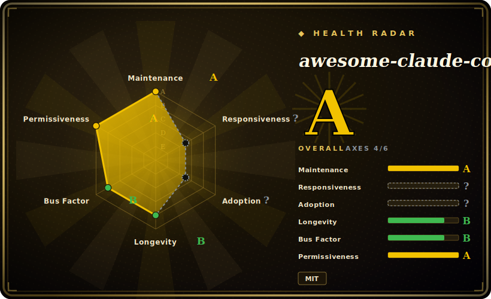

# awesome-claude-code-subagents

A curated bundle of 100+ specialized Claude Code subagent definitions — one markdown persona per role (backend-developer, code-reviewer, security-auditor, …) you drop into `~/.claude/agents/` so Claude Code can delegate to a domain expert.

## When to use

You're a developer running Claude Code on a real codebase, and you keep wishing the agent had narrower, sharper personas to hand work off to — a dedicated `code-reviewer` for diffs, a `backend-developer` for API work, a `security-auditor` before shipping — instead of one generalist trying to do everything in a single context window. Writing those subagent files yourself is tedious: you have to figure out the frontmatter (`name` / `description` / `tools` / `model`), word the activation trigger so Claude Code auto-delegates correctly, and draft a long role prompt with checklists for each domain. You'd rather start from a vetted set and prune.

This repo gives you that starting set: 154+ subagent markdown files organized into 10 categories (core development, language specialists, infrastructure, quality & security, data & AI, developer experience, specialized domains, business & product, meta & orchestration, research & analysis). Each file is a real persona with standardized frontmatter and a detailed role description — not a link to something elsewhere. You install via the Claude plugin marketplace, an interactive `install-agents.sh`, manual copy into `~/.claude/agents/`, or `curl`. Once installed, Claude Code can auto-delegate to a subagent by matching its `description`, or you invoke one explicitly ("have the code-reviewer subagent look at my latest commits"). You reach for it when you want broad role coverage fast and are willing to curate down to the handful you actually use.

## When NOT to use

- **You already curate your own subagents/skills.** 154 personas is a lot of surface to audit; layering them onto an existing, trusted agent set invites overlapping `description` triggers and unpredictable auto-delegation. Adopt a subset deliberately rather than installing the whole pack.
- **You're not on Claude Code.** These files use Claude Code's subagent format and `~/.claude/agents/` loading mechanism. On Cursor, OpenCode, Codex, Droid, or a bespoke harness there's no native loader for this exact format — the markdown alone won't auto-fire without adaptation. [推断]
- **You want enforced behavior.** A subagent is a prompt; its checklists and "always do X" steps are advisory instructions the model can deviate from, not hard gates. Don't treat "security-auditor" as a substitute for an actual scanner or CI check.
- **Trigger collisions matter to you.** With dozens of agents whose `description` fields all compete for auto-delegation, which one fires for a given task is not always obvious; the more you install, the harder routing is to reason about. [推断]
- **Maintenance / pinning.** There's no tagged release; you track `main`. A new commit can add, rename, or reword agents and shift how they route. Vendor the files you depend on rather than re-pulling blindly.

## Comparison

| Alternative | In index | Our verdict | Tradeoff |
|---|---|---|---|
| [wshobson/agents](wshobson-agents.md) | ✅ | Use this page for its stated niche; choose wshobson/agents when you need the other large Claude Code subagent collection. | The other large Claude Code subagent collection. Compare on which roles each covers, frontmatter conventions, and how opinionated each persona's prompt is — both are "drop into `~/.claude/agents/`" packs, so pick by coverage and prompt quality, not format. |
| antfu/skills, Dimillian/Skills, gstack, khazix-skills, … | 未收录 / [dimillian-skills](../personal-collections/dimillian-skills.md) ✅ | Use this page for its stated niche; choose antfu/skills, Dimillian/Skills, gstack, khazix-skills, … when you need personal *skill* collections (the `Skill`-tool format), not subagent personas. | Personal *skill* collections (the `Skill`-tool format), not subagent personas. Different unit of consumption — skills are on-demand procedures, subagents are delegated sub-conversations. Use those when you want behaviors loaded into the main agent, this when you want separate delegated experts. |
| Anthropic's built-in subagent docs / hand-rolled agents | 未收录 | Use this page for its stated niche; choose Anthropic's built-in subagent docs / hand-rolled agents when you need the native way to author subagents yourself. | The native way to author subagents yourself. This repo is a third-party starter set layered on that same mechanism, so it can duplicate or collide with agents you've already written. |
| Superpowers / SDLC methodology packs | 未收录 | Use this page for its stated niche; choose Superpowers / SDLC methodology packs when you need those install a *workflow discipline* (brainstorm→plan→TDD→verify) into one agent. | Those install a *workflow discipline* (brainstorm→plan→TDD→verify) into one agent; this installs a *roster of role experts*. Orthogonal — you can run both, but they solve different problems. |

## Health & viability

- **Maintenance** — [未验证] last pushed 2026-06, not archived, open issues low (~2); commit activity is current as of 2026-06, so it reads as **actively maintained**. No tagged release means you track a moving `main`, not pinned cuts.
- **Governance & bus factor** — [推断] org-owned (`VoltAgent`); a curated single-repo persona dump like this typically rides on a small maintainer set, and ~22k stars (2026-06) signal traction, not a governance guarantee. No foundation backing.
- **Age & Lindy** — [推断] created 2025-07, so ~1 year old as of 2026-06: young-and-hyped, **not yet a Lindy bet**. The `~/.claude/agents/` subagent format it targets is itself recent; treat longevity as unproven before standardizing on it.
- **Risk flags** — [推断] unversioned `main` is the main churn risk — a push can rename or reword personas and shift auto-delegation routing. No relicense/CVE signals observed; MIT throughout.

## Caveats (unverified)

- [未验证] GitHub metadata as of 2026-06-26: license MIT, primary language Shell (from the installer scripts), no tagged release (`latestRelease` is null), last pushed 2026-06-24, not archived — re-verify before relying on current contents.
- [未验证] Star count (~22.4k per GitHub on 2026-06-26) is unreliable and date-sensitive; treat as indicative only, not a quality signal.
- [未验证] Agent count is stated as "100+" in the repo description and "154+ across 10 categories" in the README/site copy; the exact number and category breakdown drift with `main` and were not file-counted here.
- [未验证] The frontmatter schema (`name` / `description` / `tools` / `model`, with `model` routing to opus/sonnet/haiku) and the auto-delegation-vs-explicit invocation behavior are from the README; per-agent fidelity and actual routing were not independently exercised.
- [推断] Because each subagent is a prompt loaded by Claude Code, its checklists and mandatory-sounding steps are advisory — the model can deviate; they are not enforced guarantees.
- [推断] Installation/loading is Claude-Code-specific; using these on other harnesses requires format adaptation and is not confirmed to work as-is.
