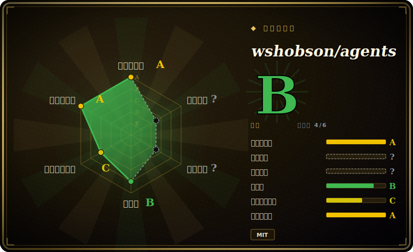

# wshobson/agents

一个大型、单人维护的多 harness「插件市场」：约 194 个领域 subagent、约 158 个 skill、约 106 个 slash command 和约 16 个多 agent orchestrator，统一用 Markdown 写一份源，再生成各 harness 原生的产物，覆盖 Claude Code、Codex CLI、Cursor、OpenCode、Gemini CLI 与 Copilot。

## 何时使用

你是一个常驻 Claude Code（或 Codex CLI / Cursor / OpenCode / Gemini CLI）的开发者，经常碰到落在自己舒适区之外的任务——一个 Rust 性能回退、一段 Terraform 模块 review、一个 SQL 查询计划、一次事故复盘、一条 auth 流程的安全检查。为每件事手写一个像样的 subagent persona 或一个聚焦的 skill 都是实打实的活，你更想直接从货架上取一个经过打磨的。于是你 `/plugin marketplace add wshobson/agents`，再 `/plugin install <plugin-name>`，对应的领域专家 subagent、skill 和 slash command 就通过 harness 自己的 loader 落进来。你拿到的不是一个臃肿的全能 prompt，而是一群窄而专的专家，agent 可以按领域委派给它们。

当你想从「同一个源」获得**广度**与**跨 harness 可移植性**时，就该用它。仓库由单一 Markdown 源构建，通过 `make generate` 产出各 harness 的惯用产物，于是同一个 "backend-architect" 或 "security-auditor" persona 会跟着你走——无论今天的任务跑在 Claude Code 还是 Codex CLI。它更像一个精选目录，而非一套有主张的方法论：挑你真正会碰到的领域（Python、全栈、ML、基础设施、安全、数据、文档、SEO、编排）的插件，其余忽略即可。

## 何时不用

- **你已经有一套自己信任的 subagent/skill 栈。** 约 194 个 agent 加约 158 个 skill 是很大的面；叠在既有方法论包之上会引入重叠 persona 和双重路由（两个「代码审查者」、两个「调试器」争抢同一任务）。每个关注点只保留一个事实源。
- **安装路径因 harness 差异极大。** Claude Code 通过 `/plugin` 原生安装；Codex 和 Cursor 从已提交的 registry 拉取；Gemini CLI 和 OpenCode 需要 clone 加 `make generate`（转换后的树被 gitignore），这要 `make`/`uv`，并非一条命令搞定的安装。[推断]
- **你想要给自己应用用的 runtime、library 或 CLI。** 除 `plugin-eval` 质量工具外，没有能 `import` 进你自己软件的东西——它配置的是 agent 行为，不是你的应用。脱离支持的 harness 它什么也不做。
- **你需要锁定、可复现的行为。** 仓库没有 tag release [未验证]；你装的就是 `main` 上的当前态。一次 push 就可能改变某个 subagent 的路由或某个 skill 的约束。需要稳定就把文件 vendor 下来、锁自己的副本。
- **约束是建议性的，且广度未经审计。** 行为活在 agent 加载的 prompt/Markdown 里；「专家」persona 是指令而非保证，而 190+ 个 persona 意味着你无法在把真实工作委派出去之前逐一亲自核验其质量。

## 横向对比

| 替代品 | 是否收录 | 我们的评价 | 取舍 |
|---|---|---|---|
| awesome-claude-code-subagents | 未收录 | 当前页用于它的主场景；如果更看重“同一 leaf 下另一个大型 Claude Code subagent 集合，但**只有 subagent**（丢进 `~/”，再选 awesome-claude-code-subagents。 | 同一 leaf 下另一个大型 Claude Code subagent 集合，但**只有 subagent**（丢进 `~/.claude/agents/`）。wshobson/agents 还打包 skill+command+orchestrator 并按 harness 生成；按你只要 persona 广度，还是要多产物、多 harness 的目录来选。 |
| [gstack](../personal-collections/gstack.zh.md) | ✅ | 当前页用于它的主场景；如果更看重“某创始人的**按角色**命令集（CEO/设计/QA persona），为他自己的日常工厂调过”，再选 gstack。 | 某创始人的**按角色**命令集（CEO/设计/QA persona），为他自己的日常工厂调过。窄得多且个人化；wshobson/agents 是通用领域目录，不是单一操作者的工作流。 |
| Anthropic Claude Plugins（官方市场） | 未收录 | 当前页用于它的主场景；如果更看重“第一方、Anthropic 精选的 `/plugin` 市场，provenance 清晰”，再选 Anthropic Claude Plugins（官方市场）。 | 第一方、Anthropic 精选的 `/plugin` 市场，provenance 清晰；范围更窄且仅限 Claude Code。wshobson/agents 是第三方且广得多、跨多个 harness，但 trust/审核成本更高。 |
| 自己手写 subagent/skill | 未收录 | 当前页用于它的主场景；如果更看重“贴合度最高、与既有栈零冲突，但一切都要你自己写和维护”，再选 自己手写 subagent/skill。 | 贴合度最高、与既有栈零冲突，但一切都要你自己写和维护。本仓库用现成广度换取你仍需自行核验的贴合度。 |

## 健康度与可持续性

- **维护** —— [未验证] 最近一次 push 在 2026-06，未归档，open issue 很少（约 5 个）；截至 2026-06 活动是当前的，因此目录**活跃维护**。无 tag release——你装的就是 `main` 上的当前态。
- **治理与 bus factor** —— [推断] **`User` 所有、单人维护、约 37k star（2026-06）——这是一个 bus-factor 风险标记。** 一个非常庞大且无版本的面（约 194 个 agent / 约 158 个 skill）压在一个人身上，意味着维护节奏与长期支持无保证；把你依赖的东西 vendor 下来。无基金会或厂商背书。
- **年龄与 Lindy** —— [推断] 创建于 2025-07，截至 2026-06 约 1 岁：年轻且热门，**尽管 star 多也还谈不上 Lindy 赌注**。多 harness 生成（`make generate`）是很新的工具链；把耐久性当作未经证实。
- **风险标记** —— [推断] 单人维护 + 无版本固定是首要风险——一次 push 可能让某个 subagent 的路由或某个 skill 的约束回退。未见 relicense/CVE 信号；全仓 MIT。

## 存疑（未验证）

- [未验证] License 为 MIT，主语言 Python，未归档，最近一次 push 在 2026-06-25，topics 含 `claude-code`/`agent-skills`/`opencode`/`codex-cli`/`mcp`，以上为 2026-06-26 GitHub 元数据——依赖细节前请复核。
- [未验证] 不存在 tag release（本次检查 `latestRelease` 为 null）；安装跟随 `main`，行为可能在没有版本号变化的情况下改变。
- [未验证] star 数（2026-06-26 GitHub 约 37.2k）不可靠且对日期敏感，只作参考、不作质量信号。
- [未验证] 清单数字（约 88 plugin、约 194 agent、约 158 skill、约 106 command、约 16 orchestrator）取自 2026-06-26 的 README，会漂移；请枚举当前 `plugins/` 树而非依赖这些计数。
- [未验证] 支持的 harness 列表（Claude Code 为 source-of-truth，外加 Codex CLI、Cursor、OpenCode、Gemini CLI、Copilot）与各 harness 安装机制（原生 registry 还是 clone + `make generate`）取自 README；各 harness 的生成/激活保真度未在此独立确认。
- [未验证] `plugin-eval` 质量框架（静态分析、用 Haiku/Sonnet 做 LLM 语义打分、Monte Carlo 验证；`uv run plugin-eval score`/`certify`）取自 README 描述，未在此独立运行验证。
- [推断] 单人维护项目；维护节奏与长期支持无保证，且一个庞大的无版本面在 push 之间可能回退。
- [推断] 因为 persona/skill 通过各 harness 的原生 loader 激活，约束是建议性的——agent 可以偏离，且跨 harness 可移植性依赖 generator 而非运行时合同。
