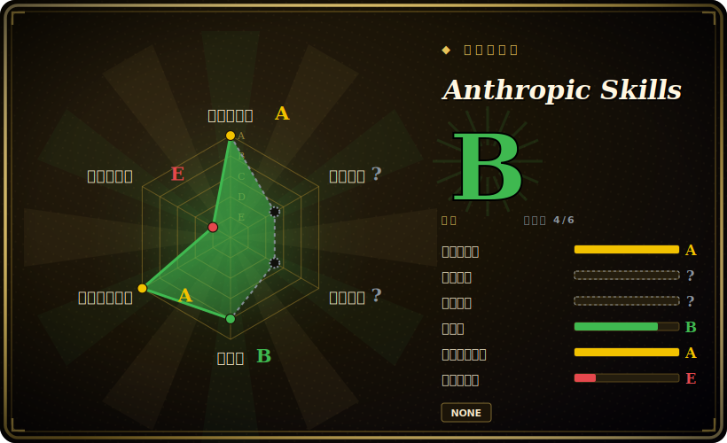

# Anthropic Skills

Anthropic 官方公开的 Agent Skills 合集——一组自包含的 `SKILL.md` 目录（文档编辑、前端/画布设计、MCP 与 skill 编写、品牌与沟通），可安装进 Claude Code、Claude.ai 或 Claude API。

## 何时使用

你是一名搭建 Claude agent 的开发者或团队，反复在向模型解释同一类流程化任务——“从这个 PDF 里抽取表单字段”“按这份提纲生成 .docx”“脚手架一个新的 MCP server”“快速搭一个前端 artifact”。你想要这些流程的官方、参考级实现，而不是自己手搓 prompt、或信任来路不明的第三方合集。这个仓库就是厂商源头：每个 skill 是一个目录，含一份 `SKILL.md`（YAML 的 `name` + `description`，后接 markdown 指令）以及配套脚本/资源，遵循 Anthropic 自家的 Agent Skills 格式。通过插件市场安装（`/plugin marketplace add anthropics/skills`，再 `/plugin install document-skills@anthropic-agent-skills` 或 `example-skills@anthropic-agent-skills`），skill 会在其 description 命中任务时按需加载。

你尤其会在以下情况选它：(a) 想要驱动 Claude 文件生成的文档类 skill（`docx`、`pdf`、`pptx`、`xlsx`）；(b) 想要一份权威的 `skill-creator` / `mcp-builder` 来学习格式、进而编写自己的 skill；(c) 想要一套由平台厂商维护的精选起步集（`frontend-design`、`canvas-design`、`brand-guidelines`、`internal-comms`、`slack-gif-creator`、`webapp-testing`、`claude-api` 等）。`spec/` 与 `template/` 目录让它成为“对照 Anthropic 实现编写 skill”的参考。把它当作你在搭建定制 skill 栈之前先采纳或 fork 的基线。

## 何时不用

- **你已有一套自己信任的精选 skill/command 体系。** 这些 skill 自带 description 与路由；叠加到已有方法论栈上容易重叠、重复触发（例如 `frontend-design` 与你自己的 UI 约定冲突）。每个职责只保留一个事实源。
- **license 混合——分发前先看清。** 示例 skill 是 Apache-2.0，但文档类 skill（`docx`、`pdf`、`pptx`、`xlsx`）明确是 **source-available，非开源**。仓库没有统一的 LICENSE 文件；别假设 Apache-2.0 覆盖你 vendor 或发布的全部内容。[未验证]
- **你不在 Claude 系 harness 上。** 安装路径是 Claude Code、Claude.ai、Claude API。`SKILL.md` 的 markdown 在没有兼容 skill loader 的非 Claude agent 上不会自动触发；本仓库并不以跨 harness 移植为目标。
- **你想要一个可运行的 tool/CLI/库。** 没有东西可 `import` 或独立运行——它是 skill 定义加配套资源，用来塑造 agent 行为，而非一个应用。
- **你需要固定、稳定的行为。** 没有打 tag 的 release；skill 是会在 `main` 上变动的 markdown/脚本。一次 pull 可能改变某个 skill 的行为或路由。需要稳定就 vendor 到具体 commit，并在更新后重新核对。[推断]

## 横向对比

| 替代品 | 是否收录 | 我们的评价 | 取舍 |
|---|---|---|---|
| Claude plugins（官方） | 未收录 | 当前页用于它的主场景；如果更看重“Anthropic 更大的官方插件/市场面”，再选 Claude plugins（官方）。 | Anthropic 更大的官方插件/市场面；本 `skills` 仓库专指 Agent Skills 合集（文档 + 示例 skill），而非完整插件目录。按“只要 skill 还是要更广的插件集”来选。 |
| AWS Labs agent plugins | 未收录 | 当前页用于它的主场景；如果更看重“另一家厂商发布的合集，带 AWS 生态色彩”，再选 AWS Labs agent plugins。 | 另一家厂商发布的合集，带 AWS 生态色彩；按你的云/工具栈倾向来选。格式与 loader 兼容性各异。 |
| MiniMax skills | 未收录 | 当前页用于它的主场景；如果更看重“另一家厂商的 skill 合集”，再选 MiniMax skills。 | 另一家厂商的 skill 合集；同样是“官方起步 skill”目标，但绑定其模型/harness。混用前先核对格式兼容性。 |
| 第三方社区 skill 包（如 Superpowers） | 未收录 | 当前页用于它的主场景；如果更看重“偏方法论/SDLC 的强观点合集，叠在 agent 之上”，再选 第三方社区 skill 包（如 Superpowers）。 | 偏方法论/SDLC 的强观点合集，叠在 agent 之上。本仓库更窄、且是第一方：参考任务 skill + 编写规范，而非完整工作流方法论。 |
| 自己写 `SKILL.md` skill | 不适用 | 当前页用于它的主场景；如果更看重“贴合度最高、零外部依赖，但放弃厂商经过验证的文档生成 skill 与权威 spec/template”，再选 自己写 SKILL.md skill。 | 贴合度最高、零外部依赖，但放弃厂商经过验证的文档生成 skill 与权威 spec/template。很多人就是从这里 fork 当基线。 |

## 健康度与可持续性

- **维护** —— [未验证] 最近一次 push 在 2026-06，未归档；截至 2026-06 活动是当前的，故**活跃维护**。open issue 数高（约 990），与一个极高流量的第一方仓库相符，未必是维护欠债信号。无 tag release；跟 `main`。
- **治理与背书** —— [推断] 组织所有，且由 **Anthropic 自己**（定义 Agent Skills 格式的平台厂商）背书。该格式可能的最强 provenance，但路线图由厂商定或转向；第一方不等于稳定 API。
- **年龄与 Lindy** —— [推断] 创建于 2025-09，截至 2026-06 不足约 1 岁：年轻。仅凭年龄 Lindy 很弱，但厂商背书 + 权威的 `spec/`/`template/` 让它成为别人 fork 的**参考**；下注风险低于同龄的社区合集。
- **采用/生态** —— [推断] 约 155k star（2026-06），且文档类 skill（`docx`/`pdf`/`pptx`/`xlsx`）驱动 Claude 自身的文件生成——作为事实基线被高度采用。
- **风险标记** —— [未验证] **license 混合**：示例 skill 为 Apache-2.0，文档类 skill 为 source-available（非开源），且无仓库级 LICENSE——分发前先看清条款。

## 存疑（未验证）

- [未验证] 截至 2026-06-26 无打 tag 的 release，也没有仓库级 LICENSE 文件；license 按区域划分——示例 skill 为 Apache-2.0，文档类 skill（`docx`/`pdf`/`pptx`/`xlsx`）为 source-available。frontmatter 里的 `Apache-2.0` 仅反映示例 skill；分发前请核对具体 skill 的条款。
- [未验证] GitHub 元数据显示主语言为 Python；仓库混合了 Python 辅助脚本、Markdown skill 定义及其他语言——语言标签是指示性的，不代表构建目标。
- [未验证] star 数（2026-06-26 GitHub 约 155k）不可靠且随时间变化；当作热度提示，而非质量信号。
- [未验证] 观察到的 skill 清单（algorithmic-art、brand-guidelines、canvas-design、claude-api、doc-coauthoring、docx、frontend-design、internal-comms、mcp-builder、pdf、pptx、skill-creator、slack-gif-creator、theme-factory、web-artifacts-builder、webapp-testing、xlsx）是 2026-06-26 对 `skills/` 的快照；集合与路由会在 `main` 上变动——请读取实时目录。
- [未验证] 安装命令与市场标识（`anthropic-agent-skills`、`document-skills`、`example-skills`）来自 README；确切插件名与触发行为可能变化——请对照当前文档确认。
- [推断] 因为行为存在于由 agent 加载的 markdown `SKILL.md` 指令中，约束是建议性的——agent 仍可能偏离；skill 描述流程，并不硬保证结果。
