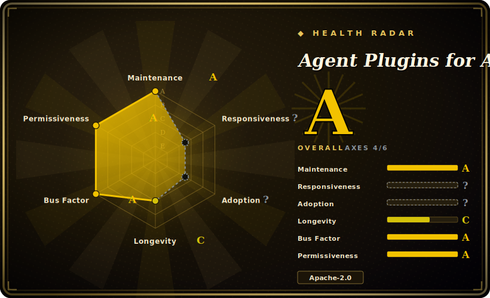

# Agent Plugins for AWS

AWS Labs' official collection of plugins that teach coding agents how to architect, deploy, and operate on AWS — nine domain plugins (serverless, Amplify, SageMaker, migration, databases, deploy/cost-estimate, etc.) installable from a Claude Code / Cursor / Codex marketplace.

## When to use

You're a developer or platform engineer working in Claude Code (or Cursor/Codex) and the task is AWS-shaped: stand up a serverless API with Lambda + API Gateway + Step Functions, estimate cost and generate IaC for a new architecture, migrate infra from GCP to AWS, scaffold an Amplify full-stack app, or build/deploy a SageMaker model. The base agent knows AWS in general but keeps reaching for stale service defaults, skipping cost checks, or hand-rolling CloudFormation you have to correct. You want first-party, AWS-maintained playbooks that encode the service-specific best practices and wire up the right AWS MCP servers (docs, pricing, IaC) for you.

This repo is the vendor source: each of the nine plugins (`aws-serverless`, `aws-amplify`, `sagemaker-ai`, `migration-to-aws`, `databases-on-aws`, `deploy-on-aws`, `aws-transform`, `amazon-location-service`, `codebase-documentor-for-aws`) bundles trigger-phrase skills, MCP server wiring, and hooks/guardrails. You add the marketplace (`/plugin marketplace add awslabs/agent-plugins`) and install only the plugins you need (e.g. `/plugin install deploy-on-aws@agent-plugins-for-aws`); the skills load on demand when the agent recognizes a matching AWS task. Reach for it when you want AWS's own opinion baked into the agent rather than building that skill stack yourself.

## When NOT to use

- **You already run a curated AWS skill/command stack you trust.** These plugins ship their own trigger phrases and MCP wiring; layering them over an existing methodology invites overlapping routing and double-firing on the same AWS task. Pick one source of truth per concern.
- **You're not on a supported harness.** Install paths are Claude Code (≥2.1.29), Cursor (≥2.5), and Codex (repo-local marketplace); Kiro is experimental via a third-party converter. On an unsupported agent there's no loader to fire the skills and the markdown alone won't auto-activate.
- **Vendor steering away — read the maturity note.** The README points to a newer **Agent Toolkit for AWS** as the recommended path for production while this repo "continues accepting contributions"; treat it as a still-maintained but potentially superseded surface, not the long-term flagship. [未验证]
- **You want cloud-neutral or non-AWS guidance.** Every plugin is AWS-ecosystem-flavored (AWS MCP servers, AWS services, AWS pricing). It actively biases solutions toward AWS — not what you want for multi-cloud or vendor-neutral architecture.
- **You want a runnable tool/CLI/library.** There's nothing to `import` or run standalone — it's skill definitions, MCP config, and hooks that shape an agent's behavior. Outside a supporting agent (and without configured AWS credentials) it does nothing.
- **Advisory, not enforced.** Behavior lives in markdown skills the agent loads; "best practice" steps are prompt-level instructions, not hard guarantees — the agent can still deviate or call AWS APIs in ways the playbook didn't intend.

## Comparison

| Alternative | In index | Tradeoff |
|---|---|---|
| [Anthropic Skills](anthropic-skills.md) | ✅ | Anthropic's first-party general-purpose skills (document gen, frontend, authoring spec). Cloud-neutral and task-generic; this AWS repo is narrower and ecosystem-locked but far deeper on AWS architecture/deploy/ops. Different unit of value. |
| [Claude Plugins (official)](claude-plugins-official.md) | ✅ | Anthropic's broad official plugin/marketplace catalog; general-purpose. This repo is a single-vendor (AWS) domain collection layered on the same plugin mechanism — pick by whether you need AWS depth or a general plugin set. |
| MiniMax skills | 未收录 | Another vendor's skill collection tied to that vendor's models/harness; overlapping "official starter skills" goal but no AWS domain content. Cross-check format/loader compatibility before mixing. |
| AWS official MCP servers (standalone) | 未收录 | The underlying AWS MCP servers (docs, pricing, IaC) can be wired up without these plugins; you get the data sources but not the packaged skills, trigger phrases, and guardrails. More assembly, less opinion. |
| Roll your own AWS skills | n/a | Maximum fit and no marketplace dependency, but you forgo AWS's maintained playbooks and MCP wiring and must keep service best-practices current yourself. |

## Health & viability

- **Maintenance** — [未验证] last pushed 2026-06, not archived, open issues low (~12); v1.0.0 tagged 2026-02 and activity current as of 2026-06, so **actively maintained** — and uniquely for this leaf, it ships a real versioned release rather than tracking `main`.
- **Governance & backing** — [推断] org-owned and **vendor-backed by AWS Labs** — strong provenance, but single-vendor and AWS-ecosystem-locked; the roadmap follows AWS's priorities, not a neutral foundation.
- **Age & Lindy** — [推断] created 2026-02, so only ~4 months old as of 2026-06: **brand new, no Lindy track record yet**. Unproven durability.
- **Risk flags** — [未验证] **vendor steering**: the README points to a newer "Agent Toolkit for AWS" as the recommended production path while this repo "continues accepting contributions" — treat as a potentially superseded surface, not the long-term flagship. ~809 stars (2026-06) is modest, consistent with its newness.

## Caveats (unverified)

- [未验证] Latest release tagged `1.0.0` (published 2026-02-18) with the repo last pushed 2026-06-25; license Apache-2.0 and primary language Shell per GitHub metadata as of 2026-06-26 — re-verify before relying on a specific version's behavior. Primary language "Shell" reflects tooling scripts; skill content is largely Markdown.
- [未验证] Star count (~809 per GitHub on 2026-06-26) is unreliable and date-sensitive; treat as indicative only, not a quality signal.
- [未验证] The nine-plugin inventory (amazon-location-service, aws-amplify, aws-serverless, aws-transform, codebase-documentor-for-aws, databases-on-aws, deploy-on-aws, migration-to-aws, sagemaker-ai) is a snapshot of `plugins/` on 2026-06-26; the set, trigger phrases, and routing change on `main` — read the live directory.
- [未验证] Supported-harness list and version floors (Claude Code ≥2.1.29, Cursor ≥2.5, Codex repo-local, Kiro experimental via third-party converter) and the marketplace/install identifiers (`agent-plugins-for-aws`, e.g. `deploy-on-aws@agent-plugins-for-aws`) are from the README; exact names and activation fidelity may change — confirm against current docs.
- [未验证] README reportedly recommends a newer "Agent Toolkit for AWS" for production use while this repo keeps accepting contributions; the exact lifecycle/deprecation status is not independently confirmed here.
- [未验证] Prerequisites (AWS CLI/credentials configured, AWS MCP servers for docs/pricing/IaC) are described in the README; actual required scopes and which plugins need which MCP servers were not verified per-plugin.
- [推断] Because behavior lives in markdown skills loaded by the agent, enforcement is advisory — the agent can deviate; "best practice" and guardrail steps are prompt/hook-level instructions, not hard guarantees, and can still drive real AWS API calls with cost/state side effects.
