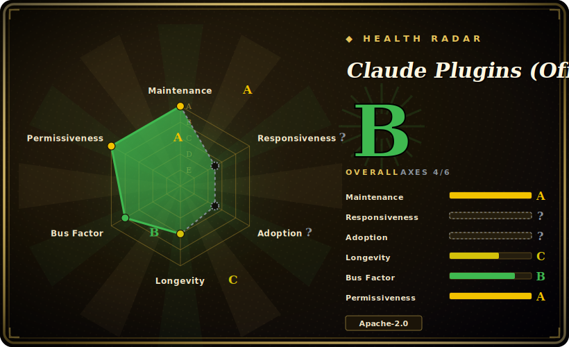

# Claude Plugins (Official)

Anthropic's first-party plugin marketplace for Claude Code: a curated directory of installable plugins, each bundling slash commands, agents, skills and/or MCP servers, installed by name through Claude Code's native `/plugin` system.

## When to use

You're a developer working day-to-day in Claude Code, and you keep re-deriving the same boilerplate by hand — wiring up an LSP for your language, setting up a code-review or commit workflow, scaffolding a new MCP server, or fishing around for a skill-authoring template. Instead of copy-pasting prompts from blog posts or hand-rolling your own `.claude-plugin` manifests, you open `/plugin`, browse the official marketplace, and `/plugin install <name>@claude-plugins-official`. The plugin drops its commands, agents, skills and MCP config into your harness through Claude Code's own loader, and you get a vetted, Anthropic-maintained building block rather than something you scraped off the internet.

You reach for this specifically when you want the *first-party* baseline: plugins that ship in the same repo Anthropic manages, with a known provenance and an Apache-2.0 license. It is the natural starting point before you go shopping in third-party marketplaces — covering language-server integrations (`typescript-lsp`, `pyright-lsp`, `rust-analyzer-lsp`, and a dozen more), workflow packs (`code-review`, `feature-dev`, `pr-review-toolkit`, `commit-commands`), and meta/authoring tooling (`plugin-dev`, `skill-creator`, `mcp-server-dev`, `hookify`). Install the ones you need; skip the rest.

## When NOT to use

- **You're not on Claude Code.** This is a Claude Code marketplace keyed to its `/plugin` loader and `.claude-plugin/plugin.json` format. On OpenCode, Codex, Droid, Cursor or a bespoke harness there's no installer to consume it; you'd be hand-porting individual `commands/`, `agents/`, `skills/` files, losing the one-command install that is the whole point. [推断]
- **You already run a curated skill/command stack.** Many of these plugins overlap with workflows you may already have (review, commit, debugging, plan-then-code). Installing a marketplace plugin on top of an existing methodology pack invites double-routing and conflicting instructions — pick one source of truth per concern.
- **You want a runtime, library or CLI.** There is nothing to `import` or run standalone here; it only configures an agent's behavior and (optionally) attaches MCP servers. Outside Claude Code it does nothing.
- **You need a specific pinned version.** The repo ships no tagged releases [未验证]; you install whatever is on `main`. If you need reproducible behavior, vendor the plugin files yourself and pin your own copy rather than tracking a moving directory.
- **You're relying on it for third-party plugin quality.** `external_plugins/` accepts partner/community submissions; "official directory" describes Anthropic's *curation and hosting*, not an audit guarantee of every third-party plugin's safety or maintenance.

## Comparison

| Alternative | In index | Tradeoff |
|---|---|---|
| [Anthropic Skills](anthropic-skills.md) | ✅ | Anthropic's standalone *skills* repo (self-contained `SKILL.md` folders, not the `/plugin`-installable marketplace format). Use it when you want the raw skill content for Claude Code / Claude.ai / the API; use this repo when you want one-command marketplace install into Claude Code. |
| awslabs/agent-plugins | 未收录 | Another vendor (AWS) plugin/skill collection; compare on whose tooling matches your stack and which harness each targets. |
| MiniMax-AI/skills | 未收录 | Vendor skill collection from MiniMax; different provider, likely different harness assumptions — compare target-agent compatibility before mixing. |
| Third-party Claude Code marketplaces / community plugin lists | 未收录 | Larger surface and faster-moving, but no Anthropic curation or provenance guarantee. This repo is the first-party baseline; community marketplaces extend it at higher trust cost. |

## Health & viability

- **Maintenance** — [未验证] last pushed 2026-06, not archived; activity current as of 2026-06, so **actively maintained**. Open issues high (~783), consistent with a high-traffic official directory that also triages `external_plugins/` submissions. No tagged releases; track `main`.
- **Governance & backing** — [推断] org-owned and **vendor-backed by Anthropic** — first-party marketplace with known provenance and Apache-2.0. Roadmap is the vendor's; "official/curated" describes Anthropic's hosting and listing, **not an audit guarantee** of every third-party `external_plugins/` entry.
- **Age & Lindy** — [推断] created 2025-11, so ~7 months old as of 2026-06: young. Lindy weak on age, but vendor backing + first-party status make it the **default baseline** before third-party marketplaces; lower betting risk than a same-age community pack.
- **Adoption/ecosystem** — [推断] ~31k stars (2026-06) and native `/plugin` install make it the canonical Claude Code plugin source.
- **Risk flags** — [推断] Claude-Code-only (no cross-harness loader); `external_plugins/` curation is hosting, not a safety/maintenance audit of partner submissions.

## Caveats (unverified)

- [未验证] Repository description recorded as "Official, Anthropic-managed directory of high quality Claude Code Plugins"; license Apache-2.0, primary language Python, not archived, topics `claude-code`/`mcp`/`skills`, last pushed 2026-06-26 per GitHub metadata as of 2026-06-26 — re-verify before relying on specifics.
- [未验证] No tagged release exists (`latestRelease` is null as of this check); installs track `main`, so behavior can change without a version bump.
- [未验证] Star count (~31.1k per GitHub on 2026-06-26) is unreliable and date-sensitive; treat as indicative only, not a quality signal.
- [未验证] The plugin inventory (e.g. `typescript-lsp`, `pyright-lsp`, `code-review`, `feature-dev`, `plugin-dev`, `skill-creator`, `mcp-server-dev`, plus an `external_plugins/` tree of third-party submissions) is read from the live repo tree on 2026-06-26 and will drift; enumerate the current `plugins/` and `external_plugins/` directories rather than trusting this list.
- [推断] Because plugins activate through Claude Code's native loader, this collection is meaningful only inside that harness; cross-harness portability is manual and not provided by the repo.
- [推断] "Official/curated" applies to Anthropic's hosting and listing decisions; it does not by itself guarantee that every third-party `external_plugins/` entry is audited, secure, or maintained.
