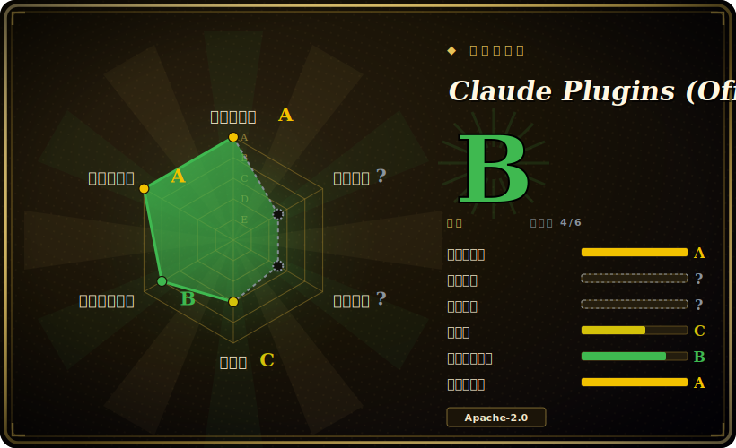

# Claude Plugins (Official)

Anthropic 官方的 Claude Code 插件市场：一个精选的可安装插件目录，每个插件打包了 slash 命令、agent、skill 和/或 MCP server，通过 Claude Code 原生 `/plugin` 系统按名安装。

## 何时使用

你是一名每天在 Claude Code 里干活的开发者，老是要重复手搓同一批样板：给某门语言接 LSP、配一套 code-review 或 commit 工作流、脚手架一个新的 MCP server，或到处翻 skill 编写模板。与其从博客里复制 prompt、或手写自己的 `.claude-plugin` manifest，你打开 `/plugin`，浏览官方市场，然后 `/plugin install <name>@claude-plugins-official`。插件会通过 Claude Code 自己的 loader 把命令、agent、skill 和 MCP 配置注入你的 harness，你拿到的是 Anthropic 维护、来源已知的现成积木，而不是网上抓来的东西。

当你想要的是「第一方基线」时尤其用它：这些插件就住在 Anthropic 管理的同一个仓库里，来源清晰、Apache-2.0 许可。在你跑去逛第三方市场之前，这里是天然的起点——涵盖语言服务集成（`typescript-lsp`、`pyright-lsp`、`rust-analyzer-lsp` 等十余个）、工作流包（`code-review`、`feature-dev`、`pr-review-toolkit`、`commit-commands`），以及元/编写工具（`plugin-dev`、`skill-creator`、`mcp-server-dev`、`hookify`）。需要哪个装哪个，其余略过。

## 何时不用

- **你不在 Claude Code 上。** 这是一个绑定 Claude Code `/plugin` loader 和 `.claude-plugin/plugin.json` 格式的市场。在 OpenCode、Codex、Droid、Cursor 或自研 harness 上没有安装器来消费它，你只能手动搬运单个 `commands/`、`agents/`、`skills/` 文件，从而失去「一条命令安装」这个核心价值。[推断]
- **你已经有一套精选的 skill/命令栈。** 这里很多插件会和你已有的工作流重叠（review、commit、调试、先规划后编码）。在既有方法论包之上再装市场插件容易造成双重路由和指令冲突——每个职责只保留一个事实源。
- **你要的是 runtime、库或 CLI。** 这里没有可 `import` 或独立运行的东西，它只配置 agent 行为并（可选）挂上 MCP server。离开 Claude Code 它什么都不做。
- **你需要某个固定版本。** 仓库没有打 tag 的 release[未验证]，你装的就是 `main` 上的当前状态。要可复现的行为，自己 vendor 插件文件并 pin 自己的副本，而不是跟一个会动的目录。
- **你指望它担保第三方插件质量。** `external_plugins/` 接收伙伴/社区提交；「官方目录」说的是 Anthropic 的*策展与托管*，不是对每个第三方插件安全性或维护度的审计承诺。

## 横向对比

| 替代品 | 是否收录 | 我们的评价 | 取舍 |
|---|---|---|---|
| [Anthropic Skills](anthropic-skills.zh.md) | ✅ | 当前页用于它的主场景；如果更看重“Anthropic 独立的 *skills* 仓库（自包含的 `SKILL”，再选 Anthropic Skills。 | Anthropic 独立的 *skills* 仓库（自包含的 `SKILL.md` 目录，不是 `/plugin` 可装的市场格式）。想要原始 skill 内容（用于 Claude Code / Claude.ai / API）用它；想要一条命令装进 Claude Code 用本仓库。 |
| awslabs/agent-plugins | 未收录 | 当前页用于它的主场景；如果更看重“另一家厂商（AWS）的插件/skill 集合”，再选 awslabs/agent-plugins。 | 另一家厂商（AWS）的插件/skill 集合；按谁的工具贴你的技术栈、各自面向哪个 harness 来比较。 |
| MiniMax-AI/skills | 未收录 | 当前页用于它的主场景；如果更看重“MiniMax 的厂商 skill 集合”，再选 MiniMax-AI/skills。 | MiniMax 的厂商 skill 集合；不同 provider，harness 假设可能不同——混用前先比对目标 agent 兼容性。 |
| 第三方 Claude Code 市场 / 社区插件清单 | 未收录 | 当前页用于它的主场景；如果更看重“面更广、迭代更快，但没有 Anthropic 的策展和来源担保”，再选 第三方 Claude Code 市场 / 社区插件清单。 | 面更广、迭代更快，但没有 Anthropic 的策展和来源担保。本仓库是第一方基线；社区市场以更高信任成本来扩展它。 |

## 健康度与可持续性

- **维护** —— [未验证] 最近一次 push 在 2026-06，未归档；活动截至 2026-06 是当前的，故**活跃维护**。open issue 数高（约 783），与一个同时分流 `external_plugins/` 提交的高流量官方目录相符。无 tag release；跟 `main`。
- **治理与背书** —— [推断] 组织所有，由 **Anthropic** 背书——第一方市场，provenance 清晰、Apache-2.0。路线图归厂商；「官方/精选」说的是 Anthropic 的托管与上架，**不是对每个第三方 `external_plugins/` 条目的审计承诺**。
- **年龄与 Lindy** —— [推断] 创建于 2025-11，截至 2026-06 约 7 个月：年轻。仅凭年龄 Lindy 弱，但厂商背书 + 第一方身份让它成为逛第三方市场前的**默认基线**；下注风险低于同龄社区合集。
- **采用/生态** —— [推断] 约 31k star（2026-06），加上原生 `/plugin` 安装，使其成为 Claude Code 插件的权威源。
- **风险标记** —— [推断] 仅限 Claude Code（无跨 harness loader）；`external_plugins/` 的策展是托管，不是对伙伴提交的安全/维护审计。

## 存疑（未验证）

- [未验证] 仓库描述记录为 "Official, Anthropic-managed directory of high quality Claude Code Plugins"；许可 Apache-2.0、主语言 Python、未归档、topics 为 `claude-code`/`mcp`/`skills`、最近 push 于 2026-06-26，均为 2026-06-26 的 GitHub 元数据——依赖具体项前请复核。
- [未验证] 不存在打 tag 的 release（本次检查 `latestRelease` 为 null）；安装跟随 `main`，行为可能在没有版本号变化的情况下改变。
- [未验证] star 数（2026-06-26 GitHub 显示约 31.1k）不可靠且对日期敏感；只作参考，不作质量信号。
- [未验证] 插件清单（如 `typescript-lsp`、`pyright-lsp`、`code-review`、`feature-dev`、`plugin-dev`、`skill-creator`、`mcp-server-dev`，外加一棵收录第三方提交的 `external_plugins/` 树）来自 2026-06-26 对实时仓库树的读取，会漂移；以当前 `plugins/` 与 `external_plugins/` 目录为准，而非本清单。
- [推断] 由于插件通过 Claude Code 原生 loader 激活，本集合只在该 harness 内有意义；跨 harness 移植需手动，仓库不提供。
- [推断] 「官方/精选」适用于 Anthropic 的托管与上架决策，本身并不保证每个第三方 `external_plugins/` 条目都经过审计、安全或在维护。
