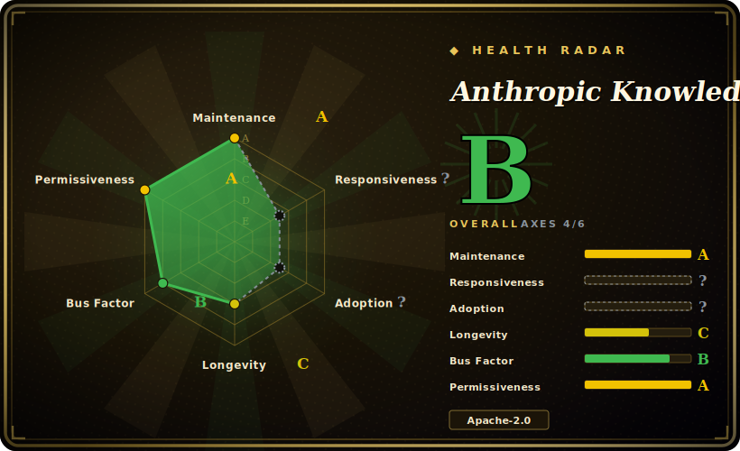

# Anthropic Knowledge Work Plugins

Anthropic's first-party collection of plugins/skills aimed at **knowledge work** — documents, communications, research, and general office tasks — installable into Claude rather than coding workflows.

## When to use

You're a knowledge worker — or you're equipping a team of them — and your day is documents, decks, briefs, inbox triage, research summaries, and status comms, not shipping code. You keep re-explaining the same office procedures to Claude ("turn these notes into a one-pager", "draft the weekly update", "summarize this research thread", "build a deck outline from this brief"), and you want first-party, vendor-maintained building blocks for that rather than hand-rolled prompts or a random community bundle. You open this repo, install the plugins/skills you need into Claude, and get an Anthropic-maintained baseline tuned for knowledge-work tasks rather than for the coding-centric stacks that most agent plugin collections assume.

You reach for it specifically when you want the *knowledge-work* slice of Anthropic's first-party surface: office/comms/research procedures with known provenance and an Apache-2.0 license, as the natural starting point before you go shopping in broader or third-party collections. Adopt the pieces that fit your office workflow; skip the rest.

## When NOT to use

- **You're not on a Claude-family harness.** This is keyed to Claude/Anthropic's loaders and skill/plugin format; on OpenCode, Codex, Droid, Cursor or a bespoke agent there's no installer to consume it, and you'd be hand-porting individual files — losing the one-step install that is the point. [推断]
- **Your work is coding, not knowledge work.** This collection is scoped to documents/comms/research/office tasks. For language-server integrations, code-review/commit/PR workflows or scaffolding, the coding-centric collections are the right surface — see [Claude Plugins (Official)](claude-plugins-official.md) and [Anthropic Skills](anthropic-skills.md), not this one.
- **You already run a curated skill/command stack you trust.** These ship their own descriptions and routing; layering them on an existing methodology pack invites overlap and double-firing. Pick one source of truth per concern.
- **You need pinned, stable behavior.** No tagged releases [未验证]; you install whatever is on `main`, and a pull can shift what a plugin does. Vendor a specific commit if you need reproducibility and re-check after updates.
- **You're betting on long-term stability of the surface.** Created 2026-01, this is **very young** (~0.5y as of 2026-06) and likely still churning its inventory and structure; the durability signal here is Anthropic's backing, not a settled track record.

## Comparison

| Alternative | In index | Tradeoff |
|---|---|---|
| [Anthropic Skills](anthropic-skills.md) | ✅ | Anthropic's standalone *skills* repo (self-contained `SKILL.md` folders), broader and not knowledge-work-scoped — includes document skills but also frontend/canvas/MCP-authoring. Use it for the general skill baseline; use this repo when you specifically want the knowledge-work slice. |
| [Claude Plugins (Official)](claude-plugins-official.md) | ✅ | Anthropic's first-party *Claude Code* plugin marketplace, coding-centric (LSPs, code-review, PR/commit packs). This repo targets knowledge work instead; compare on whether your tasks are office/comms/research vs developer workflows. |
| Third-party / community knowledge-work packs | 未收录 | Larger, faster-moving office/comms bundles, but no Anthropic curation or provenance guarantee. This repo is the first-party baseline; community packs extend it at higher trust cost. |
| Roll your own skills/plugins | n/a | Maximum fit and zero external dependency, but you forgo the vendor's maintained knowledge-work building blocks and known provenance. |

## Health & viability

- **Maintenance** — [未验证] last pushed 2026-06, not archived; activity is current as of 2026-06, so **actively maintained**. No tagged releases; track `main`.
- **Governance & backing** — [推断] org-owned and **vendor-backed by Anthropic itself** — first-party, known provenance, Apache-2.0. Anthropic official backing is a **strong durability signal** that materially offsets the project's youth, though the roadmap remains the vendor's to set or pivot.
- **Age & Lindy** — [推断] created 2026-01, so only ~0.5 year old as of 2026-06: **very young, Lindy-unproven**. On age alone this would be a weak bet; vendor backing is what makes it credible despite the youth — bet on the provenance, not the track record.
- **Adoption/ecosystem** — [推断] ~22.1k stars (2026-06) is high for a ~0.5y repo, consistent with first-party visibility, but the inventory and structure are likely still settling at this age.
- **Risk flags** — [推断] Claude/Anthropic-ecosystem-bound (no cross-harness loader); very young, so expect churn in plugin set and routing.

## Caveats (unverified)

- [未验证] Star count (~22.1k per GitHub as of 2026-06) is unreliable and date-sensitive; treat as a popularity hint, not a quality signal.
- [未验证] No tagged release as of 2026-06-28; installs track `main`, so behavior can change without a version bump.
- [未验证] Primary language reported as Python per GitHub metadata; the repo likely mixes Python helper scripts with Markdown skill/plugin definitions — the language tag is indicative, not a build target.
- [未验证] Created 2026-01 and owned by the Anthropic organization (official); age (~0.5y), youth, and active-push status are from GitHub metadata on 2026-06-28 — re-verify before relying on specifics.
- [未验证] The exact plugin/skill inventory, install commands, and which Claude surfaces (Claude Code / Claude.ai / API) it targets were not enumerated here — read the live repo README and directory tree rather than trusting a summary.
- [推断] Because behavior lives in agent-loaded plugin/skill instructions, enforcement is advisory — the agent can deviate; these describe procedures, they do not hard-guarantee outcomes.
