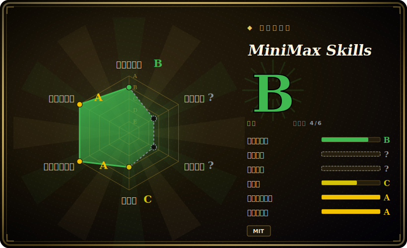

# MiniMax Skills

MiniMax 官方公开的约 16 个 Agent Skill 集合 —— 覆盖前端 / 全栈 / Android / iOS / Flutter / React Native / shader 开发，外加文档与媒体生成（pdf/docx/xlsx/pptx、音乐、视觉），通过插件市场安装进 Claude Code 及其他编码 agent。

## 何时使用

你是一名用 Claude Code（或 Cursor / Codex / OpenCode）的开发者，反复在向 agent 解释同一类带领域知识的流程化任务：「搭一个生产级 React 前端」「写一个 Android 原生页面」「按这份提纲生成 .docx」「做一个 GIF 表情包」「产出一份 PPTX」。你想要这些任务的一手、参考级配方，而不是每次手搓提示词或赌某个第三方包靠不靠谱。MiniMax Skills 就是厂商出处：一个 `skills/` 目录，里面是一组自包含的 skill 文件夹（`frontend-dev`、`fullstack-dev`、`android-native-dev`、`ios-application-dev`、`flutter-dev`、`react-native-dev`、`shader-dev`，外加 `minimax-docx`、`minimax-xlsx`、`pptx-generator`、`minimax-pdf`、`gif-sticker-maker`、`vision-analysis`、`minimax-multimodal-toolkit`、`minimax-music-gen` 等），各自在 description 匹配任务时按需加载。

当你想要一个现成、厂商定调的 skill 包，同时覆盖软件开发与 MiniMax 自家的媒体/文档/多模态能力，并且你正用在受支持的 harness 上时，就用它。一次性通过市场安装（`claude plugin marketplace add MiniMax-AI/skills` 然后安装该包），或在 Cursor/Codex/OpenCode 上 clone 仓库并指向各 harness 的 manifest 目录（`.claude-plugin`、`.cursor-plugin`、`.codex`、`.opencode`）。之后这套方法论通过平台原生的 skill 加载机制激活，而不是你去 `import` 它。

## 何时不用

- **你已有一套信得过的 skill 栈。** 这是厂商定调的成包；把 16 个 skill 叠在既有方法论栈之上，容易引入重叠或冲突的路由 —— 选一个唯一事实源。
- **你只要软件开发纪律、不要媒体生成。** 这里很大一部分价值是 MiniMax 专属的媒体/文档/多模态 skill（音乐生成、视觉、GIF/PPTX/DOCX）。若你只想要开发流程指导，一个聚焦的 dev-methodology 包比装整包更轻。
- **你不在受支持的 harness 上。** skill 靠各平台的 loader 激活（Claude Code 市场；Cursor/Codex/OpenCode 的 manifest 目录）。在自制或不受支持的 agent 上没有 loader 触发它们，单凭 markdown 不会自动激活。
- **你需要最新、频繁更新的厂商源。** 无 tag 发布、最近一次 push 是 2026-04 [未验证] —— 依赖某个具体 skill 行为前先核实新鲜度；你在意的领域里一个失维的 skill 比没有更糟。
- **你期望硬保证。** 行为存在于 agent 加载的提示词/markdown skill 里，「生产级指导」是 advisory 而非强制 —— agent 仍可能偏离。

## 横向对比

| 替代品 | 是否收录 | 我们的评价 | 取舍 |
|---|---|---|---|
| [Anthropic Skills](anthropic-skills.md) | ✅ | 当前页用于它的主场景；如果更看重“Anthropic 一手成包（文档编辑、前端/画布、MCP/skill 编写）”，再选 Anthropic Skills。 | Anthropic 一手成包（文档编辑、前端/画布、MCP/skill 编写）。Claude 格式贴合度更高、领域更窄。MiniMax 多了移动端/shader 开发 + MiniMax 专属媒体/多模态 skill。 |
| [Claude Plugins（官方）](claude-plugins-official.md) | ✅ | 当前页用于它的主场景；如果更看重“Anthropic 官方*插件*市场（commands/agents/hooks/MCP，不只是 skill）”，再选 Claude Plugins（官方）。 | Anthropic 官方*插件*市场（commands/agents/hooks/MCP，不只是 skill）。插件面更广、仅限 Claude。MiniMax 是聚焦 skill、跨 harness 的厂商成包。 |
| aws-agent-plugins | 未收录 | 当前页用于它的主场景；如果更看重“另一个厂商/官方插件集合”，再选 aws-agent-plugins。 | 另一个厂商/官方插件集合；按各自支持哪些 harness、以及你需要云专属还是媒体/开发通用型 skill 来取舍。 |
| 自己搭 `skills/` 目录 | 未收录 | 当前页用于它的主场景；如果更看重“完全可控、零锁定、无维护 bus-factor 风险”，再选 自己搭 skills/ 目录。 | 完全可控、零锁定、无维护 bus-factor 风险 —— 但每个 skill 都得自己写自己维护。MiniMax 用这点换一个现成、厂商维护的成包。 |

## 健康度与可持续性

- **维护** —— [未验证] 最近一次 push 在 **2026-04**，无 tag release；对照今天（2026-06）已停滞约 2 个月——读作**滑行（coasting），未废弃**：依赖某个具体 skill 前先核实新鲜度，因为你在意领域里一个失维的 skill 比没有更糟。
- **治理与背书** —— [推断] 组织所有，由 **MiniMax** 背书；provenance 强但单厂商，且绑定 MiniMax 的模型/harness 假设。路线图跟随厂商。
- **年龄与 Lindy** —— [推断] 创建于 2026-03，截至 2026-06 仅约 3 个月：**全新，无 Lindy 履历**，且已出现 2 个月的活动空档——耐久性未经证实。
- **风险标记** —— [推断] 活动空档是主要标记；约 1.28 万 star（2026-06）代表早期热度而非维护承诺。MIT 许可，未见 relicense/CVE 信号。

## 存疑（未验证）

- [未验证] License 为 MIT、主语言为 C#（约 68.5%，Python 约 24.3%），据 GitHub 元数据 2026-06-26；C# 占比高被归因于文档类 skill（如 `minimax-docx`）背后的 .NET/OpenXML 辅助代码 —— 假定某条构建工具链前请对仓库核实。
- [未验证] 最近一次 push 为 2026-04-18，截至 2026-06-26 **无 tag 发布**；把该包当作快照看待，依赖任一具体 skill 前先核实新鲜度。
- [未验证] star 数（GitHub 2026-06-26 约 1.28 万）不可靠且对日期敏感；仅作参考，勿当质量信号。
- [未验证] skill 列表（约 16 个：前端/全栈/android/ios/flutter/react-native/shader 开发，外加 pdf/docx/xlsx/pptx、gif-sticker、vision、multimodal、music-gen/playlist、buddy-sings）读自 README 与 `skills/` 列表；请以当前 `skills/` 目录为准，而非本枚举。
- [未验证] 受支持 harness 的说法（Claude Code 市场；Cursor/Codex/OpenCode 经 clone 后的 manifest 目录）来自 README；各 harness 的实际激活保真度此处未独立确认。
- [推断] 因为行为存在于 agent 加载的提示词/markdown skill 中，强制力是 advisory 的 ——「生产级指导」是提示词层指令，不是硬保证，agent 可能偏离。
