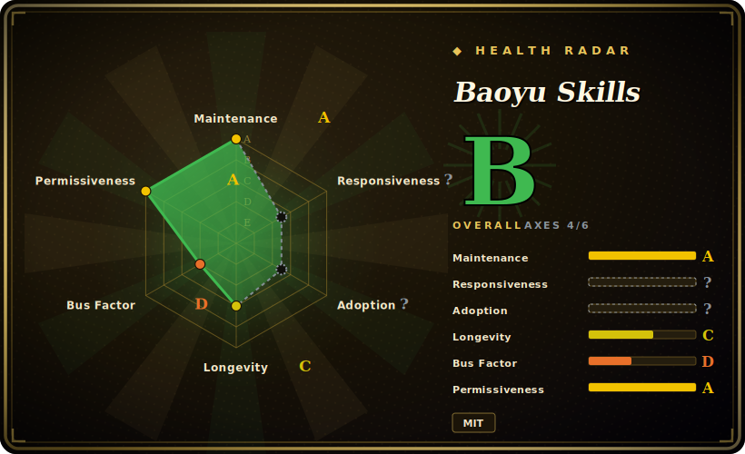

# Baoyu Skills

A 20+ skill pack from "宝玉" (Baoyu) for coding agents — translation, markdown/HTML formatting, transcript and URL capture, plus image/diagram/slide generation — installable into Claude Code, Codex, and other skill-capable harnesses.

## When to use

You're a bilingual content creator or developer who lives in the terminal, and your real job around the code is *publishing*: translating an English essay into publication-quality Chinese, turning a raw transcript into a clean article, formatting messy markdown for WeChat, or pulling a YouTube transcript before you write a summary. Your coding agent can do any one of these if you hand-craft the prompt each time — but you keep re-explaining the same workflow, and the translation comes out stiff and machine-flavored instead of reading like a human wrote it. You want a curated, opinionated set of these moves baked in once and invoked by name.

Baoyu Skills gives you exactly that for the writing/translation slice: `baoyu-translate` runs a three-mode workflow (quick / normal / refined, the refined mode doing analysis → draft → review → polish with custom-glossary support), `baoyu-format-markdown` structures plain text with frontmatter, `baoyu-markdown-to-html` themes it for WeChat, and `baoyu-url-to-markdown` / `baoyu-youtube-transcript` feed your pipeline clean source text. Install once (`npx skills add jimliu/baoyu-skills`, or the plugin marketplace), and the agent loads each skill on demand through the platform's native skill-loading mechanism rather than you pasting a prompt every time.

## When NOT to use

- **You only want translation/humanizing, not the whole bundle.** This is a broad 20+ skill pack (images, infographics, slide decks, posting to X/WeChat/Weibo, Electron extraction). Installing it for `baoyu-translate` alone pulls in a large surface and a TypeScript helper-package install you may not want. A single-purpose translation/de-AI skill is leaner.
- **You already run a curated skill/voice system.** If you have your own translation or humanizing skills, layering Baoyu's opinionated workflows on top invites double-routing and conflicting glossary/voice instructions — pick one source of truth.
- **You're not on a supported harness.** It activates through each platform's skill loader (Claude Code, Codex, and other skill-capable agents per the README); on a bespoke agent with no loader, the markdown skills won't auto-fire. [推断]
- **You distrust unofficial / reverse-engineered backends.** Some skills (`baoyu-danger-gemini-web`, `baoyu-danger-x-to-markdown`) explicitly wrap unofficial APIs and carry the project's own disclaimers; the writing skills don't, but they ship in the same repo.
- **You need hard enforcement.** Skill behavior is prompt/markdown-driven and advisory — the agent can deviate; "refined mode" is a documented workflow, not a guarantee. [推断]
- **Single-maintainer, fast-moving upstream.** Frequent releases (v2.x) mean a version bump can change a skill's prompt, modes, or routing; pin and re-check after upgrades.

## Comparison

| Alternative | In index | Our verdict | Tradeoff |
|---|---|---|---|
| [Humanizer-zh](humanizer-zh.md) | ✅ | Use this page for its stated niche; choose Humanizer-zh when you need a focused Chinese AI-text humanizing skill. | A focused Chinese AI-text humanizing skill — narrow and single-purpose (de-AI / voice), where Baoyu Skills is a broad content/publishing bundle whose translation skill is one of 20+. Reach for the focused one if all you want is humanizing; reach for Baoyu if you want the whole translate→format→publish pipeline. |
| Hand-written project skills | 未收录 | Use this page for its stated niche; choose Hand-written project skills when you need writing your own `SKILL. | Writing your own `SKILL.md` for translate/format gives full control and zero third-party surface, but you rebuild and maintain the three-mode workflow, glossary handling, and HTML theming yourself. |
| Single de-AI / translation prompt | 未收录 | Use this page for its stated niche; choose Single de-AI / translation prompt when you need a one-off prompt is the lightest possible option for one task, but it doesn't persist, version, or l. | A one-off prompt is the lightest possible option for one task, but it doesn't persist, version, or load by name across sessions the way an installed skill does. |
| Built-in agent skill ecosystems | 未收录 | Use this page for its stated niche; choose Built-in agent skill ecosystems when you need the harness's own marketplace skills. | The harness's own marketplace skills; Baoyu is a third-party curated bundle layered on top, so it can overlap or conflict with native equivalents. |

## Health & viability

- **Maintenance** — [未验证] last pushed 2026-06, not archived, open issues ~1; v2.5.2 (2026-06) and a fast v2.x release cadence make it **actively, even rapidly maintained** — and it ships real version pins rather than only `main`.
- **Governance & bus factor** — [推断] **`User`-owned, single-maintainer repo ("宝玉"/JimLiu) with ~22k stars (2026-06) — a bus-factor flag.** Personal project, no team or org backing; cadence and continuity ride on one author.
- **Age & Lindy** — [推断] created 2026-01, so only ~5 months old as of 2026-06: **brand new, no Lindy track record**. Popular but unproven over time.
- **Risk flags** — [推断] fast releases mean a version bump can change a skill's prompt, modes, or routing — pin and re-check after upgrades. [未验证] some `baoyu-danger-*` skills wrap unofficial/reverse-engineered backends (may break or violate third-party terms); the writing skills don't, but share the same repo and cadence. MIT license.

## Caveats (unverified)

- [未验证] Latest release reported as v2.5.2 (published 2026-06-18) with the repo last pushed 2026-06-20; license MIT and primary language TypeScript per GitHub metadata as of 2026-06-26 — re-verify before relying on a specific version's behavior.
- [未验证] Star count (~22.5k per GitHub on 2026-06-26) is unreliable and date-sensitive; treat as indicative only, not as a quality signal.
- [未验证] The skill inventory (21 directories under `skills/`, including `baoyu-translate`, `baoyu-format-markdown`, `baoyu-markdown-to-html`, `baoyu-url-to-markdown`, `baoyu-youtube-transcript`, and image/diagram/slide/posting skills) is from the repo file listing and README; the exact set and each skill's modes change release-to-release — inspect the current `skills/` directory.
- [未验证] Supported harnesses (Claude Code, Codex, and other skill-capable agents) and install paths (`npx skills add`, plugin marketplace, copying into `.agents/skills/`) are from the README; actual activation fidelity varies per harness and is not independently confirmed here.
- [推断] Because skill logic lives in markdown loaded by the agent (with TypeScript workspace packages as helpers), enforcement is advisory — documented modes/workflows are prompt-level instructions, not hard guarantees.
- [推断] Translation/humanizing quality depends on the underlying model the agent runs; the skill orchestrates the workflow but does not itself add a translation engine.
- [未验证] `baoyu-danger-*` skills wrap unofficial/reverse-engineered backends per the README and may break or violate third-party terms; the writing-focused skills do not, but share the same repo and release cadence.
