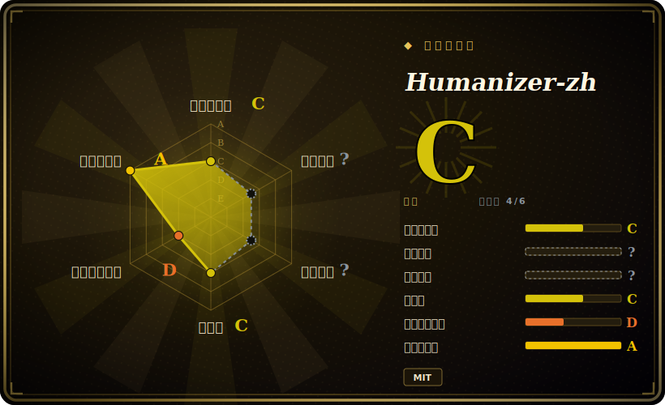

# Humanizer-zh

一个 Claude Code 单技能（`SKILL.md`，简体中文），把文本里典型的「AI 味」改写掉——它是 `blader/humanizer` 的中文本地化版，靠一份覆盖内容 / 语言 / 风格 / 套话四类、约 24 条的清单来驱动改写。

## 何时使用

你是用 LLM 起草中文文案的写手、编辑或市场人员，产出的稿子总是一眼「机器写的」：每段都收尾在「挑战与展望」，行文堆着「此外 / 至关重要 / 展示」，列表一律凑成三项，标题挂着 emoji，结尾还来一句「希望这对您有帮助」。你想让 agent 当个真正的编辑——把这些 AI 痕迹找出来、改写成自然的人话中文——而不必每次都把这套规则重讲一遍。把 Humanizer-zh 装进 `~/.claude/skills/`，agent 就会按需加载这份约 24 条、分为内容 / 语言语法 / 风格 / 沟通套话四类的清单，在保意保调的前提下消除 AI 签名式特征。

当你的产出语言是中文、且宁可采用一份经社区翻译核校的现成规则、也不想自己手写去味提示词时，最适合用它。安装是即插即用：`npx skills add https://github.com/op7418/Humanizer-zh.git`，或把文件夹 clone / 拷进 Claude Code 的 skills 目录；之后技能通过 Claude Code 原生的技能加载机制触发。

## 何时不用

- **你已有信任的去 AI 痕 / voice 技能。** 它与任何已有的「去 AI 腔 / humanize」流程（以及原版 `blader/humanizer`）直接重叠。两套去味规则叠加会产生互相打架的修改——保留一个事实源即可。
- **你不在 Claude Code（或不加载 `SKILL.md` 的 harness）上。** 它是纯提示词 markdown，没有运行器；在不支持的 agent 上无从触发，文件也不会自动生效。[推断]
- **你的目标语言不是中文。** 规则和示例都用简体中文写、针对中文 AI 写作特征；英文文案请直接用上游 `blader/humanizer`。
- **你要的是强制 / 评分，而非建议。** 它靠 advisory 指令改写——agent 仍可能漏掉某条模式或改过头；没有 lint 检查，也没有可量化的「AI 分数」闸门。
- **维护信号偏弱。** 单作者本地化，无 tagged release、近期也无 push；上游模式清单可能与此快照漂移。依赖它处理「当下的 AI 痕迹」前请先复核。

## 横向对比

| 替代品 | 是否收录 | 我们的评价 | 取舍 |
|---|---|---|---|
| `blader/humanizer`（上游） | 未收录 | 当前页用于它的主场景；如果更看重“本仓库翻译自的英文原版”，再选 blader/humanizer（上游）。 | 本仓库翻译自的英文原版。英文文案选上游；中文特征与示例选 Humanizer-zh。 |
| [Baoyu Skills](baoyu-skills.zh.md) | ✅ | 当前页用于它的主场景；如果更看重“一个更宽的中文作者技能集（翻译 / markdown / 内容生成助手），而非单一去味规则”，再选 Baoyu Skills。 | 一个更宽的中文作者技能集（翻译 / markdown / 内容生成助手），而非单一去味规则。看你要一个专注的 humanize 技能，还是一整套写作技能包。 |
| 写在 `CLAUDE.md` 里的自制去味提示词 | 未收录 | 当前页用于它的主场景；如果更看重“你自己维护的几条内联规则：零安装、完全归你，但要自己推导和调参，而非继承一份经核校的约 24 条清单”，再选 写在 CLAUDE.md 里的自制去味提示词。 | 你自己维护的几条内联规则：零安装、完全归你，但要自己推导和调参，而非继承一份经核校的约 24 条清单。 |
| 维基百科「Signs of AI writing」指南 | 未收录 | 当前页用于它的主场景；如果更看重“规则背后的参考来源”，再选 维基百科「Signs of AI writing」指南。 | 规则背后的参考来源——一份人读的指南，不是可安装技能。用它来审计或扩充清单，而非直接执行改写。 |

## 健康度与可持续性

- **维护** —— 截至 2026-06 最后 push 在 2026-01，即约 5 个月无更新、无 tagged release；这是个小型本地化仓库，而非持续演进的产品。应视为「滑向静态」而非活跃维护。[推断]
- **治理 / 巴士因子** —— 单作者（`User` 所有）对上游 `blader/humanizer` 的本地化；一人、单一用途的仓库却有约 1.1 万 star，是巴士因子警示——作者一旦停手，中文模式清单就冻结在当时的状态。[推断]
- **年龄与 Lindy** —— 创建于 2026-01，截至 2026-06 不足一年：太年轻，谈不上 Lindy 履历；且作为翻译，它继承上游的方向，而非自定方向。[推断]
- **风险旗标** —— `[未验证]` 没有评分/强制层，也没有自动触发的运行器，纯提示词 markdown。真正的持久性风险是*漂移*：上游规则会演进，而这份快照不会，于是除非重新同步，价值会悄悄衰减。MIT 许可证，无重新授权历史。

## 存疑（未验证）

- [未验证] 据 GitHub 元数据（2026-06-26）许可证为 MIT、仓库未归档；`latestRelease` 为 null（无 tagged 版本），最后 push 为 2026-01-19——依赖其成熟度前请复核。
- [未验证] GitHub 报告 `primaryLanguage` 为 null（仓库是 markdown / 技能内容）；frontmatter 里的 `language: Markdown` 是对内容类型的推断，而非检测到的代码语言。
- [未验证] 星标数（2026-06-26 约 1.16 万）不可靠且随日期变动，仅作参考、不作质量信号。
- [未验证] 「约 24 条、分 4 类」这个数字及示例特征（此外 / 至关重要 /「挑战与展望」/ emoji 标题 /「希望这对您有帮助」）读自 README/SKILL.md；确切条数和分组可能随编辑变化——请读当前 `SKILL.md` 而非依赖本摘要。
- [未验证] 安装命令（`npx skills add …`、clone 到 `~/.claude/skills/humanizer-zh`）以及「通过 Claude Code 原生技能加载器激活」的说法来自 README；在其它 harness 上的激活保真度未独立确认。
- [推断] 由于行为完全存在于提示词 / markdown 技能里，改写是 advisory——对任一 AI 痕迹的覆盖是尽力而为、非保证，agent 也可能引入自己的修改。
