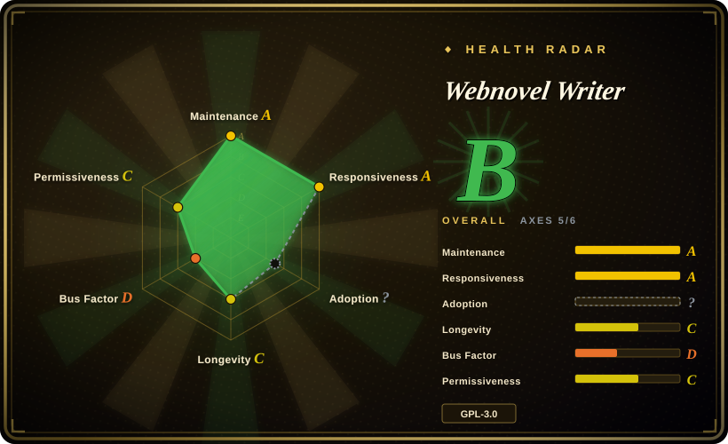

# Webnovel Writer

A Claude Code plugin for long-running Chinese web-novel projects: it turns story facts, chapter commits, retrieval, review, and a read-only dashboard into a continuity workflow rather than a one-shot drafting prompt.

## When to use

You're a serial-fiction author already working in Claude Code, and after dozens of chapters your model starts contradicting character motives, timelines, world rules, and planted clues. You need each chapter to pass through context preparation, drafting, review, fact extraction, a chapter commit, and derived state/index/summary projections. Pick Webnovel Writer over a generic writing prompt because it keeps an auditable project-side story system and queryable continuity state instead of treating every chapter as an isolated chat.

You accept its Claude Code plugin workflow, initialize a book, and use its `init`, `plan`, `write`, `review`, `query`, `learn`, `dashboard`, and `doctor` commands to carry a long serial forward. Semantic RAG is optional: without embedding credentials it falls back to BM25, so a local keyword-retrieval path remains available.

## When NOT to use

- **You need an independent desktop novel editor or do not use Claude Code.** Pick [novelWriter](https://github.com/vkbo/novelWriter) or [Manuskript](https://github.com/olivierkes/manuskript) instead; both target standalone long-form writing, while this project is a Claude Code plugin.
- **You are drafting a short story, one article, or one-off marketing copy.** Use a focused drafting prompt or a smaller writing skill instead; story contracts, chapter commits, SQLite indexes, projections, and review gates add setup that only pays off when continuity is the real problem.
- **Your policy forbids prose context from reaching external embedding or reranking APIs.** Use a fully local retrieval stack or accept this project's BM25 fallback; its documented semantic-RAG setup uses compatible external embedding and rerank endpoints.
- **You need to distribute a combined proprietary derivative without a GPL review.** Choose a permissively licensed alternative or get legal advice first; this repository is GPL-3.0.
- **You need independently benchmarked proof that it handles a particular novel length.** Treat the project's 2-million-character-scale claim as unverified and validate with a representative manuscript; no public benchmark was found in this review.

## Comparison

| Alternative | In index | Our verdict | Tradeoff |
|---|---|---|---|
| [Humanizer-zh](humanizer-zh.md) | ✅ | Choose Webnovel Writer when long-running story facts and chapter continuity are the failure mode; choose Humanizer-zh when polishing Chinese prose is the only job. | Webnovel Writer maintains project state and runs a multi-stage writing workflow; Humanizer-zh is a lightweight advisory rewrite skill. |
| [Baoyu Skills](baoyu-skills.md) | ✅ | Choose Webnovel Writer for a novel-specific, stateful serial workflow; choose Baoyu Skills for a broad collection of writing and formatting tasks. | The focused plugin brings contracts, indexes, and review overhead; the general pack is lighter but does not provide a novel continuity system. |
| novelWriter | not indexed | Choose novelWriter when a cross-platform, local desktop editor is required; choose this page when Claude Code should actively plan, draft, and reconcile a serial. | novelWriter avoids model/provider and plugin coupling; Webnovel Writer adds agent-driven retrieval and review. |
| Manuskript | not indexed | Choose Manuskript when you want a standalone outlining and writing application; choose this page when chapter facts must feed an agent-readable state system. | Manuskript keeps the author in a desktop workflow; Webnovel Writer depends on Claude Code and Python tooling. |

## Tech stack

- **Core:** Python 3.10+ Claude Code plugin with Skills, Agents, Hooks, and a Python CLI.
- **State:** `.story-system` contracts and chapter commits; JSON plus SQLite indexes, vectors, summaries, and memory projections.
- **Dashboard:** FastAPI, Uvicorn, Watchdog, SSE, and a bundled React/Vite frontend.
- **Retrieval:** BM25 plus optional vector, rerank, hybrid, and graph-hybrid paths through OpenAI-compatible endpoints.

## Dependencies

- **Required:** Claude Code plugin runtime and Python 3.10+.
- **Python packages:** `aiohttp`, `filelock`, and `pydantic`; the dashboard additionally uses FastAPI, Uvicorn, HTTPX, and Watchdog.
- **Optional semantic RAG:** compatible embedding and reranking services plus their API credentials. With no embedding key, documented behavior falls back to BM25.
- **Frontend development only:** Node.js/npm; the released dashboard bundle includes built assets for ordinary use.

## Ops difficulty

**Medium.** Installation is a Claude Code Marketplace plugin plus Python dependencies, but a real book project owns contracts, generated SQLite/JSON state, backups, and optional external RAG credentials. The local dashboard binds to loopback by default, yet maintaining a large manuscript still requires backup and upgrade discipline.

## Health & viability

- **Maintenance snapshot (2026-07-13):** active, unarchived, with `v6.2.1` released and the default branch updated on 2026-07-07.
- **Governance / bus factor:** GitHub's contributor API showed one human contributor plus automation. The project describes itself as spare-time maintained, so a single-maintainer interruption is a material risk. [推断]
- **Age / Lindy:** created 2026-01, so its roughly six-month history is too short to establish a long-term durability signal despite high early attention.
- **Adoption and risk:** ~5.6k stars and 981 forks are interest signals, not evidence that its continuity or scale claims work for a given manuscript. GPL-3.0 is the decisive legal constraint for derivative distribution.

## Caveats (unverified)

- [未验证] The claim that the workflow supports a 2-million-character-scale serial comes from the project description; no independent load test or public benchmark was found.
- [未验证] The current release's claim of 774 passing tests is a maintainer release-note statement and was not reproduced locally.
- [未验证] The exact quality of vector, rerank, and graph-hybrid retrieval depends on the selected external providers and the manuscript; only the documented BM25 fallback was verified from source materials.
- [推断] A contributor list dominated by one author and a sub-one-year project age make forkability and local backups more important than star count when adopting it for a long serial.
