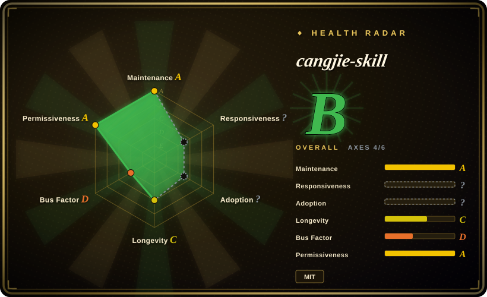

# cangjie-skill

Methodology skill for distilling books, long videos, podcasts, courses, interviews, and transcripts into reusable, testable agent skill packs.

## When to use

You're turning a long-form source into something an agent can actually reuse later: a book, long video transcript, podcast transcript, course, interview, speech, or dense document contains frameworks and judgment rules, but a summary would not tell the agent when and how to apply them. Pick cangjie-skill when you want a structured distillation pipeline that produces multiple `SKILL.md` modules, a skill index, a digest, glossary, and test prompts rather than one compressed note.

The decisive tradeoff is rigor versus speed. cangjie-skill's RIA-TV++ flow spends effort on extraction, triple verification, RIA++ structuring, Zettelkasten-style linking, and pressure tests; it is overkill for quick notes, but useful when the output must become a reusable skill pack.

## When NOT to use

- **You only need retrieval over source documents.** Use [NotebookLM Claude Code Skill](notebooklm-skill.md) when you want source-grounded Q&A over notebooks; cangjie-skill creates static skills and does not replace citation-backed retrieval.
- **You are distilling a person or public figure.** Use [nuwa-skill](nuwa-skill.md) for perspective/persona distillation; cangjie-skill is for systematic content such as books, transcripts, courses, and long-form materials.
- **You need a quick summary or study note.** Use a summarizer, notes workflow, or local writing skill instead; cangjie-skill deliberately filters, structures, links, and tests candidate skills.
- **You cannot legally or ethically transform the source.** Do not use cangjie-skill to repackage copyrighted books, paid courses, or private transcripts without rights or permission; choose source-grounded private retrieval instead.
- **You need executable tool wrappers.** Use [Scientific Agent Skills](../engineering/scientific-agent-skills.md) or a custom tool skill when the job is wrapping Python libraries or APIs; cangjie-skill extracts methodology, not runtime integrations.

## Comparison

| Alternative | In index | Our verdict | Tradeoff |
|---|---|---|---|
| [nuwa-skill](nuwa-skill.md) | ✅ | For public-figure or theme perspective skills, choose nuwa-skill; for books, transcripts, courses, and other systematic content, choose cangjie-skill. | nuwa models a viewpoint; cangjie decomposes explicit source material into reusable methods. |
| [NotebookLM Claude Code Skill](notebooklm-skill.md) | ✅ | For citation-backed answers from your own notebooks, choose NotebookLM; for static skill packs distilled from source material, choose cangjie-skill. | NotebookLM keeps retrieval live and sourced; cangjie creates portable skills but can lose source-level traceability unless you preserve citations. |
| [book-to-skill](../book-to-skill.md) | ✅ | For technical PDFs converted into installable skills, evaluate book-to-skill; for a documented multi-stage methodology covering books and non-book transcripts, choose cangjie-skill. | book-to-skill is tool-oriented; cangjie is a process skill with stronger manual judgment gates. |
| One-off summary prompt | 未收录 | For a disposable summary, use a simple prompt; choose cangjie-skill when you need reusable trigger conditions, boundaries, tests, and an index. | Summaries are faster; skill packs are more expensive to produce but easier for agents to invoke later. |

## Health & viability

- **Maintenance snapshot (2026-07-16):** GitHub reports `archived=false` and `pushed_at=2026-07-16T03:00:58Z`; the health scorer grades maintenance `A`.
- **Adoption snapshot:** GitHub API reports ~3,203 stars as of 2026-07; the README lists multiple generated skill-pack examples, but oss-atlas did not independently validate their quality.
- **License snapshot:** root `LICENSE` is MIT and README links to it.
- **Lindy / governance:** the repo is about 3 months old, so longevity is still `C`; governance is `D` because the scorer sees high contributor concentration.
- **Risk flags:** the output may embed source-derived methods; copyright, source attribution, and permission matter more here than in ordinary prompt packs.

## Caveats (unverified)

- [未验证] The quality of generated downstream skill packs was not audited individually.
- [未验证] The RIA-TV++ pass/fail rates and pressure-test effectiveness come from the README and were not independently measured.
- [推断] This belongs in context-engineering because it changes what the agent reads and how reusable context is packaged, even though some examples are writing, business, or knowledge-work oriented.
